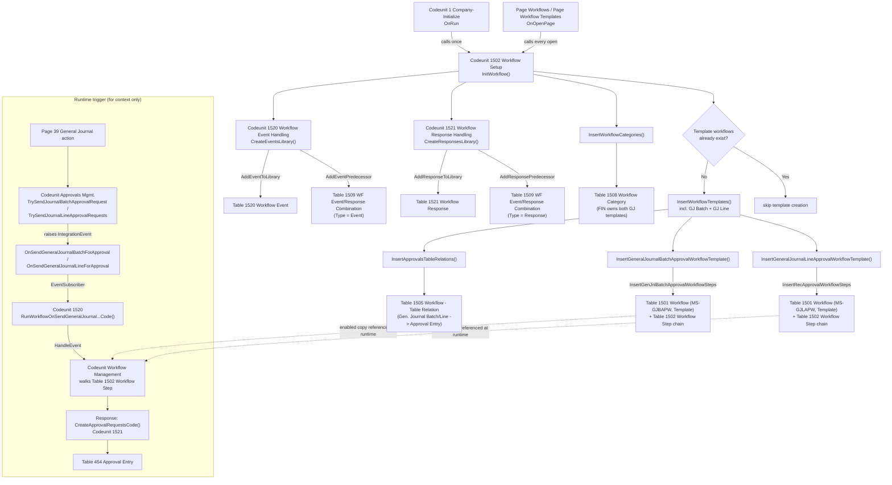

# General Journal Approvals - Session 2: Workflow Registration Analysis

Scope: how General Journal approval capability is registered into the standard BC Workflow libraries (categories, events, responses, predecessor/successor combinations, table relations, templates) and made discoverable on the Workflow / Workflow Templates pages. Runtime approval-entry creation, posting, and target design are out of scope.

## 1. Registration lifecycle

Registration is idempotent and happens in two ways:

1. **Company initialization.** `Codeunit 1 "Company-Initialize"` ([CompanyInitialize.Codeunit.al](../../../Base%20Application/Foundation/Company/CompanyInitialize.Codeunit.al#L100-L121)) calls `Codeunit 1502 "Workflow Setup".InitWorkflow()` once, during `OnRun`, when a company is initialized.
2. **Lazy re-assertion on page open.** `Page "Workflows"` ([Workflows.Page.al](../../../Base%20Application/System/Workflow/Workflows.Page.al#L381-L390)) and `Page "Workflow Templates"` ([WorkflowTemplates.Page.al](../../../Base%20Application/System/Workflow/WorkflowTemplates.Page.al#L140-L150)) both call `WorkflowSetup.InitWorkflow()` in `OnOpenPage`, guaranteeing the library exists even if company-init never ran (e.g., upgraded databases) or was reset via `ResetWorkflowTemplates`.

`InitWorkflow` ([WorkflowSetup.Codeunit.al](../../../Base%20Application/System/Workflow/WorkflowSetup.Codeunit.al#L165-L182)) performs, in order:

1. `WorkflowEventHandling.CreateEventsLibrary()` - populates `Workflow Event` (table 1520) and `WF Event/Response Combination` (table 1509, Type = Event) with every event and its predecessor events.
2. `WorkflowRequestPageHandling.CreateEntitiesAndFields()` / `AssignEntitiesToWorkflowEvents()` - not examined in depth this session (out of General Journal scope; no GJ-specific evidence found).
3. `WorkflowResponseHandling.CreateResponsesLibrary()` - populates `Workflow Response` (table 1521) and `WF Event/Response Combination` (Type = Response) with every response and its predecessor events.
4. `InsertWorkflowCategories()` - populates `Workflow Category` (table 1508), including `FIN` (Finance), which owns both General Journal templates.
5. `InsertJobQueueData()` - unrelated to General Journal; not traced further.
6. Template insertion, gated by `if Workflow.IsEmpty()` on `Workflow` records whose `Code` starts with the template token (`MS-`) - so templates are created once and never re-created unless deleted (see `ResetWorkflowTemplates`, [WorkflowSetup.Codeunit.al L263-L279](../../../Base%20Application/System/Workflow/WorkflowSetup.Codeunit.al#L263-L279)).
7. `OnAfterInitWorkflowTemplates()` - publisher extension point, no in-repo subscribers found for General Journal.

Each of the four library-population steps is individually idempotent (each `Add...ToLibrary` procedure does a `Get`/existence check before inserting), so calling `InitWorkflow` repeatedly is safe and is exactly how the Workflows/Workflow Templates pages keep the library current without a dedicated install/upgrade codeunit specific to General Journal.

## 2. Object inventory

| Object type | ID | Name | Namespace | App | File | Role |
| --- | --- | --- | --- | --- | --- | --- |
| Codeunit | 1502 | Workflow Setup | System.Automation | Base Application | [WorkflowSetup.Codeunit.al](../../../Base%20Application/System/Workflow/WorkflowSetup.Codeunit.al) | Orchestrates `InitWorkflow`; builds GJ batch/line templates; owns generic step-builder helpers (`InsertEntryPointEventStep`, `InsertEventStep`, `InsertResponseStep`, `SetNextStep`, `InsertApprovalArgument`, `InsertTableRelation`, `InsertWorkflowCategory`, `MarkWorkflowAsTemplate`). |
| Codeunit | 1520 | Workflow Event Handling | System.Automation | Base Application | [WorkflowEventHandling.Codeunit.al](../../../Base%20Application/System/Workflow/WorkflowEventHandling.Codeunit.al) | Owns `CreateEventsLibrary`, the GJ event-code constants, the GJ event predecessor wiring, and the subscribers that forward `Approvals Mgmt.` events and the `Gen. Journal Batch` table events into the generic workflow engine. |
| Codeunit | 1521 | Workflow Response Handling | System.Automation | Base Application | [WorkflowResponseHandling.Codeunit.al](../../../Base%20Application/System/Workflow/WorkflowResponseHandling.Codeunit.al) | Owns `CreateResponsesLibrary`, the GJ-relevant response codes (`CreateApprovalRequestsCode`, `CheckGeneralJournalBatchBalanceCode`, etc.), and their predecessor wiring to GJ events. |
| Codeunit | 1804 | Approval Workflow Setup Mgt. | System.Automation | Base Application | [ApprovalWorkflowSetupMgt.Codeunit.al](../../../Base%20Application/System/Workflow/ApprovalWorkflowSetupMgt.Codeunit.al) | Legacy wizard that clones the GJ Line template into a user-specific workflow (`CreateGenJnlLineApprovalWorkflow`). Every public procedure used here is `[Scope('OnPrem')]`. |
| Codeunit | 1540 | Workflow Webhook Setup | System.Automation | Base Application | [WorkflowWebhookSetup.Codeunit.al](../../../Base%20Application/System/Workflow/WorkflowWebhookSetup.Codeunit.al) | Separate, parallel registration path that builds webhook-flavored GJ batch/line workflows on demand using its own low-level step builders (not `WorkflowSetup`'s). Out of this session's tracing depth beyond identifying the split. |
| Codeunit | 134 (Approvals Mgmt.) | Approvals Mgmt. | n/a | Base Application | [ApprovalsMgmt.Codeunit.al](../../../Base%20Application/OtherCapabilities/Approvals/ApprovalsMgmt.Codeunit.al) | Publishes the GJ-specific integration events (`OnSendGeneralJournalBatchForApproval`, `OnSendGeneralJournalLineForApproval`, `OnCancelGeneralJournalBatchApprovalRequest`, `OnCancelGeneralJournalLineApprovalRequest`) that the workflow engine subscribes to. Also owns `TrySendJournalBatchApprovalRequest` / `TrySendJournalLineApprovalRequests`, the actual call sites reached from journal page actions. |
| Table | 1501 | Workflow | System.Automation | Base Application | [Workflow.Table.al](../../../Base%20Application/System/Workflow/Workflow.Table.al) | Workflow header/instance record (also doubles as the template record when `Template = true`). |
| Table | 1502 | Workflow Step | System.Automation | Base Application | [WorkflowStep.Table.al](../../../Base%20Application/System/Workflow/WorkflowStep.Table.al) | Per-workflow step; carries `Previous Workflow Step ID` / `Next Workflow Step ID`, i.e., the actual predecessor/successor chain for a concrete workflow (template or enabled instance). |
| Table | 1505 | Workflow - Table Relation | System.Automation | Base Application | [WorkflowTableRelation.Table.al](../../../Base%20Application/System/Workflow/WorkflowTableRelation.Table.al) | Generic table-to-`Approval Entry` (and other) relation registry, populated by `InsertApprovalsTableRelations`. |
| Table | 1508 | Workflow Category | System.Automation | Base Application | [WorkflowCategory.Table.al](../../../Base%20Application/System/Workflow/WorkflowCategory.Table.al) | Category library (`FIN` owns both GJ templates). |
| Table | 1509 | WF Event/Response Combination | System.Automation | Base Application | [WFEventResponseCombination.Table.al](../../../Base%20Application/System/Workflow/WFEventResponseCombination.Table.al) | **Library-level** predecessor/successor legality table: which events may follow which events, and which responses may follow which events. Distinct from `Workflow Step`'s per-instance chain. |
| Table | 1520 | Workflow Event | System.Automation | Base Application | [WorkflowEvent.Table.al](../../../Base%20Application/System/Workflow/WorkflowEvent.Table.al) | Event library (function name, table ID, description, request page, "used for record change" flag). |
| Table | 1521 | Workflow Response | System.Automation | Base Application | [WorkflowResponse.Table.al](../../../Base%20Application/System/Workflow/WorkflowResponse.Table.al) | Response library (function name, table ID, description, response option group). |
| Table | 1523 | Workflow Step Argument | System.Automation | Base Application | [WorkflowStepArgument.Table.al](../../../Base%20Application/System/Workflow/WorkflowStepArgument.Table.al) | Per-step arguments (approver type/limit, condition filters, messages, field-change data). |
| Table | 232 | Gen. Journal Batch | Microsoft.Finance.GeneralLedger.Journal | Base Application | [GenJournalBatch.Table.al](../../../Base%20Application/Finance/GeneralLedger/Journal/GenJournalBatch.Table.al) | Raises `OnGeneralJournalBatchBalanced` / `OnGeneralJournalBatchNotBalanced` from `CheckBalance()`. |
| Table | 81 | Gen. Journal Line | Microsoft.Finance.GeneralLedger.Journal | Base Application | [GenJournalLine.Table.al](../../../Base%20Application/Finance/GeneralLedger/Journal/GenJournalLine.Table.al) | Subject of the GJ Line approval template; not examined for its own publishers this session beyond what `WorkflowSetup` references. |
| Table | 454 | Approval Entry | n/a | Base Application | [ApprovalEntry.Table.al](../../../Base%20Application/OtherCapabilities/Approvals/ApprovalEntry.Table.al) | Target of the `Workflow - Table Relation` entries for both GJ Batch and GJ Line. |

## 3. Workflow event catalogue (General Journal-relevant)

All defined in `Codeunit 1520 "Workflow Event Handling"`, added via `AddEventToLibrary` inside `CreateEventsLibrary` ([lines 155-169](../../../Base%20Application/System/Workflow/WorkflowEventHandling.Codeunit.al#L155-L169)):

| Event function code (`Code[128]`) | Getter procedure | Table ID | Description | Raised by |
| --- | --- | --- | --- | --- |
| `RUNWORKFLOWONSENDGENERALJOURNALBATCHFORAPPROVAL` | `RunWorkflowOnSendGeneralJournalBatchForApprovalCode()` | 232 (Gen. Journal Batch) | "Approval of a general journal batch is requested." | Subscriber `RunWorkflowOnSendGeneralJournalBatchForApproval` on `Approvals Mgmt.OnSendGeneralJournalBatchForApproval` ([L836-840](../../../Base%20Application/System/Workflow/WorkflowEventHandling.Codeunit.al#L836-L840)) |
| `RUNWORKFLOWONCANCELGENERALJOURNALBATCHAPPROVALREQUEST` | `RunWorkflowOnCancelGeneralJournalBatchApprovalRequestCode()` | 232 | "An approval request for a general journal batch is canceled." | Subscriber on `Approvals Mgmt.OnCancelGeneralJournalBatchApprovalRequest` ([L842-846](../../../Base%20Application/System/Workflow/WorkflowEventHandling.Codeunit.al#L842-L846)) |
| `RUNWORKFLOWONSENDGENERALJOURNALLINEFORAPPROVAL` | `RunWorkflowOnSendGeneralJournalLineForApprovalCode()` | 81 (Gen. Journal Line) | "Approval of a general journal line is requested." | Subscriber on `Approvals Mgmt.OnSendGeneralJournalLineForApproval` ([L848-852](../../../Base%20Application/System/Workflow/WorkflowEventHandling.Codeunit.al#L848-L852)) |
| `RUNWORKFLOWONCANCELGENERALJOURNALLINEAPPROVALREQUEST` | `RunWorkflowOnCancelGeneralJournalLineApprovalRequestCode()` | 81 | "An approval request for a general journal line is canceled." | Subscriber on `Approvals Mgmt.OnCancelGeneralJournalLineApprovalRequest` ([L854-858](../../../Base%20Application/System/Workflow/WorkflowEventHandling.Codeunit.al#L854-L858)) |
| `RUNWORKFLOWONGENERALJOURNALBATCHBALANCED` | `RunWorkflowOnGeneralJournalBatchBalancedCode()` | 232 | "A general journal batch is balanced." | Subscriber `RunWorkflowOnGeneralJournalBatchBalanced` on **table** event `Gen. Journal Batch.OnGeneralJournalBatchBalanced` ([L859-863](../../../Base%20Application/System/Workflow/WorkflowEventHandling.Codeunit.al#L859-L863)) |
| `RUNWORKFLOWONGENERALJOURNALBATCHNOTBALANCED` | `RunWorkflowOnGeneralJournalBatchNotBalancedCode()` | 232 | "A general journal batch is not balanced." | Subscriber `RunWorkflowOnGeneralJournalBatchNotBalanced` on `Gen. Journal Batch.OnGeneralJournalBatchNotBalanced` ([L865-869](../../../Base%20Application/System/Workflow/WorkflowEventHandling.Codeunit.al#L865-L869)) |

Every subscriber forwards into the generic engine with `WorkflowManagement.HandleEvent(<Code>, <Record>)`, which is what actually walks `Workflow Step` for enabled workflows and executes matching responses.

**Underlying publishers actually raised by GJ business logic:**

- `Codeunit "Approvals Mgmt.".OnSendGeneralJournalBatchForApproval(var GenJournalBatch)` — `[IntegrationEvent(false,false)]`, raised from `TrySendJournalBatchApprovalRequest` ([ApprovalsMgmt.Codeunit.al L2267-2280](../../../Base%20Application/OtherCapabilities/Approvals/ApprovalsMgmt.Codeunit.al#L2267-L2280)).
- `Codeunit "Approvals Mgmt.".OnSendGeneralJournalLineForApproval(var GenJournalLine)` — raised from `TrySendJournalLineApprovalRequests` ([L2282-2296](../../../Base%20Application/OtherCapabilities/Approvals/ApprovalsMgmt.Codeunit.al#L2282-L2296)).
- `Codeunit "Approvals Mgmt.".OnCancelGeneralJournalBatchApprovalRequest` / `OnCancelGeneralJournalLineApprovalRequest` — raised from `TryCancelJournalBatchApprovalRequest` / `TryCancelJournalLineApprovalRequests` ([L2302-2321](../../../Base%20Application/OtherCapabilities/Approvals/ApprovalsMgmt.Codeunit.al#L2302-L2321)).
- `Table "Gen. Journal Batch".OnGeneralJournalBatchBalanced` / `OnGeneralJournalBatchNotBalanced` — `[IntegrationEvent(true,false)]` (global subscription allowed), raised from `CheckBalance()` ([GenJournalBatch.Table.al L490-497](../../../Base%20Application/Finance/GeneralLedger/Journal/GenJournalBatch.Table.al#L490-L497)).

## 4. Workflow response catalogue (General Journal-relevant)

All defined in `Codeunit 1521 "Workflow Response Handling"`, added via `AddResponseToLibrary` inside `CreateResponsesLibrary` ([L95-133](../../../Base%20Application/System/Workflow/WorkflowResponseHandling.Codeunit.al#L95-L133)). None of the response codes below are GJ-exclusive — they are the same generic approval responses shared by every first-party approval workflow — except `CheckGeneralJournalBatchBalanceCode`, which is GJ Batch-specific.

| Response function code | Getter | Response option group | Table ID | Description | GJ-specific? |
| --- | --- | --- | --- | --- | --- |
| `CheckGeneralJournalBatchBalanceCode()` | -"- | `GROUP 0` | 0 | "Check if the general journal batch is balanced." | Yes - only meaningful for `Gen. Journal Batch`; implementation ([`CheckGeneralJournalBatchBalance`, L969-981](../../../Base%20Application/System/Workflow/WorkflowResponseHandling.Codeunit.al#L969-L981)) calls `GenJournalBatch.CheckBalance()`. |
| `RestrictRecordUsageCode()` | -"- | `GROUP 0` | 0 | "Add record restriction." | No - generic. |
| `CreateApprovalRequestsCode()` | -"- | `GROUP 5` | 0 | "Create an approval request..." | No - generic; this is the response that actually creates `Approval Entry` rows for whatever record type is passed. |
| `SendApprovalRequestForApprovalCode()` | -"- | `GROUP 2` | 0 | "Send approval request..." | No - generic. |
| `RejectAllApprovalRequestsCode()` | -"- | `GROUP 2` | 0 | "Reject the approval request..." | No - generic. |
| `CancelAllApprovalRequestsCode()` | -"- | `GROUP 2` | 0 | "Cancel the approval request..." | No - generic. |
| `AllowRecordUsageCode()` | -"- | `GROUP 0` | 0 | "Remove record restriction." | No - generic. |
| `ShowMessageCode()` | -"- | `GROUP 4` | 0 | "Show message..." | No - generic. |

**The response that actually creates the approval request(s):** `CreateApprovalRequestsCode()` (`Codeunit 1521`, `Response Option Group = GROUP 5`). Its predecessor events include both `RunWorkflowOnSendGeneralJournalLineForApprovalCode()` and `RunWorkflowOnSendGeneralJournalBatchForApprovalCode()` / `RunWorkflowOnGeneralJournalBatchBalancedCode()` ([L186-215](../../../Base%20Application/System/Workflow/WorkflowResponseHandling.Codeunit.al#L186-L215)).

## 5. Predecessor/successor map

Two distinct predecessor/successor mechanisms exist; do not conflate them:

### 5a. Library-level legality (`WF Event/Response Combination`, table 1509)

Populated once, at library build time, via `AddEventPredecessor` (event-to-event) and `AddResponsePredecessor` (response-to-event). This defines which combinations the Workflow **designer UI** will allow a user to pick, not a specific workflow's steps.

- Event predecessors relevant to GJ ([WorkflowEventHandling.Codeunit.al L226-303](../../../Base%20Application/System/Workflow/WorkflowEventHandling.Codeunit.al#L226-L303)):
  - `RUNWORKFLOWONCANCELGENERALJOURNALBATCHAPPROVALREQUEST` ← predecessor `RUNWORKFLOWONSENDGENERALJOURNALBATCHFORAPPROVAL`
  - `RUNWORKFLOWONCANCELGENERALJOURNALLINEAPPROVALREQUEST` ← predecessor `RUNWORKFLOWONSENDGENERALJOURNALLINEFORAPPROVAL`
  - `RUNWORKFLOWONGENERALJOURNALBATCHBALANCED` ← predecessor `RUNWORKFLOWONSENDGENERALJOURNALBATCHFORAPPROVAL`
  - `RUNWORKFLOWONGENERALJOURNALBATCHNOTBALANCED` ← predecessor `RUNWORKFLOWONSENDGENERALJOURNALBATCHFORAPPROVAL`
  - `RUNWORKFLOWONAPPROVEAPPROVALREQUEST` / `RUNWORKFLOWONREJECTAPPROVALREQUEST` / `RUNWORKFLOWONDELEGATEAPPROVALREQUEST` each list both `RUNWORKFLOWONSENDGENERALJOURNALBATCHFORAPPROVAL`, `RUNWORKFLOWONGENERALJOURNALBATCHBALANCED`, and `RUNWORKFLOWONSENDGENERALJOURNALLINEFORAPPROVAL` as valid predecessors.
- Response predecessors relevant to GJ ([WorkflowResponseHandling.Codeunit.al L165-330](../../../Base%20Application/System/Workflow/WorkflowResponseHandling.Codeunit.al#L165-L330)):
  - `CreateApprovalRequestsCode` and `SendApprovalRequestForApprovalCode` both list `RunWorkflowOnSendGeneralJournalLineForApprovalCode`, `RunWorkflowOnSendGeneralJournalBatchForApprovalCode`, and `RunWorkflowOnGeneralJournalBatchBalancedCode` as valid predecessor events.
  - `OpenDocumentCode` and `CancelAllApprovalRequestsCode` both list `RunWorkflowOnCancelGeneralJournalLineApprovalRequestCode` / `RunWorkflowOnCancelGeneralJournalBatchApprovalRequestCode` as valid predecessors.
  - `CheckGeneralJournalBatchBalanceCode` lists `RunWorkflowOnSendGeneralJournalBatchForApprovalCode` as its only valid predecessor.

### 5b. Concrete instance chain (`Workflow Step`, table 1502, per `Workflow.Code`)

Built by the step-builder helpers in `Codeunit 1502`, using `Previous Workflow Step ID` / `Next Workflow Step ID`. This is the actual, ordered chain materialized for the **GJ Batch template** (`InsertGenJnlBatchApprovalWorkflowSteps`, [WorkflowSetup.Codeunit.al L1754+](../../../Base%20Application/System/Workflow/WorkflowSetup.Codeunit.al#L1754)) and the **GJ Line template** (`InsertRecApprovalWorkflowSteps`, called from `InsertGeneralJournalLineApprovalWorkflowDetails`, [L1296-1305](../../../Base%20Application/System/Workflow/WorkflowSetup.Codeunit.al#L1296-L1305)):

**GJ Batch template chain:**

1. Entry event: send batch for approval (with GJ-Batch view-filter condition string)
2. Response: check batch balance
3. Event: batch is balanced → response: restrict record usage → response: create approval requests → response: send approval request (+ notification)
   - (parallel) Event: batch is not balanced → response: show message ("not balanced")
4. Event: request approved (no pending) → response: allow record usage
   Event: request approved (pending remain) → response: send approval request again (loop, `SetNextStep` back to step 3's send-request step)
5. Event: request rejected → response: reject all approvals (+ notification)
6. Event: request canceled → response: cancel all approvals (+ notification) → response: show message ("canceled")
7. Event: request delegated → response: send approval request again (loop back to step 3)

**GJ Line template chain** (`InsertRecApprovalWorkflowSteps`, `ShowConfirmationMessage=false`, `RemoveRestrictionOnCancel=false`):

1. Entry event: send line for approval (with GJ-Line view-filter condition string)
2. Response: restrict record usage → response: create approval requests → response: send approval request (+ notification)
3. Event: request approved (no pending) → response: allow record usage
   Event: request approved (pending remain) → response: send approval request again (loop back to step 2's send-request step)
4. Event: request rejected → response: reject all approvals (+ notification)
5. Event: request canceled → response: cancel all approvals (+ notification) — no restriction-removal or message step for the line template (both flags are `false`)
6. Event: request delegated → response: send approval request again (loop back to step 2)

The Batch chain differs from the generic `InsertRecApprovalWorkflowSteps` pattern precisely by inserting the balance-check response and its balanced/not-balanced branch before restricting usage - this is the one GJ-specific structural deviation from the shared approval-workflow skeleton.

## 6. Workflow-template construction

- `GeneralJournalBatchApprovalWorkflowCode()` returns `'GJBAPW'`; the stored template `Code` is `GetWorkflowTemplateCode('GJBAPW')` = `'MS-GJBAPW'` (token `MS-` from `GetWorkflowTemplateToken()`).
- `GeneralJournalLineApprovalWorkflowCode()` returns `'GJLAPW'` → template code `'MS-GJLAPW'`.
- Both templates are created via `InsertWorkflowTemplate(Workflow, <code>, <description>, 'FIN')` then `MarkWorkflowAsTemplate(Workflow)` (sets `Template := true`), and both are `Enabled := false` at creation (templates are never directly enabled; a copy is enabled instead, per `LibraryWorkflow.CreateEnabledWorkflow` usage seen throughout the test apps).
- `ResetWorkflowTemplates()` (`internal procedure`, [L233-262](../../../Base%20Application/System/Workflow/WorkflowSetup.Codeunit.al#L233-L262)) deletes all `Template = true` workflows whose code starts with the token and their `Workflow Step` / `Workflow Step Argument` rows, then calls `InitWorkflow()` again to rebuild. `internal` scope means it is only callable from within the Base Application module, not from a dependent extension.

## 7. Table-relation handling

`InsertApprovalsTableRelations()` (public, [WorkflowSetup.Codeunit.al L283-322](../../../Base%20Application/System/Workflow/WorkflowSetup.Codeunit.al#L283-L322)) inserts, among others:

- `("Gen. Journal Line", 0) → ("Approval Entry", "Record ID to Approve")`
- `("Gen. Journal Batch", 0) → ("Approval Entry", "Record ID to Approve")`

via the shared helper `InsertTableRelation(TableId, FieldId, RelatedTableId, RelatedFieldId)`, which is a plain `Get`-then-`Insert` into `Workflow - Table Relation` (table 1505). There is no GJ-specific relation logic beyond these two rows; the relation table is entirely generic. A publisher extension point exists after all core relations are inserted: `OnAfterInsertApprovalsTableRelations()` ([L318-321](../../../Base%20Application/System/Workflow/WorkflowSetup.Codeunit.al#L318-L321)), which a target extension could subscribe to in order to add relations for its own tables without modifying Base Application.

## 8. Accessibility classifications

| Symbol | Object.Procedure | Classification | Notes |
| --- | --- | --- | --- |
| `Codeunit 1502 "Workflow Setup"` | (all procedures inspected) | **Public supported dependency** | No `[Scope('OnPrem')]` found anywhere in this codeunit; all procedures used in this session (`InsertWorkflowTemplate`, `InsertEntryPointEventStep`, `InsertEventStep`, `InsertResponseStep`, `SetNextStep`, `InsertApprovalArgument`, `InsertNotificationArgument`, `InsertTableRelation`, `InsertWorkflowCategory`, `MarkWorkflowAsTemplate`, `InsertRecApprovalWorkflowSteps`, `InsertGenJnlBatchApprovalWorkflowSteps`, `InsertGenJnlLineApprovalWorkflowSteps`, `GeneralJournalBatchApprovalWorkflowCode`, `GeneralJournalLineApprovalWorkflowCode`, `BuildGeneralJournalBatchTypeConditions`, `BuildGeneralJournalLineTypeConditions`) are ordinary public procedures a dependent AL extension can call directly. |
| `Codeunit 1502.ResetWorkflowTemplates` | `internal procedure` | **Observable but inaccessible implementation** | `internal` restricts callers to the same module; a target extension cannot call it. |
| `Codeunit 1502.InitWorkflow` | `procedure` | **Public supported dependency** | Callable directly to force (re-)registration; used by test libraries (`LibraryWorkflow`) and the Workflows/Workflow Templates pages. |
| `Codeunit 1520 "Workflow Event Handling"` getters (`RunWorkflowOnSendGeneralJournalBatchForApprovalCode`, etc.) | `procedure` | **Public supported dependency** | Return the literal event-code strings; safe, stable way to reference GJ events without hardcoding string literals. |
| `Codeunit 1520.CreateEventsLibrary` / `AddEventToLibrary` / `AddEventPredecessor` | `procedure` | **Accessible data contract** | Public and callable, but intended for library population; a target extension would normally only call `AddEventToLibrary`/`AddEventPredecessor` for its *own* new events via the `OnAddWorkflowEventsToLibrary` / `OnAddWorkflowEventPredecessorsToLibrary` integration events, not to re-register GJ's own events (already registered). |
| `Codeunit 1520`, `OnAddWorkflowEventsToLibrary`, `OnAddWorkflowEventPredecessorsToLibrary`, `OnAddWorkflowTableRelationsToLibrary` | `[IntegrationEvent(false,false)] local procedure` | **Published extension point** | `local` + `IntegrationEvent` is the standard AL pattern for a subscribable-only event; a target extension subscribes via `[EventSubscriber(...)]`, it cannot call these procedures directly. |
| `Codeunit 1521 "Workflow Response Handling"` public procedures (`CreateResponsesLibrary`, `AddResponseToLibrary`, `AddResponsePredecessor`, response-code getters) | `procedure` | **Public supported dependency** / **Accessible data contract** | Same pattern as the event-handling codeunit. |
| `Codeunit 1521`, `OnAddWorkflowResponsesToLibrary`, `OnAddWorkflowResponsePredecessorsToLibrary` | `[IntegrationEvent(false,false)] local procedure` | **Published extension point** | Extension point for adding new responses/predecessors. |
| `Codeunit "Approvals Mgmt.".OnSendGeneralJournalBatchForApproval` / `OnSendGeneralJournalLineForApproval` / `OnCancelGeneralJournalBatchApprovalRequest` / `OnCancelGeneralJournalLineApprovalRequest` | `[IntegrationEvent(false,false)] procedure` (not `local`) | **Published extension point** | Public (non-local) integration events — can both be subscribed to *and* invoked directly by a caller with visibility to the codeunit (though invoking them out of band would bypass the `TrySend.../TryCancel...` guard logic, so subscribing is the supported usage). |
| `Table "Gen. Journal Batch".OnGeneralJournalBatchBalanced` / `OnGeneralJournalBatchNotBalanced` | `[IntegrationEvent(true,false)] local procedure` | **Published extension point** | `true` first parameter = global subscription allowed (no sender-instance binding required); a target extension can subscribe from anywhere without needing an object reference. |
| `Codeunit 1804 "Approval Workflow Setup Mgt."` (`CreateGenJnlLineApprovalWorkflow`, `ApplyPaymantJrnlWizardUserInput`, etc.) | `[Scope('OnPrem')] procedure` | **General Journal-specific implementation** (and version-sensitive) | Every public procedure inspected on this codeunit carries `[Scope('OnPrem')]`; this legacy wizard is not usable from an AppSource/SaaS-targeted extension. A target extension must reimplement the wizard behavior by calling `Codeunit 1502` directly (see §9), not by calling into 1804. |
| `Codeunit 1540 "Workflow Webhook Setup"` GJ builders (`CreateGeneralJournalBatchApprovalWorkflow`, `CreateGeneralJournalBatchApprovalWorkflowSteps`, etc.) | `procedure` (mostly public, not `local`) | **Observable but inaccessible implementation** / **Version-sensitive or uncertain** | Technically public, but this is a self-contained webhook-flow construction path with its own private step-builder helpers; reusing it from a target extension was not verified this session and the pattern is materially different from the template-based approach in §9. Treat as unconfirmed until a follow-up session inspects it directly. |
| `Table "Workflow Step"."Previous/Next Workflow Step ID"`, `Table "WF Event/Response Combination"` | Table fields/records | **Accessible data contract** | Both tables are ordinary (non-restricted) Base Application tables; a target extension can read them (e.g., to introspect an enabled workflow's chain) but should not write to `WF Event/Response Combination` for GJ's own rows (already owned by Microsoft). |

## 9. Pattern required for another AL extension

To register a **new** GJ-batch- or GJ-line-scoped approval capability (e.g., a custom condition set, a different approver flow) without modifying Base Application, the verified, non-OnPrem-restricted pattern is:

1. Do **not** call `Codeunit 1804`'s wizard procedures (OnPrem-only). Call `Codeunit 1502 "Workflow Setup"` directly.
2. If introducing genuinely new events/responses (not just a new workflow instance), subscribe to `Codeunit 1520.OnAddWorkflowEventsToLibrary` / `OnAddWorkflowEventPredecessorsToLibrary` and `Codeunit 1521.OnAddWorkflowResponsesToLibrary` / `OnAddWorkflowResponsePredecessorsToLibrary`, and call the corresponding public `AddEventToLibrary`/`AddEventPredecessor`/`AddResponseToLibrary`/`AddResponsePredecessor` procedures from inside those subscribers.
3. To reuse the **existing** GJ events/responses and just create a new concrete workflow (the pattern `Codeunit 1804` itself uses internally, minus the OnPrem restriction):
   - Build a condition string with `WorkflowSetup.BuildGeneralJournalBatchTypeConditions()` or `BuildGeneralJournalLineTypeConditions(GenJournalLine)`.
   - Create a `Workflow` record with `WorkflowSetup.InsertWorkflowTemplate` (or a plain `Workflow.Insert()` for a non-template, directly enabled workflow).
   - Call `WorkflowSetup.InsertGenJnlBatchApprovalWorkflowSteps(...)` for a batch-scoped workflow, or `WorkflowSetup.InsertGenJnlLineApprovalWorkflowSteps(...)` / `InsertRecApprovalWorkflowSteps(...)` for a line-scoped workflow, supplying a populated `Workflow Step Argument` (approver type/limit, due-date formula).
   - Set `Workflow.Enabled := true` and `Modify()`.
4. If a new table needs an `Approval Entry` relation, subscribe to `Codeunit 1502.OnAfterInsertApprovalsTableRelations` and call the public `InsertTableRelation` procedure — no need to touch `InsertApprovalsTableRelations` itself.
5. To add a brand-new category, call `WorkflowSetup.InsertWorkflowCategory` from a subscriber to `Codeunit 1502.OnAddWorkflowCategoriesToLibrary`.

This whole pattern is generic (applies identically to Sales, Purchase, Item, Vendor, etc.), and the only General Journal-specific pieces are: the two event-code getters, the `CheckGeneralJournalBatchBalanceCode` response, and the two `BuildGeneralJournal...TypeConditions` helpers.

## 10. Unresolved findings

- **Webhook registration path (`Codeunit 1540`) not fully traced.** It builds a structurally similar but independently-coded GJ batch/line workflow using its own step helpers rather than `Codeunit 1502`'s. Whether a target extension can/should reuse `Codeunit 1540`'s public procedures, or must go through Power Automate/webhook infrastructure entirely, is unresolved and requires a dedicated session if webhook-driven approval is in scope for the target design.
- **`Workflow Request Page Handling` codeunit** (`CreateEntitiesAndFields`, `AssignEntitiesToWorkflowEvents`, called from `InitWorkflow`) was not inspected. No General Journal-specific evidence was found or searched for in this codeunit this session; whether it affects GJ event discoverability in the Workflow designer's request-page picker is unconfirmed.
- **`InsertJobQueueData()`** (called from `InitWorkflow`) was not inspected; assumed unrelated to General Journal based on its name and the reconnaissance-session object inventory, but not verified.
- **Multiplicity of the `Approve/Reject/Delegate` loop-back semantics** (`SetNextStep` re-pointing to the "send approval request" step) was read structurally but not executed/tested in this session; whether this produces exactly one notification per remaining approver or could re-notify already-notified approvers was not verified (would require tracing `SendApprovalRequestForApproval`'s implementation, which is explicitly out of this session's boundary).
- **Contradiction check against Session 1:** none found. Session 1's candidate inventory (`Workflow Setup`, `Workflow Event Handling`, `Workflow Response Handling`, `Workflow Webhook Setup`, `Workflow Webhook Management`) is confirmed accurate; this session adds `Approvals Mgmt.` (codeunit, unnumbered in Session 1's table) and `Approval Workflow Setup Mgt.` (codeunit 1804) as necessary additions to explain registration and discoverability.

## Registration flow diagram

### Next-session handoff

- Facts established:
  - Registration is idempotent and triggered from `Company-Initialize.OnRun` (once) and `Workflows`/`Workflow Templates` page `OnOpenPage` (every open), all via `Codeunit 1502.InitWorkflow`.
  - GJ Batch and GJ Line each get a dedicated `MS-`-prefixed template workflow, owned by the `FIN` category, built with codeunit-1502 step-builder helpers.
  - The GJ-specific workflow events are forwarded into the generic engine from two distinct publisher sources: `Approvals Mgmt.` integration events (Send/Cancel) and the `Gen. Journal Batch` table's own integration events (Balanced/NotBalanced).
  - The only GJ-specific response is `CheckGeneralJournalBatchBalanceCode`; everything else (`CreateApprovalRequestsCode`, `SendApprovalRequestForApprovalCode`, etc.) is shared with every other first-party approval workflow.
  - Table relations for both GJ Batch and GJ Line to `Approval Entry` are generic rows in `Workflow - Table Relation`, added once via `InsertApprovalsTableRelations`.
  - `Codeunit 1804 "Approval Workflow Setup Mgt."` (the wizard) is entirely `[Scope('OnPrem')]` and not usable by a target AppSource/SaaS extension; `Codeunit 1502` itself is not scope-restricted and is the correct integration surface.
- Standard symbols verified:
  - `Codeunit 1502 "Workflow Setup"`, `Codeunit 1520 "Workflow Event Handling"`, `Codeunit 1521 "Workflow Response Handling"`, `Table 1501 Workflow`, `Table 1502 "Workflow Step"`, `Table 1505 "Workflow - Table Relation"`, `Table 1508 "Workflow Category"`, `Table 1509 "WF Event/Response Combination"`, `Table 1520 "Workflow Event"`, `Table 1521 "Workflow Response"`, `Table 1523 "Workflow Step Argument"`.
- Target-specific symbols verified:
  - `Codeunit "Approvals Mgmt."` (`OnSendGeneralJournalBatchForApproval`, `OnSendGeneralJournalLineForApproval`, `OnCancelGeneralJournalBatchApprovalRequest`, `OnCancelGeneralJournalLineApprovalRequest`, `TrySendJournalBatchApprovalRequest`, `TrySendJournalLineApprovalRequests`, `TryCancelJournalBatchApprovalRequest`, `TryCancelJournalLineApprovalRequests`).
  - `Table 232 "Gen. Journal Batch"` (`CheckBalance`, `OnGeneralJournalBatchBalanced`, `OnGeneralJournalBatchNotBalanced`).
  - `Codeunit 1804 "Approval Workflow Setup Mgt."` (`CreateGenJnlLineApprovalWorkflow`, `ApplyPaymantJrnlWizardUserInput`).
  - `Codeunit 1540 "Workflow Webhook Setup"` GJ-specific builders (identified, not deeply traced).
- Important interpretations:
  - The "library-level" predecessor table (`WF Event/Response Combination`) and the "instance-level" chain (`Workflow Step.Previous/Next Workflow Step ID`) are two separate mechanisms serving different purposes (designer-picker legality vs. actual execution order); a future session or design document must not conflate them.
  - The GJ Batch template's one structural deviation from the shared approval skeleton is the balance-check response/branch inserted before the restrict-usage step.
- Unresolved questions:
  - Whether `Codeunit 1540 "Workflow Webhook Setup"`'s GJ builders are safely reusable by a target extension, or whether webhook approval should be treated as a wholly separate, non-reusable mechanism.
  - Whether `Workflow Request Page Handling` affects GJ discoverability in the Workflow designer's request-page picker.
  - Whether the approve/reject/delegate loop-back (`SetNextStep` re-pointing) can cause duplicate notifications — requires runtime tracing, explicitly out of this session's boundary.
- Version-sensitive findings:
  - Workflow template codes (`MS-GJBAPW`, `MS-GJLAPW`), category codes (`FIN`), and response option groups (`GROUP 0/2/4/5`) are literal string/label constants in this BC 29 snapshot and could change in a later hotfix or differ by localization.
  - `Codeunit 1804`'s `[Scope('OnPrem')]` markers are current as of this snapshot; historically some of these wizard procedures have shifted scope across BC major versions.
- Files that provide the strongest evidence:
  - Base Application/System/Workflow/WorkflowSetup.Codeunit.al
  - Base Application/System/Workflow/WorkflowEventHandling.Codeunit.al
  - Base Application/System/Workflow/WorkflowResponseHandling.Codeunit.al
  - Base Application/OtherCapabilities/Approvals/ApprovalsMgmt.Codeunit.al
  - Base Application/Finance/GeneralLedger/Journal/GenJournalBatch.Table.al
  - Base Application/System/Workflow/ApprovalWorkflowSetupMgt.Codeunit.al
  - Base Application/Foundation/Company/CompanyInitialize.Codeunit.al
- Documents created:
  - .design/architecture/general-journal-approvals/02-workflow-registration-analysis.md
- Recommended scope for the next session:
  - Either (a) trace `Codeunit 1540 "Workflow Webhook Setup"` / `Codeunit 1543 "Workflow Webhook Management"` end-to-end as a self-contained webhook-registration session, or (b) move forward into approval-entry creation and lifecycle (`CreateApprovalRequestsCode`'s implementation, `Approval Entry` state machine) as Session 3, per the original session plan — whichever the target design actually needs first.
