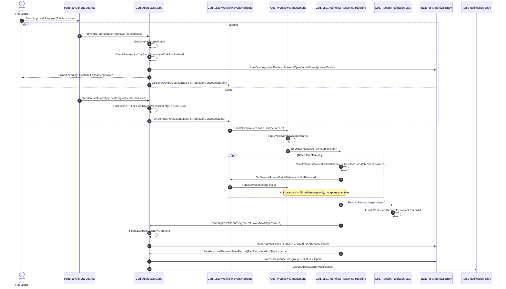
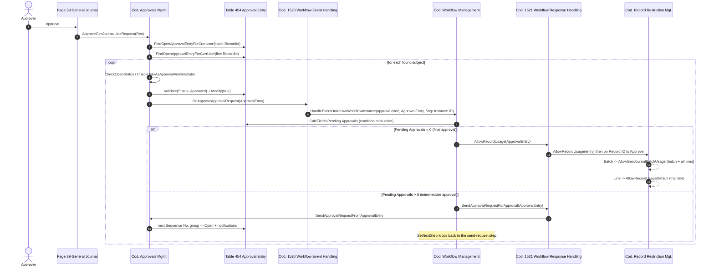
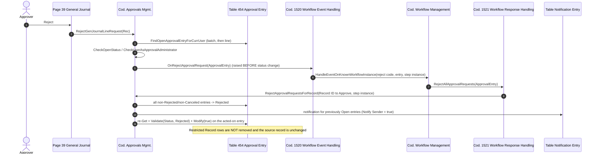
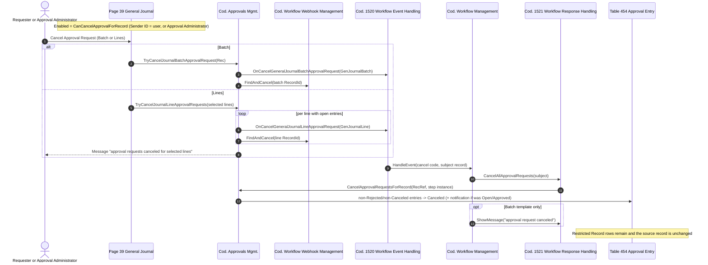
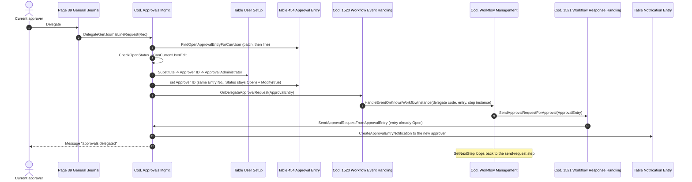

# General Journal Approvals - Session 3: Runtime sequence flows

Scope: the runtime approval lifecycle for General Journals - send, approve, reject, cancel, delegate. Posting enforcement, target-repository design, and deep webhook tracing are out of scope. Encountered posting checks are recorded only as Session 4 pointers (§8).

Context:

- Branch: `gb-29-vNext`, commit `a74fec3ec909d`.
- Snapshot: BC `29.0.53247.0` (GB), per Session 1.
- All evidence below is from checked-in Base Application source unless stated otherwise.

Legend for the "Fact / Interpretation" column: **F** = directly readable in source; **I** = reasoned conclusion from source.

---

## 1. Two parallel approval mechanisms

The General Journal page exposes **two independent, simultaneously-enabled approval paths**:

| Path | Subject record | Entry-point event | Template |
| --- | --- | --- | --- |
| Batch approval | `Gen. Journal Batch` (table 232) | `RUNWORKFLOWONSENDGENERALJOURNALBATCHFORAPPROVAL` | `MS-GJBAPW` |
| Line approval | `Gen. Journal Line` (table 81) | `RUNWORKFLOWONSENDGENERALJOURNALLINEFORAPPROVAL` | `MS-GJLAPW` |

There is also a third, webhook-driven path (`Workflow Webhook Management`) whose *state queries* are interleaved into the same page-action enablement logic (`GetCanRequestAndCanCancel`, `GetCanRequestAndCanCancelJournalBatch`, `FindAndCancel`). This document traces the classic approval path and records the webhook touch-points where they change page behaviour, but does not trace webhook execution (still unresolved from Session 2).

**F** - Both paths are checked on every `OnAfterGetCurrRecord` via `SetApprovalStateForBatch` and on `SetControlAppearance` via `SetApprovalState` ([GeneralJournal.Page.al L2180-L2212](../../../Base%20Application/Finance/GeneralLedger/Journal/GeneralJournal.Page.al#L2180-L2212)).

---

## 2. Scenario A - Send approval request

### 2.1 A-batch: "Send Approval Request → Journal Batch"

| # | Object | Procedure / trigger | Path & lines | Inputs | Outputs / side effects | Accessibility | F/I |
| --- | --- | --- | --- | --- | --- | --- | --- |
| A1 | Page 39 `General Journal` | `action(SendApprovalRequestJournalBatch).OnAction` | [GeneralJournal.Page.al L1359-L1374](../../../Base%20Application/Finance/GeneralLedger/Journal/GeneralJournal.Page.al#L1359-L1374) | `Rec` (`Gen. Journal Line`, current line) | Calls `TrySendJournalBatchApprovalRequest`; then refreshes control appearance | Page action; extendable by page extension | F |
| A2 | - | `Enabled` expression | same, L1363 | `OpenApprovalEntriesOnBatchOrAnyJnlLineExist`, `CanRequestFlowApprovalForBatchAndAllLines`, `EnabledGenJnlBatchWorkflowsExist` | Purely a UI gate; **not** re-evaluated server-side | Page property | F |
| A3 | Cod. `Approvals Mgmt.` | `TrySendJournalBatchApprovalRequest(var GenJournalLine)` | [ApprovalsMgmt.Codeunit.al L2267-L2281](../../../Base%20Application/OtherCapabilities/Approvals/ApprovalsMgmt.Codeunit.al#L2267-L2281) | current line | Resolves the batch, validates, raises `OnSendGeneralJournalBatchForApproval` | Public | F |
| A4 | - | `GetGeneralJournalBatch` | [L2334-L2338](../../../Base%20Application/OtherCapabilities/Approvals/ApprovalsMgmt.Codeunit.al#L2334-L2338) | line's `Journal Template Name` / `Journal Batch Name`, else the record's *filters* | `GenJournalBatch` | local | F |
| A5 | - | `CheckGeneralJournalBatchApprovalsWorkflowEnabled` | [L1720-L1729](../../../Base%20Application/OtherCapabilities/Approvals/ApprovalsMgmt.Codeunit.al#L1720-L1729) | batch | `Error(NoWorkflowEnabledErr)` when `WorkflowManagement.CanExecuteWorkflow` is false | Public | F |
| A6 | - | `HasOpenApprovalEntries(batch.RecordId)` + `HasAnyOpenJournalLineApprovalEntries(template, batch)` | [L2136-L2154](../../../Base%20Application/OtherCapabilities/Approvals/ApprovalsMgmt.Codeunit.al#L2136-L2154), [L2224-L2265](../../../Base%20Application/OtherCapabilities/Approvals/ApprovalsMgmt.Codeunit.al#L2224-L2265) | batch key | `Error(PendingJournalBatchApprovalExistsErr)` - blocks batch send while *any* line has an open request | Public | F |
| A7 | - | `HasApprovedApprovalEntries(batch.RecordId)` | [L2186-L2198](../../../Base%20Application/OtherCapabilities/Approvals/ApprovalsMgmt.Codeunit.al#L2186-L2198) | batch key | `Confirm(...)`; user may abort. Runs `Confirm` unconditionally - not `GuiAllowed`-guarded | Public | F |
| A8 | - | `OnSendGeneralJournalBatchForApproval` | [L157-L160](../../../Base%20Application/OtherCapabilities/Approvals/ApprovalsMgmt.Codeunit.al#L157-L160) | `var GenJournalBatch` | Integration event (non-`local`) | Published extension point | F |
| A9 | Cod. 1520 `Workflow Event Handling` | `RunWorkflowOnSendGeneralJournalBatchForApproval` | [WorkflowEventHandling.Codeunit.al L836-L840](../../../Base%20Application/System/Workflow/WorkflowEventHandling.Codeunit.al#L836-L840) | batch | `WorkflowManagement.HandleEvent(code, GenJournalBatch)` | `EventSubscriber` | F |
| A10 | Cod. `Workflow Management` | `HandleEvent` → `HandleEventWithxRec` | [WorkflowManagement.Codeunit.al L489-L525](../../../Base%20Application/System/Workflow/WorkflowManagement.Codeunit.al#L489-L525) | function name + batch | Exits silently in `Upgrade` execution context and for temporary records; else `FindEventWorkflowStepInstance` + `ExecuteResponses` | Public | F |
| A11 | - | `ExecuteResponses` | [L574-L620](../../../Base%20Application/System/Workflow/WorkflowManagement.Codeunit.al#L574-L620) | actionable step instance | Marks event step `Completed`, walks `FindResponse` chain, calls `WorkflowResponseHandling.ExecuteResponse` per step, archives instance when complete | Public | F |
| A12 | Cod. 1521 `Workflow Response Handling` | `CheckGeneralJournalBatchBalance` | [WorkflowResponseHandling.Codeunit.al L969-L982](../../../Base%20Application/System/Workflow/WorkflowResponseHandling.Codeunit.al#L969-L982) | batch | `GenJournalBatch.CheckBalance()` → raises `OnGeneralJournalBatchBalanced` **or** `OnGeneralJournalBatchNotBalanced` | local | F |
| A13 | Cod. 1520 | `RunWorkflowOnGeneralJournalBatchBalanced` / `...NotBalanced` | [L859-L870](../../../Base%20Application/System/Workflow/WorkflowEventHandling.Codeunit.al#L859-L870) | batch | Second `HandleEvent` pass; the not-balanced branch ends in `ShowMessage` and creates **no** approval entries | `EventSubscriber` | F |
| A14 | Cod. 1521 | `RestrictRecordUsage` | [L1013-L1020](../../../Base%20Application/System/Workflow/WorkflowResponseHandling.Codeunit.al#L1013-L1020) | batch | `Record Restriction Mgt.RestrictRecordUsage(batch, '<workflow code> <description>')` - inserts one `Restricted Record` row for the **batch RecordId only** | local | F |
| A15 | Cod. 1521 | `CreateApprovalRequests` | [L779-L786](../../../Base%20Application/System/Workflow/WorkflowResponseHandling.Codeunit.al#L779-L786) | batch RecRef + step instance | `ApprovalsMgmt.CreateApprovalRequests` | local | F |
| A16 | Cod. `Approvals Mgmt.` | `CreateApprovalRequests` | [L794-L823](../../../Base%20Application/OtherCapabilities/Approvals/ApprovalsMgmt.Codeunit.al#L794-L823) | RecRef, step instance | `PopulateApprovalEntryArgument`, then dispatch on `Workflow Step Argument."Approver Type"`; finally `InformUserOnStatusChange` when `Show Confirmation Message` (true for the batch template) | Public | F |
| A17 | - | `PopulateApprovalEntryArgument` | [L1188-L1287](../../../Base%20Application/OtherCapabilities/Approvals/ApprovalsMgmt.Codeunit.al#L1188-L1287) | RecRef | For `Gen. Journal Batch` the case branch only does `RecRef.SetTable(GenJournalBatch)` - **no** `Document No.`, `Amount`, `Currency Code`, `Salespers./Purch. Code` | Public | F |
| A18 | - | `CreateApprovalRequestForApprover` (default template: `Approver` / `Direct Approver`) | [L1007-L1033](../../../Base%20Application/OtherCapabilities/Approvals/ApprovalsMgmt.Codeunit.al#L1007-L1033) | step argument, entry argument | Requires `User Setup` for the sender (`UserIdNotInSetupErr`), resolves `UserSetup."Approver ID"`, falls back to self if the sender is an `Approval Administrator`; one `MakeApprovalEntry` call | local | F |
| A19 | - | `MakeApprovalEntry` | [L1092-L1144](../../../Base%20Application/OtherCapabilities/Approvals/ApprovalsMgmt.Codeunit.al#L1092-L1144) | argument, sequence no., approver id | Inserts `Approval Entry`; `Status := Approved` when approver = current user, else `Created` | Public | F |
| A20 | Cod. 1521 | `SendApprovalRequestForApproval` | [L812-L826](../../../Base%20Application/System/Workflow/WorkflowResponseHandling.Codeunit.al#L812-L826) | batch RecRef | Dispatches to `SendApprovalRequestFromRecord` (record variant) | local | F |
| A21 | Cod. `Approvals Mgmt.` | `SendApprovalRequestFromRecord` | [L714-L755](../../../Base%20Application/OtherCapabilities/Approvals/ApprovalsMgmt.Codeunit.al#L714-L755) | RecRef, step instance | Finds `Created` entries for this step instance, promotes **the lowest-sequence group only** to `Open`, `CreateApprovalEntryNotification` per entry. If no `Created` entry exists, re-raises `OnApproveApprovalRequest` on the last `Approved` entry, else `Error(NoApprovalRequestsFoundErr)` | Public | F |
| A22 | - | `CreateApprovalEntryNotification` | [L1290-L1319](../../../Base%20Application/OtherCapabilities/Approvals/ApprovalsMgmt.Codeunit.al#L1290-L1319) | entry, step instance | Inserts `Notification Entry` for the approver (suppressed when the approver is the current interactive user) and optionally for the sender (`Notify Sender`) | Public | F |

**Interpretation (I):** the batch template's balance check is the only General Journal-specific structural deviation in the send flow; everything after `RestrictRecordUsage` is the shared approval skeleton. This confirms Session 2 §5b - no contradiction.

### 2.2 A-line: "Send Approval Request → Selected Journal Lines"

| # | Object | Procedure | Path & lines | Behaviour | F/I |
| --- | --- | --- | --- | --- | --- |
| A'1 | Page 39 | `action(SendApprovalRequestJournalLine).OnAction` | [L1376-L1394](../../../Base%20Application/Finance/GeneralLedger/Journal/GeneralJournal.Page.al#L1376-L1394) | `GetCurrentlySelectedLines` (with `[SecurityFiltering(SecurityFilter::Filtered)]`) then `SendJournalLinesApprovalRequests` | F |
| A'2 | `Approvals Mgmt.` | `SendJournalLinesApprovalRequests` | [L2875-L2898](../../../Base%20Application/OtherCapabilities/Approvals/ApprovalsMgmt.Codeunit.al#L2875-L2898) | 1 selected line → `TrySendJournalLineApprovalRequests` inline. >1 line → marks lines without open entries and hands them to `Batch Processing Mgt.BatchProcess(..., Codeunit::"Approvals Journal Line Request", "Show Error", NoOfSelected, NoOfSkipped)` | F |
| A'3 | `Approvals Mgmt.` | `TrySendJournalLineApprovalRequests` | [L2283-L2297](../../../Base%20Application/OtherCapabilities/Approvals/ApprovalsMgmt.Codeunit.al#L2283-L2297) | Workflow-enabled check only when exactly one line is in the set; then per line: `CanExecuteWorkflow` **and** `not HasOpenApprovalEntries(line.RecordId)` → `OnSendGeneralJournalLineForApproval(line)` | F |
| A'4 | Cod. 1536 `Approvals Journal Line Request` | `OnRun` (TableNo = `Gen. Journal Line`) | [ApprovalsJournalLineRequest.Codeunit.al L14-L21](../../../Base%20Application/OtherCapabilities/Approvals/ApprovalsJournalLineRequest.Codeunit.al#L14-L21) | Same guard, one line per invocation, inside the batch-processing error-collection frame | F |
| A'5 | Cod. 1520 | `RunWorkflowOnSendGeneralJournalLineForApproval` | [L848-L852](../../../Base%20Application/System/Workflow/WorkflowEventHandling.Codeunit.al#L848-L852) | `HandleEvent(code, GenJournalLine)` | F |
| A'6 | Template chain | `InsertRecApprovalWorkflowSteps` | [WorkflowSetup.Codeunit.al L1610-L1688](../../../Base%20Application/System/Workflow/WorkflowSetup.Codeunit.al#L1610-L1688) | `RestrictRecordUsage(line)` → `CreateApprovalRequests` → `SendApprovalRequestForApproval`. No balance check, `ShowConfirmationMessage = false` | F |
| A'7 | `Approvals Mgmt.` | `PopulateApprovalEntryArgument`, `Gen. Journal Line` branch | [L1245-L1266](../../../Base%20Application/OtherCapabilities/Approvals/ApprovalsMgmt.Codeunit.al#L1245-L1266) | Maps `Document Type`, `Document No.`, `Salespers./Purch. Code`, `Amount`, `Amount (LCY)`, `Currency Code` from the line | F |

**F** - Approver-limit evaluation is only meaningful for the line subject: `IsSufficientApprover` routes `Gen. Journal Line` to `IsSufficientGenJournalLineApprover` (purchase / sales / G-L-account limits), and for `Gen. Journal Batch` it emits `ApporvalChainIsUnsupportedMsg` and returns `true` ([L1450-L1476](../../../Base%20Application/OtherCapabilities/Approvals/ApprovalsMgmt.Codeunit.al#L1450-L1476)). **I** - an approver chain configured against the batch subject therefore terminates immediately with a message rather than walking the chain.

### 2.3 Send sequence diagram

---

## 3. Scenario B - Approve

| # | Object | Procedure | Path & lines | Behaviour | F/I |
| --- | --- | --- | --- | --- | --- |
| B1 | Page 39 | `action(Approve).OnAction` | [L1455-L1469](../../../Base%20Application/Finance/GeneralLedger/Journal/GeneralJournal.Page.al#L1455-L1469) | `Visible = OpenApprovalEntriesExistForCurrUser` (a page variable that is the **OR** of batch-level and line-level results); calls `ApproveGenJournalLineRequest(Rec)` | F |
| B2 | `Approvals Mgmt.` | `ApproveGenJournalLineRequest` | [L262-L273](../../../Base%20Application/OtherCapabilities/Approvals/ApprovalsMgmt.Codeunit.al#L262-L273) | Checks the **batch** RecordId first, then the **line** RecordId; approves whichever has an open entry for the current user. Both can be approved in one click | F |
| B3 | - | `ApproveRecordApprovalRequest` | [L251-L260](../../../Base%20Application/OtherCapabilities/Approvals/ApprovalsMgmt.Codeunit.al#L251-L260) | `FindOpenApprovalEntryForCurrUser` else `Error(NoReqToApproveErr)`; `SetRecFilter` narrows to that single entry | F |
| B4 | - | `FindOpenApprovalEntryForCurrUser` | [L546-L558](../../../Base%20Application/OtherCapabilities/Approvals/ApprovalsMgmt.Codeunit.al#L546-L558) | Filters `Table ID`, `Record ID to Approve`, `Status = Open`, `Approver ID = UserId`, `Related to Change = false` | F |
| B5 | - | `ApproveSelectedApprovalRequest` | [L438-L454](../../../Base%20Application/OtherCapabilities/Approvals/ApprovalsMgmt.Codeunit.al#L438-L454) | `CheckOpenStatus` (`ApproveOnlyOpenRequestsErr`); if `Approver ID <> UserId` → `CheckUserAsApprovalAdministrator`; `Validate(Status, Approved)`, `Modify(true)`; then `OnApproveApprovalRequest(ApprovalEntry)` | F |
| B6 | Table 454 | `OnModify` | [ApprovalEntry.Table.al L251-L256](../../../Base%20Application/OtherCapabilities/Approvals/ApprovalEntry.Table.al#L251-L256) | Stamps `Last Date-Time Modified`, `Last Modified By User ID` | F |
| B7 | Cod. 1520 | `RunWorkflowOnApproveApprovalRequest` | [L752-L759](../../../Base%20Application/System/Workflow/WorkflowEventHandling.Codeunit.al#L752-L759) | `HandleEventOnKnownWorkflowInstance(code, ApprovalEntry, ApprovalEntry."Workflow Step Instance ID")` - **the approval entry itself is the event record** | F |
| B8 | `Workflow Management` | `HandleEventWithxRecOnKnownWorkflowInstance` | [L533-L570](../../../Base%20Application/System/Workflow/WorkflowManagement.Codeunit.al#L533-L570) | Filters `Workflow Step Instance` by ID + `Status = Active` + `Function Name`, evaluates each candidate's condition, executes the **first matching** step | F |
| B9 | Cod. 1502 | `BuildNoPendingApprovalsConditions` / `BuildPendingApprovalsConditions` | [WorkflowSetup.Codeunit.al L2473-L2487](../../../Base%20Application/System/Workflow/WorkflowSetup.Codeunit.al#L2473-L2487) | Encoded views on `Approval Entry."Pending Approvals"` = `0` vs `>0`. **This is the final-approval detection mechanism** | F |
| B10 | Table 454 | field 21 `Pending Approvals` | [ApprovalEntry.Table.al L133-L140](../../../Base%20Application/OtherCapabilities/Approvals/ApprovalEntry.Table.al#L133-L140) | FlowField `count("Approval Entry" where "Record ID to Approve" = field(...), Status = filter(Created\|Open), "Workflow Step Instance ID" = field(...))` | F |
| B11 | Cod. 1521 | Final branch: `AllowRecordUsage` | [L1022-L1074](../../../Base%20Application/System/Workflow/WorkflowResponseHandling.Codeunit.al#L1022-L1074) | Variant is an `Approval Entry`: removes its own restriction, then `RecRef.Get("Record ID to Approve")` and recurses. `Gen. Journal Batch` → `AllowGenJournalBatchUsage` (batch **and every line**); `Gen. Journal Line` → `AllowRecordUsageDefault` (that line only) | F |
| B12 | Cod. 1521 | Intermediate branch: `SendApprovalRequestForApproval` | [L812-L826](../../../Base%20Application/System/Workflow/WorkflowResponseHandling.Codeunit.al#L812-L826) | Variant is an `Approval Entry` → `SendApprovalRequestFromApprovalEntry` | F |
| B13 | `Approvals Mgmt.` | `SendApprovalRequestFromApprovalEntry` | [L757-L792](../../../Base%20Application/OtherCapabilities/Approvals/ApprovalsMgmt.Codeunit.al#L757-L792) | If the entry is already `Open` → notification only. If open entries remain for the step instance → exit. Otherwise promotes the next `Created` sequence group to `Open` + notifications | F |
| B14 | Cod. 1502 | `SetNextStep(SendApprovalRequestResponseID2, SendApprovalRequestResponseID)` | [L1653-L1655](../../../Base%20Application/System/Workflow/WorkflowSetup.Codeunit.al#L1650-L1656) | The intermediate-approval response loops back to the original send-request step, so the same approve/reject/cancel/delegate event steps stay armed | F |

**I** - "Final approval" is therefore not a flag on the source record; it is the moment when no `Created`/`Open` entry remains for the *same* `Record ID to Approve` + `Workflow Step Instance ID` pair. Approving one line does not affect any other line or the batch.

**F** - `Record Restriction Mgt.AllowRecordUsage` deletes **all** `Restricted Record` rows matching the record, regardless of which `Details` text imposed them ([RecordRestrictionMgt.Codeunit.al L112-L129](../../../Base%20Application/System/Workflow/RecordRestrictionMgt.Codeunit.al#L112-L129)). **I** - final approval of a *batch* therefore also clears line-level restrictions that were imposed by the *line* workflow, if both are enabled. This is a real cross-path interaction and is carried forward as an open risk for Session 4.

### 3.1 Approve sequence diagram

---

## 4. Scenario C - Reject

| # | Object | Procedure | Path & lines | Behaviour | F/I |
| --- | --- | --- | --- | --- | --- |
| C1 | Page 39 | `action(Reject).OnAction` | [L1470-L1484](../../../Base%20Application/Finance/GeneralLedger/Journal/GeneralJournal.Page.al#L1470-L1484) | `Visible = OpenApprovalEntriesExistForCurrUser`; `RejectGenJournalLineRequest(Rec)` | F |
| C2 | `Approvals Mgmt.` | `RejectGenJournalLineRequest` | [L306-L317](../../../Base%20Application/OtherCapabilities/Approvals/ApprovalsMgmt.Codeunit.al#L306-L317) | Same batch-then-line pattern as approve | F |
| C3 | - | `RejectSelectedApprovalRequest` | [L456-L475](../../../Base%20Application/OtherCapabilities/Approvals/ApprovalsMgmt.Codeunit.al#L456-L475) | `CheckOpenStatus` (`RejectOnlyOpenRequestsErr`), administrator check, then **`OnRejectApprovalRequest` is raised *before* the entry is set to `Rejected`**, after which the entry is re-`Get`, validated to `Rejected` and modified | F |
| C4 | Cod. 1520 | `RunWorkflowOnRejectApprovalRequest` | [L768-L774](../../../Base%20Application/System/Workflow/WorkflowEventHandling.Codeunit.al#L768-L774) | `HandleEventOnKnownWorkflowInstance` on the entry's step instance | F |
| C5 | Cod. 1521 | `RejectAllApprovalRequests` | [L847-L865](../../../Base%20Application/System/Workflow/WorkflowResponseHandling.Codeunit.al#L847-L865) | Variant is an `Approval Entry` → resolves `Record ID to Approve` → `ApprovalsMgmt.RejectApprovalRequestsForRecord` | F |
| C6 | `Approvals Mgmt.` | `RejectApprovalRequestsForRecord` | [L683-L712](../../../Base%20Application/OtherCapabilities/Approvals/ApprovalsMgmt.Codeunit.al#L683-L712) | All entries for that record + step instance whose status is not already `Rejected`/`Canceled` → `Rejected`; notification only for entries that were `Open`. `Notify Sender = true` on this response's argument ([WorkflowSetup L1661-L1663](../../../Base%20Application/System/Workflow/WorkflowSetup.Codeunit.al#L1657-L1665)) | F |

**F** - Neither the batch template nor the line template inserts an `AllowRecordUsage` step in the reject branch ([WorkflowSetup L1657-L1665](../../../Base%20Application/System/Workflow/WorkflowSetup.Codeunit.al#L1657-L1665) and [L1811-L1817](../../../Base%20Application/System/Workflow/WorkflowSetup.Codeunit.al#L1811-L1817)).

**Source-record effect:** none. The `Gen. Journal Line` / `Gen. Journal Batch` record is not modified, has no status field, and stays restricted.

**Resubmission:** allowed. Rejected entries are neither `Open` nor `Created`, so `HasOpenApprovalEntries` is false and the send guards pass. **I** - a new send creates a *new* `Workflow Step Instance ID` and a *new* set of approval entries; the rejected entries persist as history and remain visible on the Approval Entries page.

---

## 5. Scenario D - Cancel

| # | Object | Procedure | Path & lines | Behaviour | F/I |
| --- | --- | --- | --- | --- | --- |
| D1 | Page 39 | `action(CancelApprovalRequestJournalBatch).OnAction` | [L1400-L1415](../../../Base%20Application/Finance/GeneralLedger/Journal/GeneralJournal.Page.al#L1400-L1415) | `Enabled = CanCancelApprovalForJnlBatch or CanCancelFlowApprovalForBatch`; `TryCancelJournalBatchApprovalRequest(Rec)` | F |
| D2 | Page 39 | `action(CancelApprovalRequestJournalLine).OnAction` | [L1417-L1433](../../../Base%20Application/Finance/GeneralLedger/Journal/GeneralJournal.Page.al#L1417-L1433) | `Enabled = CanCancelApprovalForJnlLine or CanCancelFlowApprovalForLine`; `GetCurrentlySelectedLines` → `TryCancelJournalLineApprovalRequests` | F |
| D3 | `Approvals Mgmt.` | `CanCancelApprovalForRecord` | [L2595-L2615](../../../Base%20Application/OtherCapabilities/Approvals/ApprovalsMgmt.Codeunit.al#L2595-L2615) | Requires a `User Setup` record; entries with `Status` in `Created\|Open`; unless the user is an `Approval Administrator`, additionally `Sender ID = UserId`. **This is the only requester validation** | F |
| D4 | `Approvals Mgmt.` | `TryCancelJournalBatchApprovalRequest` | [L2299-L2307](../../../Base%20Application/OtherCapabilities/Approvals/ApprovalsMgmt.Codeunit.al#L2299-L2307) | Resolves the batch, raises `OnCancelGeneralJournalBatchApprovalRequest`, then `WorkflowWebhookManagement.FindAndCancel(batch.RecordId)`. **No requester or open-entry check inside the procedure** | F |
| D5 | `Approvals Mgmt.` | `TryCancelJournalLineApprovalRequests` | [L2309-L2319](../../../Base%20Application/OtherCapabilities/Approvals/ApprovalsMgmt.Codeunit.al#L2309-L2319) | Per line: `HasOpenApprovalEntries` → raise cancel event; always `FindAndCancel` webhook; ends with `Message(ApprovalReqCanceledForSelectedLinesMsg)` (unconditional `Message`, no `GuiAllowed` guard) | F |
| D6 | Cod. 1520 | `RunWorkflowOnCancelGeneralJournal...ApprovalRequest` | [L842-L858](../../../Base%20Application/System/Workflow/WorkflowEventHandling.Codeunit.al#L842-L858) | `HandleEvent(cancel code, batch or line)` - note this is the *record*, not the approval entry | F |
| D7 | Cod. 1521 | `CancelAllApprovalRequests` | [L867-L885](../../../Base%20Application/System/Workflow/WorkflowResponseHandling.Codeunit.al#L867-L885) | `ApprovalsMgmt.CancelApprovalRequestsForRecord` | F |
| D8 | `Approvals Mgmt.` | `CancelApprovalRequestsForRecord` | [L659-L681](../../../Base%20Application/OtherCapabilities/Approvals/ApprovalsMgmt.Codeunit.al#L659-L681) | All entries for the record + step instance that are not already `Rejected`/`Canceled` → `Canceled`; notification when the previous status was `Open` or `Approved` | F |
| D9 | Cod. 1502 | Cancel branch of both templates | [L1815-L1822](../../../Base%20Application/System/Workflow/WorkflowSetup.Codeunit.al#L1815-L1822) (batch), [L1666-L1682](../../../Base%20Application/System/Workflow/WorkflowSetup.Codeunit.al#L1666-L1682) (line, `RemoveRestrictionOnCancel = false`) | Batch: cancel-all → `ShowMessage('approval request canceled')`. Line: cancel-all only. **Neither removes the record restriction** | F |
| D10 | Table 81 / 232 | `OnDelete` / `OnInsert` | [GenJournalLine.Table.al L3902-L3949](../../../Base%20Application/Finance/GeneralLedger/Journal/GenJournalLine.Table.al#L3902-L3949), [L3951-L3979](../../../Base%20Application/Finance/GeneralLedger/Journal/GenJournalLine.Table.al#L3951-L3979) | Deleting the *last* line of a batch, or inserting into a batch with an open request, routes through `PreventDeletingRecordWithOpenApprovalEntry` / `PreventInsertRecIfOpenApprovalEntryExist`, which for `Gen. Journal Batch` **offer to cancel the batch approval via `Confirm`** and then raise the same cancel event ([ApprovalsMgmt L2706-L2799](../../../Base%20Application/OtherCapabilities/Approvals/ApprovalsMgmt.Codeunit.al#L2706-L2799)). For `Gen. Journal Line` the delete is simply blocked with `PreventDeleteRecordWithOpenApprovalEntryForSenderMsg` | F |

**I / risk:** the direct-cancel path performs its requester validation only through the page action's `Enabled` property. `TryCancelJournalBatchApprovalRequest` and `TryCancelJournalLineApprovalRequests` are ordinary public procedures on `Approvals Mgmt.`; any code path that calls them (web service, extension, test) bypasses `CanCancelApprovalForRecord` entirely. Recorded as an unresolved risk, not asserted as a defect, because the workflow response itself only touches entries belonging to the resolved step instance.

**Resulting source-record state:** unchanged record, entries `Canceled`, restriction still present. **I** - the restriction is intentional: with an approval workflow enabled the line is re-restricted on every insert/modify anyway (see §7), so removing it on cancel would only be cosmetic.

---

## 6. Scenario E - Delegate

Delegation **is** supported for both General Journal subjects.

| # | Object | Procedure | Path & lines | Behaviour | F/I |
| --- | --- | --- | --- | --- | --- |
| E1 | Page 39 | `action(Delegate).OnAction` | [L1485-L1499](../../../Base%20Application/Finance/GeneralLedger/Journal/GeneralJournal.Page.al#L1485-L1499) | `Visible = OpenApprovalEntriesExistForCurrUser`; `DelegateGenJournalLineRequest(Rec)` | F |
| E2 | `Approvals Mgmt.` | `DelegateGenJournalLineRequest` → `DelegateRecordApprovalRequest` → `DelegateApprovalRequests` | [L350-L361](../../../Base%20Application/OtherCapabilities/Approvals/ApprovalsMgmt.Codeunit.al#L350-L361), [L339-L348](../../../Base%20Application/OtherCapabilities/Approvals/ApprovalsMgmt.Codeunit.al#L339-L348), [L417-L436](../../../Base%20Application/OtherCapabilities/Approvals/ApprovalsMgmt.Codeunit.al#L417-L436) | Same batch-then-line pattern; `Message(ApprovalsDelegatedMsg)` after the loop | F |
| E3 | - | `DelegateSelectedApprovalRequest(entry, CheckCurrentUser = true)` | [L477-L498](../../../Base%20Application/OtherCapabilities/Approvals/ApprovalsMgmt.Codeunit.al#L477-L498) | `CheckOpenStatus` (`DelegateOnlyOpenRequestsErr`); `ApprovalEntry.CanCurrentUserEdit()` else `Error(NoPermissionToDelegateErr)` | F |
| E4 | - | `SubstituteUserIdForApprovalEntry` | [L513-L544](../../../Base%20Application/OtherCapabilities/Approvals/ApprovalsMgmt.Codeunit.al#L513-L544) | Resolution order: `User Setup.Substitute` → `User Setup."Approver ID"` → first `Approval Administrator`; else `SubstituteNotFoundErr`. Updates `Approver ID` **in place** (same `Entry No.`, same `Sequence No.`, status stays `Open`), `Modify(true)`, then `OnDelegateApprovalRequest` | F |
| E5 | Cod. 1520 | `RunWorkflowOnDelegateApprovalRequest` | [L761-L766](../../../Base%20Application/System/Workflow/WorkflowEventHandling.Codeunit.al#L761-L766) | `HandleEventOnKnownWorkflowInstance` | F |
| E6 | Cod. 1521 / `Approvals Mgmt.` | `SendApprovalRequestForApproval` → `SendApprovalRequestFromApprovalEntry` | [L757-L768](../../../Base%20Application/OtherCapabilities/Approvals/ApprovalsMgmt.Codeunit.al#L757-L768) | Entry is `Open`, so the procedure only issues `CreateApprovalEntryNotification` to the new approver and exits | F |
| E7 | Cod. 1502 | `SetNextStep(SentApprovalRequestResponseID3, SendApprovalRequestResponseID)` | [L1685-L1687](../../../Base%20Application/System/Workflow/WorkflowSetup.Codeunit.al#L1683-L1688) | Delegate branch loops back to the send-request step, keeping approve/reject/cancel/delegate armed | F |

**F** - No new approval entry is created and no sequence renumbering occurs. **F** - `Delegation Date Formula` is stamped at creation from `Workflow Step Argument."Delegate After"` ([ApprovalsMgmt L1118-L1130](../../../Base%20Application/OtherCapabilities/Approvals/ApprovalsMgmt.Codeunit.al#L1118-L1130)); the standard General Journal templates leave `Delegate After` at its default, so this yields a blank formula.

---

## 7. Restriction lifecycle (summary of runtime effects)

| Trigger | Code | Effect |
| --- | --- | --- |
| Workflow response `RestrictRecordUsage` | [WorkflowResponseHandling L1013-L1020](../../../Base%20Application/System/Workflow/WorkflowResponseHandling.Codeunit.al#L1013-L1020) | One `Restricted Record` row for the **subject** RecordId, `Details` = "`<workflow code> <description>`" |
| `Gen. Journal Line` insert / modify while a GJ approval workflow is enabled | [RecordRestrictionMgt L153-L180](../../../Base%20Application/System/Workflow/RecordRestrictionMgt.Codeunit.al#L153-L180) | Per-line rows with `Details` = "line requires approval" and/or "journal batch requires approval" - imposed by **table event subscribers**, independently of any pending request |
| Final approval (`Pending Approvals = 0`) | [WorkflowResponseHandling L1022-L1074](../../../Base%20Application/System/Workflow/WorkflowResponseHandling.Codeunit.al#L1022-L1074) | Batch subject → `AllowGenJournalBatchUsage` (batch + all lines); line subject → that line only |
| Reject / Cancel | template chains, §4 and §5 | No restriction removal |
| Batch posting move | `PostApprovalEntriesMoveGenJournalBatch` [ApprovalsMgmt L1785-L1794](../../../Base%20Application/OtherCapabilities/Approvals/ApprovalsMgmt.Codeunit.al#L1785-L1794) | `AllowRecordUsage(batch)` + delete approval entries after posting |

**I** - because line-level restriction rows are (re-)created by `OnAfterInsertEvent`/`OnAfterModifyEvent` subscribers whenever *any* General Journal approval workflow is enabled, restriction presence is **not** a reliable indicator of "a request is pending". The approval status shown on the page deliberately combines both signals (`GetApprovalStatusFromApprovalEntry`, [ApprovalsMgmt L2987-L3050](../../../Base%20Application/OtherCapabilities/Approvals/ApprovalsMgmt.Codeunit.al#L2987-L3050)).

---

## 8. Posting-enforcement pointers for Session 4 (not traced here)

- `Record Restriction Mgt.GenJournalBatchCheckGenJournalLinePostRestrictions` and the three sibling subscribers on `Gen. Journal Line.OnCheckGenJournalLinePostRestrictions` ([RecordRestrictionMgt L360-L436](../../../Base%20Application/System/Workflow/RecordRestrictionMgt.Codeunit.al#L360-L436), [L506-L521](../../../Base%20Application/System/Workflow/RecordRestrictionMgt.Codeunit.al#L506-L521)).
- `Gen. Journal Line.OnCheckGenJournalLineExportRestrictions` / `OnCheckGenJournalLinePrintCheckRestrictions` subscribers ([L436-L556](../../../Base%20Application/System/Workflow/RecordRestrictionMgt.Codeunit.al#L436-L556)).
- `Approvals Mgmt.PostApprovalEntriesMoveGenJournalLine` on `Gen. Jnl.-Post Line.OnMoveGenJournalLine` ([L1771-L1776](../../../Base%20Application/OtherCapabilities/Approvals/ApprovalsMgmt.Codeunit.al#L1771-L1776)) and `PostApprovalEntriesMoveGenJournalBatch` on `Gen. Journal Batch.OnMoveGenJournalBatch` ([L1784-L1794](../../../Base%20Application/OtherCapabilities/Approvals/ApprovalsMgmt.Codeunit.al#L1784-L1794)) - both feed `PostApprovalEntries` / `Posted Approval Entry`.
- `CheckRecordHasUsageRestrictions` ([L289-L321](../../../Base%20Application/System/Workflow/RecordRestrictionMgt.Codeunit.al#L289-L321)) is the single error-raising choke point.

---

## 9. Accessibility classification of the runtime surface

| Symbol | Classification | Note |
| --- | --- | --- |
| `Approvals Mgmt.TrySendJournalBatchApprovalRequest` / `TrySendJournalLineApprovalRequests` / `SendJournalLinesApprovalRequests` / `TryCancelJournal*` / `Approve...`, `Reject...`, `DelegateGenJournalLineRequest` / `ShowJournalApprovalEntries` | **Public supported dependency** | Ordinary public procedures; the standard call surface for a target extension replicating the page actions |
| `Approvals Mgmt.OnSendGeneralJournal*ForApproval` / `OnCancelGeneralJournal*ApprovalRequest` | **Published extension point** (non-`local` `IntegrationEvent`) | Callable *and* subscribable; calling directly bypasses the `Try...` guards |
| `Approvals Mgmt.OnApproveApprovalRequest` / `OnRejectApprovalRequest` / `OnDelegateApprovalRequest` | **Published extension point** (`local` `IntegrationEvent`) | Subscribe-only; these are what drive the approve/reject/delegate workflow legs |
| `Approvals Mgmt.CreateApprovalRequests`, `MakeApprovalEntry`, `PopulateApprovalEntryArgument`, `SendApprovalRequestFromRecord`, `SendApprovalRequestFromApprovalEntry`, `CreateApprovalEntryNotification`, `GetLastSequenceNo` | **Public supported dependency** | Used to implement custom responses |
| `Approvals Mgmt.ApproveSelectedApprovalRequest`, `RejectSelectedApprovalRequest`, `SubstituteUserIdForApprovalEntry`, `CheckOpenStatus`, `CheckUserAsApprovalAdministrator` | **Observable but inaccessible implementation** (`local`) | Behaviour must be influenced through the `OnBefore*` handled-pattern events instead |
| `Approvals Mgmt.PreventModifyRecIfOpenApprovalEntryExist` | **Observable but inaccessible implementation** (`internal`) | The `...ForCurrentUser` variant is public |
| `Workflow Management.HandleEvent`, `HandleEventOnKnownWorkflowInstance`, `CanExecuteWorkflow`, `EnabledWorkflowExist`, `ExecuteResponses` | **Public supported dependency** | - |
| `Workflow Response Handling` response implementations (`CreateApprovalRequests`, `SendApprovalRequestForApproval`, `RestrictRecordUsage`, `AllowRecordUsage`, `Cancel/RejectAllApprovalRequests`, `CheckGeneralJournalBatchBalance`) | **Observable but inaccessible implementation** (`local`) | Reached only via `ExecuteResponse` dispatch; extend by registering a new response code |
| `Record Restriction Mgt.RestrictRecordUsage`, `AllowRecordUsage`, `AllowGenJournalBatchUsage`, `CheckRecordHasUsageRestrictions` | **Public supported dependency** | - |
| `Page 39` approval variables (`OpenApprovalEntriesExistForCurrUser`, `CanCancelApprovalForJnlBatch`, ...) | **Observable but inaccessible implementation** | Page-local; a page extension must recompute them via `Approvals Mgmt.` / `Workflow Webhook Management` |
| `Workflow Webhook Management.GetCanRequestAndCanCancel*`, `FindAndCancel`, `HasPendingWorkflowWebhookEntryByRecordId` | **Version-sensitive or uncertain** | Called from the traced paths but not itself traced this session (carried forward from Session 2) |

---

## 10. Contradictions with earlier sessions

**Resolved.** [00-environment-and-reconnaissance.md](00-environment-and-reconnaissance.md) originally recorded the repository branch as `main`. The correct branch is **`gb-29-vNext`** (commit `a74fec3ec909d`), confirmed against the local Git state; the Session 1 document has been corrected. The application version (`29.0.53247.0`, GB) was consistent throughout, so no Session 1 conclusion is affected.

Two refinements of Session 2 statements (not contradictions):

1. Session 2 described the batch template's cancel branch as "cancel all approvals (+ notification) → show message"; this session confirms that and adds explicitly that **no restriction removal occurs on cancel or reject in either template**.
2. Session 2 listed `CreateApprovalRequestsCode` as the response that "actually creates `Approval Entry` rows". Confirmed, with the addition that the number of rows is decided by `Workflow Step Argument."Approver Type"`/`"Approver Limit Type"`, and that for the `Gen. Journal Batch` subject the approver-chain limit logic is explicitly unsupported (`ApporvalChainIsUnsupportedMsg`).

---

### Next-session handoff

- Facts established:
  - The page action surface is thin: every approval action delegates to a public `Approvals Mgmt.` procedure; all eligibility gating other than `CheckGeneralJournal*ApprovalsWorkflowEnabled`, `HasOpenApprovalEntries` and `HasApprovedApprovalEntries` lives in page `Enabled`/`Visible` properties.
  - Send-batch is blocked while *any* line in the batch has an open request (`HasAnyOpenJournalLineApprovalEntries`).
  - The batch template runs `CheckGeneralJournalBatchBalance` first, which re-enters the workflow engine through `OnGeneralJournalBatchBalanced` / `OnGeneralJournalBatchNotBalanced`; the not-balanced branch produces a message and no approval entries.
  - Approval entries are created exclusively by `Approvals Mgmt.MakeApprovalEntry`, called from the `CreateApprovalRequestsCode` response via the approver-type dispatch in `CreateApprovalRequests`.
  - Final approval is detected by the workflow *event condition* on the `Approval Entry."Pending Approvals"` FlowField (`= 0` vs `> 0`), scoped to `Record ID to Approve` + `Workflow Step Instance ID`.
  - Approve/Reject/Delegate all run `HandleEventOnKnownWorkflowInstance` with the `Approval Entry` as the event record and its `Workflow Step Instance ID` as the instance key.
  - Delegation mutates `Approver ID` on the existing entry; no new entry, no new sequence.
  - Reject and Cancel leave `Restricted Record` rows in place; only final approval (or batch posting) removes them.
  - `IsSufficientApprover` explicitly does not support approver chains for the `Gen. Journal Batch` subject.
- Standard symbols verified:
  - `Codeunit "Approvals Mgmt."`, `Codeunit "Workflow Management"` (`HandleEvent`, `HandleEventWithxRec`, `HandleEventOnKnownWorkflowInstance`, `ExecuteResponses`, `FindResponse`, `FindEventWorkflowStepInstance`, `CanExecuteWorkflow`, `EnabledWorkflowExist`), `Codeunit "Workflow Response Handling"` (`ExecuteResponse` implementations), `Codeunit "Record Restriction Mgt."`, `Codeunit 1536 "Approvals Journal Line Request"`, `Table 454 "Approval Entry"`, `Enum "Approval Status"`, `Table "Restricted Record"`, `Table "Notification Entry"`, `Codeunit "Batch Processing Mgt."`.
- Target-specific symbols verified:
  - `Page 39 "General Journal"` actions `SendApprovalRequestJournalBatch`, `SendApprovalRequestJournalLine`, `CancelApprovalRequestJournalBatch`, `CancelApprovalRequestJournalLine`, `Approve`, `Reject`, `Delegate`, `Comments`, `Approvals`; procedures `SetApprovalState`, `SetApprovalStateForBatch`.
  - `Approvals Mgmt.` General Journal procedures listed in §9.
  - `Table 81 "Gen. Journal Line"` `OnInsert`/`OnModify`/`OnDelete`/`OnRename` approval hooks; `Table 232 "Gen. Journal Batch"` equivalents.
- Important interpretations:
  - Final approval of a *batch* clears line-level restrictions as well, because `AllowGenJournalBatchUsage` deletes every `Restricted Record` row for the batch and all its lines regardless of which workflow imposed them.
  - Restriction presence is not equivalent to "approval pending", because table-event subscribers re-impose line restrictions on every insert/modify while a workflow is enabled.
  - Requester validation for cancel is enforced only by the page action's `Enabled` property, not inside `Approvals Mgmt.`.
  - A re-send after rejection produces a new `Workflow Step Instance ID` and a fresh entry set; historical entries are retained.
- Unresolved questions:
  - Webhook path (`Workflow Webhook Management`) behaviour when both classic and webhook approvals are active on the same record - still untraced (carried from Session 2).
  - Whether the intermediate-approval loop-back can re-notify an approver who was already notified (Session 2 question; §3 narrows it - `SendApprovalRequestFromApprovalEntry` exits early when open entries already exist for the step instance - but this was not executed or tested).
  - `Confirm`/`Message` calls in `TrySendJournalBatchApprovalRequest` and `TryCancelJournalLineApprovalRequests` are not `GuiAllowed`-guarded; behaviour in job-queue/web-service contexts is unverified.
  - Consequence of a batch-level and a line-level workflow both being enabled and both restricting the same lines - the interaction is visible in code but not covered by an inspected test.
- Version-sensitive findings:
  - Condition strings are stored as encoded `Approval Entry` views (`BuildNoPendingApprovalsConditions` / `BuildPendingApprovalsConditions`); a change to the `Pending Approvals` FlowField definition would silently change final-approval detection.
  - `Enum "Approval Status"` ordinals (`Created 0, Open 1, Canceled 2, Rejected 3, Approved 4, ' ' 5`) are relied on by `GetApprovalEntryStatusValueName`, which uses `Status.AsInteger() + 1` as a 1-based enum index.
  - GB localization affects captions used by the page's `Approval Status` text fields only, not the logic.
- Files that provide the strongest evidence:
  - Base Application/Finance/GeneralLedger/Journal/GeneralJournal.Page.al
  - Base Application/OtherCapabilities/Approvals/ApprovalsMgmt.Codeunit.al
  - Base Application/System/Workflow/WorkflowManagement.Codeunit.al
  - Base Application/System/Workflow/WorkflowResponseHandling.Codeunit.al
  - Base Application/System/Workflow/WorkflowSetup.Codeunit.al
  - Base Application/System/Workflow/WorkflowEventHandling.Codeunit.al
  - Base Application/System/Workflow/RecordRestrictionMgt.Codeunit.al
  - Base Application/OtherCapabilities/Approvals/ApprovalEntry.Table.al
  - Base Application/Finance/GeneralLedger/Journal/GenJournalLine.Table.al
  - Tests-General Journal/GeneralJournalLineApproval.Codeunit.al
- Documents created:
  - .design/architecture/general-journal-approvals/03-runtime-sequence-flows.md
  - .design/architecture/general-journal-approvals/04-approval-subject-and-state-model.md
- Recommended scope for the next session:
  - Session 4: posting and export enforcement - trace `OnCheckGenJournalLinePostRestrictions` subscribers, `CheckRecordHasUsageRestrictions`, `PostApprovalEntries` / `Posted Approval Entry`, and the interaction between batch-level and line-level restrictions during posting, using the pointers in §8.
