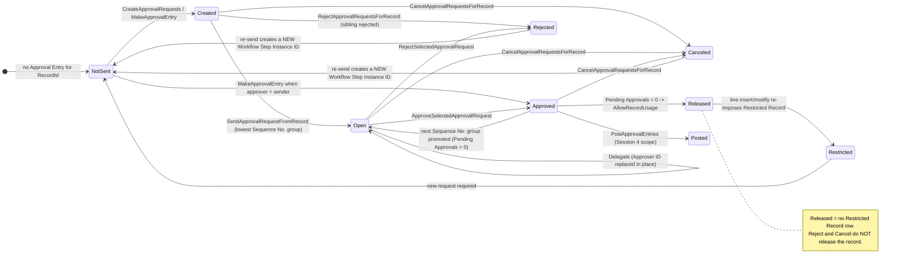

# General Journal Approvals - Session 3: Approval subject and state model

Companion to [03-runtime-sequence-flows.md](03-runtime-sequence-flows.md). Same Git context: branch `gb-29-vNext`, commit `a74fec3ec909d`, BC `29.0.53247.0` (GB).

Legend: **F** = fact readable in source; **I** = interpretation.

---

## 1. The exact approval subject

General Journal approval is **hybrid**: two distinct subjects exist, governed by two separate workflow templates, and both can be active at the same time on the same page.

| | Batch approval | Line approval |
| --- | --- | --- |
| Source table | `Gen. Journal Batch` | `Gen. Journal Line` |
| Table ID | **232** | **81** |
| Workflow template | `MS-GJBAPW` (code `GJBAPW`) | `MS-GJLAPW` (code `GJLAPW`) |
| Entry-point event | `RUNWORKFLOWONSENDGENERALJOURNALBATCHFORAPPROVAL` | `RUNWORKFLOWONSENDGENERALJOURNALLINEFORAPPROVAL` |
| Approval granularity | one request per batch, regardless of line count | one request per line |
| Approver-limit support | not supported (`ApporvalChainIsUnsupportedMsg`) | supported (purchase / sales / G-L-account limits) |
| Balance pre-check | yes (`CheckGeneralJournalBatchBalance`) | no |
| Confirmation message on send | yes (`Show Confirmation Message = true`) | no |

**F** - Both table IDs are registered as approval subjects in `Workflow Setup.InsertApprovalsTableRelations` ([WorkflowSetup.Codeunit.al L283-L322](../../../Base%20Application/System/Workflow/WorkflowSetup.Codeunit.al#L283-L322)), mapping `Gen. Journal Line` and `Gen. Journal Batch` to `Approval Entry."Record ID to Approve"`.

**F** - There is no header record and no status field on either table. `Gen. Journal Batch` has no approval-status field, and the page's `GenJnlBatchApprovalStatus` / `GenJnlLineApprovalStatus` are **page variables computed on the fly**, not stored data ([GeneralJournal.Page.al L155-L163, L262-L270](../../../Base%20Application/Finance/GeneralLedger/Journal/GeneralJournal.Page.al#L155-L163)).

**I** - "The approval subject" cannot be answered with a single table for General Journals. Any target design must model both subjects, or explicitly choose one and document the loss of the other.

### 1.1 Journal template / batch / line relationship

```
Gen. Journal Template (Name)
  └── Gen. Journal Batch  (Journal Template Name, Name)          <- subject of MS-GJBAPW
        └── Gen. Journal Line (Journal Template Name,
                               Journal Batch Name, Line No.)     <- subject of MS-GJLAPW
```

- The `Gen. Journal Template` is never an approval subject. **F**
- Page 39 is a *line* page: `Rec` is always a `Gen. Journal Line`, and the batch is resolved from the line's `Journal Template Name` / `Journal Batch Name`, or from the record's filters when no line exists (`GetGeneralJournalBatch`, [ApprovalsMgmt.Codeunit.al L2334-L2338](../../../Base%20Application/OtherCapabilities/Approvals/ApprovalsMgmt.Codeunit.al#L2334-L2338)). **F**
- **I** - consequence: on an *empty* batch, `GetGeneralJournalBatch` falls back to the filters, so a batch approval can still be requested with no lines. There is no "nothing to approve" guard equivalent to `CheckSalesApprovalPossible`/`CheckPurchaseApprovalPossible`.

### 1.2 Exact `RecordId` values

| Subject | `RecordId` composition | Produced at |
| --- | --- | --- |
| Batch | `Gen. Journal Batch: <Journal Template Name>, <Name>` | `GenJournalBatch.RecordId` in the page and in `TrySendJournalBatchApprovalRequest` |
| Line | `Gen. Journal Line: <Journal Template Name>, <Journal Batch Name>, <Line No.>` | `GenJournalLine.RecordId` / `RecRef.RecordId` in `PopulateApprovalEntryArgument` |

**F** - `PopulateApprovalEntryArgument` sets `"Record ID to Approve" := RecRef.RecordId` and `"Table ID" := RecRef.Number` for every subject ([ApprovalsMgmt L1188-L1210](../../../Base%20Application/OtherCapabilities/Approvals/ApprovalsMgmt.Codeunit.al#L1188-L1210)).

### 1.3 Number of approval entries created

| Configuration | Entries per send |
| --- | --- |
| Standard template (`Approver Type = Approver`, `Limit Type = Direct Approver`) | **1** per subject record |
| `Approver Chain` | one per approver in the chain (`CreateApprovalRequestForUser` + `CreateApprovalRequestForChainOfApprovers`) |
| `First Qualified Approver` | one per approver until the limit is sufficient |
| `Workflow User Group` | one per group member |
| Batch subject with any chain limit type | chain resolution short-circuits with `ApporvalChainIsUnsupportedMsg` and returns "sufficient" |

**F** - Confirmed by first-party tests: `Assert.AreEqual(1, ApprovalEntry.Count, ...)` for the direct-approver line scenario and `Assert.AreEqual(3, ApprovalEntry.Count, ...)` for the chain scenarios ([Tests-General Journal/GeneralJournalLineApproval.Codeunit.al L71-L75, L361-L362](../../../Tests-General%20Journal/GeneralJournalLineApproval.Codeunit.al#L71-L75)).

**F** - `MakeApprovalEntry` writes `Status := Approved` immediately when the resolved approver is the current user ([ApprovalsMgmt L1131-L1136](../../../Base%20Application/OtherCapabilities/Approvals/ApprovalsMgmt.Codeunit.al#L1131-L1136)), so a self-approving configuration produces an entry that never passes through `Open`.

### 1.4 Multiple selected lines

**F** - Selecting *N* lines and choosing "Send Approval Request → Selected Journal Lines" produces *N* independent workflow instances and *N* × (approvers) approval entries. One line is processed inline; two or more go through `Batch Processing Mgt.BatchProcess` with `Codeunit 1536 "Approvals Journal Line Request"` and `"Error Handling Options"::"Show Error"` ([ApprovalsMgmt L2875-L2898](../../../Base%20Application/OtherCapabilities/Approvals/ApprovalsMgmt.Codeunit.al#L2875-L2898)).

**F** - Lines that already have open entries are skipped (marked out before the batch run, and re-checked in `Codeunit 1536`).

**I** - Approve/Reject/Delegate on Page 39 act on the **current line only** (plus the batch), not on the multi-selection; there is no multi-line approve action. Approving N lines therefore requires N interactions on the journal page, or use of the Approval Entries page / Requests to Approve list.

### 1.5 Stability of the source-record identity

| Event | Handling | Result |
| --- | --- | --- |
| `Gen. Journal Line.OnRename` (Line No. change) | `ApprovalsMgmt.OnRenameRecordInApprovalRequest(xRec.RecordId, RecordId)` ([GenJournalLine.Table.al L4000-L4006](../../../Base%20Application/Finance/GeneralLedger/Journal/GenJournalLine.Table.al#L4000-L4006)) → `RenameApprovalEntries` ([ApprovalsMgmt L2434-L2450](../../../Base%20Application/OtherCapabilities/Approvals/ApprovalsMgmt.Codeunit.al#L2434-L2450)) and `Record Restriction Mgt.UpdateGenJournalLineRestrictionsAfterRename` | Entries and restrictions are re-pointed; identity survives |
| `Gen. Journal Batch.OnRename` | same pattern ([GenJournalBatch.Table.al L354-L358](../../../Base%20Application/Finance/GeneralLedger/Journal/GenJournalBatch.Table.al#L354-L358)) | Survives |
| `Gen. Journal Line.OnDelete` | `PreventDeletingRecordWithOpenApprovalEntry` blocks the delete for the *sender*; if it does proceed, `DeleteApprovalEntriesAfterDeleteGenJournalLine` (`OnAfterDeleteEvent`) removes the entries ([ApprovalsMgmt L1777-L1782](../../../Base%20Application/OtherCapabilities/Approvals/ApprovalsMgmt.Codeunit.al#L1777-L1782)) | History is destroyed, not archived |
| `Gen. Journal Batch.OnDelete` | `DeleteApprovalEntriesAfterDeleteGenJournalBatch` deletes entries **unless** `Gen. Journal Template."Increment Batch Name"` is set ([L1795-L1806](../../../Base%20Application/OtherCapabilities/Approvals/ApprovalsMgmt.Codeunit.al#L1795-L1806)) | Conditional retention |
| Posting | `PostApprovalEntriesMoveGenJournalLine` on `Gen. Jnl.-Post Line.OnMoveGenJournalLine`; `PostApprovalEntriesMoveGenJournalBatch` on `Gen. Journal Batch.OnMoveGenJournalBatch` | Entries are copied to `Posted Approval Entry` against the posted `ToRecordID`, then deleted. Session 4 scope |

**I** - the `Gen. Journal Line` RecordId is inherently unstable across the journal's own lifecycle: renumbering a line, deleting it, or posting the batch all invalidate or move the identity. Anything relying on `Record ID to Approve` as a durable key must account for the rename/delete/move subscribers above.

---

## 2. Approval Entry mapping

Table 454 `Approval Entry` ([ApprovalEntry.Table.al](../../../Base%20Application/OtherCapabilities/Approvals/ApprovalEntry.Table.al)). Population source column: **G** = generic approval handling, **GJ** = General Journal-specific case arm, **W** = workflow engine / step argument, **S** = event subscriber or table trigger.

| Field | Batch subject value | Line subject value | Populated by | Src |
| --- | --- | --- | --- | --- |
| 1 `Table ID` | 232 | 81 | `PopulateApprovalEntryArgument` (`RecRef.Number`) | G |
| 2 `Document Type` | `" "` (blank) | `Invoice` / `Credit Memo` / `Payment` / `" "` mapped from `GenJournalLine."Document Type"` | `PopulateApprovalEntryArgument` case arm [L1245-L1266](../../../Base%20Application/OtherCapabilities/Approvals/ApprovalsMgmt.Codeunit.al#L1245-L1266) | GJ |
| 3 `Document No.` | **empty** | `GenJournalLine."Document No."` | same | GJ |
| 4 `Sequence No.` | `GetLastSequenceNo + 1` per approver | same | `CreateApprovalRequestFor*` | G |
| 5 `Approval Code` | `WorkflowStepInstance."Workflow Code"` (`GJBAPW`) | (`GJLAPW`) | `PopulateApprovalEntryArgument` | W |
| 6 `Sender ID` | `UserId` at send time | same | `MakeApprovalEntry` [L1102](../../../Base%20Application/OtherCapabilities/Approvals/ApprovalsMgmt.Codeunit.al#L1092-L1144) | G |
| 7 `Salespers./Purch. Code` | **empty** | from the line's salesperson/purchaser resolution | `PopulateApprovalEntryArgument` | GJ |
| 8 `Approver ID` | resolved approver | same | `CreateApprovalRequestForApprover` → `MakeApprovalEntry`; later mutated by `SubstituteUserIdForApprovalEntry` | G |
| 9 `Status` | `Created`, or `Approved` if approver = sender | same | `MakeApprovalEntry`, then `Send/Approve/Reject/CancelApprovalRequests*` | G |
| 10 `Date-Time Sent for Approval` | `CurrentDateTime` at creation | same | `MakeApprovalEntry` | G |
| 11 `Last Date-Time Modified` | set at creation and on every `Modify` | same | `MakeApprovalEntry` + table `OnModify` | G/S |
| 12 `Last Modified By User ID` | same | same | as above | G/S |
| 13 `Comment` (FlowField) | `exist("Approval Comment Line")` keyed by Table ID + Record ID to Approve + Workflow Step Instance ID | same | calculated | G |
| 14 `Due Date` | `CalcDate(WorkflowStepArgument."Due Date Formula", Today)` - blank formula in the standard GJ templates | same | `MakeApprovalEntry` | W |
| 15 `Amount` | **0** | `GenJournalLine.Amount` | `PopulateApprovalEntryArgument` | GJ |
| 16 `Amount (LCY)` | **0** | `GenJournalLine."Amount (LCY)"` | same | GJ |
| 17 `Currency Code` | **empty** | `GenJournalLine."Currency Code"` | same | GJ |
| 18 `Approval Type` | from `WorkflowStepArgument."Approver Type"` (`Approver`) | same | `SetApproverType` | W |
| 19 `Limit Type` | from `"Approver Limit Type"` (`Direct Approver`) | same | `SetLimitType` | W |
| 20 `Available Credit Limit (LCY)` | 0 | customer credit limit when applicable | `MakeApprovalEntry` | G |
| 21 `Pending Approvals` (FlowField) | count of `Created\|Open` entries for the same `Record ID to Approve` + `Workflow Step Instance ID` | same | calculated - **drives final-approval detection** | G |
| 22 `Record ID to Approve` | batch RecordId | line RecordId | `PopulateApprovalEntryArgument` | G |
| 23 `Delegation Date Formula` | from `WorkflowStepArgument."Delegate After"` (`Never` in the standard templates → blank) | same | `MakeApprovalEntry` [L1118-L1130](../../../Base%20Application/OtherCapabilities/Approvals/ApprovalsMgmt.Codeunit.al#L1118-L1130) | W |
| 26 `Number of Approved Requests` (FlowField) | count of `Approved` for the same record + step instance | same | calculated | G |
| 27 `Number of Rejected Requests` (FlowField) | count of `Rejected` | same | calculated | G |
| 29 `Entry No.` | `AutoIncrement` | same | platform | G |
| 30 `Workflow Step Instance ID` | `WorkflowStepInstance.ID` (GUID) | same | `PopulateApprovalEntryArgument` - **the correlation key for every subsequent event** | W |
| 31 `Related to Change` (FlowField) | `exist("Workflow - Record Change")` - always false for GJ | same | calculated | G |
| 32-34 `*Full Name` / `Salespers./Purch. Name` | lookups | lookups | calculated | G |

**Keys relevant at runtime** ([ApprovalEntry.Table.al L204-L231](../../../Base%20Application/OtherCapabilities/Approvals/ApprovalEntry.Table.al#L204-L231)):

- `Key2` `Record ID to Approve, Workflow Step Instance ID, Sequence No.`
- `Key3` `Table ID, Document Type, Document No., Sequence No., Record ID to Approve` - used by `Approve/Cancel/RejectApprovalRequestsForRecord`
- `Key7` `Table ID, Record ID to Approve, Status, Workflow Step Instance ID, Sequence No.` (includes `Approver ID`) - used by `SendApprovalRequestFromRecord`

**Notable gaps for the batch subject (F):** `Document No.`, `Amount`, `Amount (LCY)`, `Currency Code` and `Salespers./Purch. Code` are all left at their defaults, because the `Gen. Journal Batch` case arm of `PopulateApprovalEntryArgument` performs only `RecRef.SetTable(GenJournalBatch)`. **I** - approval-limit logic, amount-based conditions and amount columns on approval lists are therefore meaningless for batch approvals; this is consistent with `IsSufficientApprover` explicitly declaring chains unsupported for that table.

### 2.1 Related records

| Record | Linkage | Code |
| --- | --- | --- |
| `Approval Comment Line` | `Table ID` + `Record ID to Approve` + `Workflow Step Instance ID` | Page 39 `Comments` action → `ApprovalsMgmt.GetApprovalComment(Rec)` ([GeneralJournal.Page.al L1501-L1520](../../../Base%20Application/Finance/GeneralLedger/Journal/GeneralJournal.Page.al#L1501-L1520)); line comments if the line has entries, else batch comments |
| `Notification Entry` | `Triggered By Record` = the approval entry's RecordId; deleted by `Approval Entry.OnDelete` | `CreateApprovalEntryNotification` |
| `Restricted Record` | `Record ID` = subject RecordId | `Record Restriction Mgt.` |
| `Workflow Step Instance` | `Approval Entry."Workflow Step Instance ID"` = instance `ID` | `HandleEventOnKnownWorkflowInstance` |
| `Workflow Webhook Entry` | separate `Record ID` linkage; queried by the page for Flow-approval states | `Workflow Webhook Management` |
| `Posted Approval Entry` | created at posting from `PostApprovalEntries` | Session 4 |

**Navigation:** `Approvals Mgmt.ShowJournalApprovalEntries` opens Page "Approval Entries" filtered to `Table ID` in `{232, 81}` and `Record ID to Approve` in `{batch RecordId, line RecordId}`, with `Related to Change = false` ([ApprovalsMgmt L2321-L2332](../../../Base%20Application/OtherCapabilities/Approvals/ApprovalsMgmt.Codeunit.al#L2321-L2332)). `Approval Entry.ShowRecord` navigates back via `RecRef.Get("Record ID to Approve")` + `Page Management.PageRun`.

---

## 3. Effective state model

There is **no persisted approval state on the journal record**. The effective state of a General Journal batch or line is a derived tuple:

```
EffectiveState = f( Approval Entry rows for this RecordId,
                    Restricted Record rows for this RecordId,
                    Workflow Webhook Entry rows for this RecordId,
                    whether an approval workflow is enabled at all )
```

`Enum "Approval Status"` ordinals ([ApprovalStatus.Enum.al L12-L17](../../../Base%20Application/OtherCapabilities/Approvals/ApprovalStatus.Enum.al#L12-L17)): `0 Created`, `1 Open`, `2 Canceled`, `3 Rejected`, `4 Approved`, `5 ' '`.

### 3.1 Derived states as surfaced by the page

| Derived state | Detection code | Displayed as |
| --- | --- | --- |
| No workflow enabled | `WorkflowManagement.EnabledWorkflowExist(...)` false → status fields hidden | fields not visible |
| Not sent | no `Approval Entry` for the RecordId | blank |
| Pending approval | `Status = Open` | `PendingApprovalLbl` via `GetApprovalStatusFromApprovalEntry` ([ApprovalsMgmt L2987-L3050](../../../Base%20Application/OtherCapabilities/Approvals/ApprovalsMgmt.Codeunit.al#L2987-L3050)) |
| Approved but still restricted | `Status = Approved` **and** a `Restricted Record` row still exists | `ImposedRestrictionLbl` |
| Approved and released | `Status = Approved` and no `Restricted Record` row | status caption "Approved" |
| Rejected | `Status = Rejected` | status caption |
| Canceled | `Status = Canceled` | status caption |
| Stale after edit | `CleanGenJournalApprovalStatus` on `OnModifyRecord` re-labels an approved record as `ImposedRestrictionLbl` ([L3101-L3120](../../../Base%20Application/OtherCapabilities/Approvals/ApprovalsMgmt.Codeunit.al#L3101-L3120)) | `ImposedRestrictionLbl` |

**F** - The status text is resolved via `FindLastApprovalEntryForCurrUser` first, falling back to `FindApprovalEntryByRecordId` ([L2900-L2931](../../../Base%20Application/OtherCapabilities/Approvals/ApprovalsMgmt.Codeunit.al#L2900-L2931)). **I** - therefore two users looking at the same line can legitimately see different status text.

### 3.2 Transition table (per approval entry)

| From | Event / action | Code | To | Side effects |
| --- | --- | --- | --- | --- |
| (none) | Send request, `CreateApprovalRequests` | `MakeApprovalEntry` | `Created` | Entry inserted; `Restricted Record` inserted for the subject by the preceding `RestrictRecordUsage` response |
| (none) | Send request where approver = sender | `MakeApprovalEntry` | `Approved` | No `Open` phase; `Pending Approvals` immediately 0 for that entry |
| `Created` | `SendApprovalRequestForApproval` (lowest sequence group) | `SendApprovalRequestFromRecord` | `Open` | `Notification Entry` created for the approver |
| `Created` | Later sequence group promoted after an intermediate approval | `SendApprovalRequestFromApprovalEntry` | `Open` | Notification |
| `Open` | Approve | `ApproveSelectedApprovalRequest` | `Approved` | `OnApproveApprovalRequest` → workflow evaluates `Pending Approvals` |
| `Open` | Reject | `RejectSelectedApprovalRequest` + `RejectApprovalRequestsForRecord` | `Rejected` | Notification (sender notified); all sibling entries for the same step instance also rejected |
| `Created` | Sibling rejected | `RejectApprovalRequestsForRecord` | `Rejected` | No notification (only previously-`Open` entries are notified) |
| `Open` / `Created` / `Approved` | Cancel | `CancelApprovalRequestsForRecord` | `Canceled` | Notification only when the previous status was `Open` or `Approved` |
| `Open` | Delegate | `SubstituteUserIdForApprovalEntry` | `Open` (unchanged) | `Approver ID` replaced in place; notification to the new approver |
| any | Source line deleted | `DeleteApprovalEntriesAfterDeleteGenJournalLine` | (deleted) | Entry and its notifications removed |
| any | Source record renamed | `RenameApprovalEntries` | (unchanged status) | `Record ID to Approve` re-pointed |
| `Approved` | Batch posted | `PostApprovalEntries` | (moved) | Copied to `Posted Approval Entry`, then deleted. Session 4 |

### 3.3 Restriction transition table (per subject record)

| From | Trigger | To |
| --- | --- | --- |
| unrestricted | `RestrictRecordUsage` response on send | restricted (`Details` = workflow code + description) |
| unrestricted | `Gen. Journal Line` insert/modify while a GJ workflow is enabled | restricted (`Details` = "line requires approval" and/or "journal batch requires approval") |
| restricted | Final approval, line subject | unrestricted (that line) |
| restricted | Final approval, batch subject | unrestricted (batch **and every line in it**) |
| restricted | Reject | restricted (unchanged) |
| restricted | Cancel | restricted (unchanged) |
| restricted | Batch posted / moved | `AllowRecordUsage(batch)` in `PostApprovalEntriesMoveGenJournalBatch` |

### 3.4 State diagram



---

## 4. Editability implications

| Operation on the journal | Guard | Effect while an approval is open |
| --- | --- | --- |
| Modify a line | `Gen. Journal Line.OnModify` → `CheckOpenApprovalEntryExistForCurrentUser` → `PreventModifyRecIfOpenApprovalEntryExistForCurrentUser(line)` and `(batch)` ([GenJournalLine.Table.al L8418-L8426](../../../Base%20Application/Finance/GeneralLedger/Journal/GenJournalLine.Table.al#L8418-L8426)) | Blocked **only for the current approver** (or when a webhook entry is pending), with an actionable `ErrorInfo` offering "Reject approval" and "Show comments" ([ApprovalsMgmt L2836-L2858](../../../Base%20Application/OtherCapabilities/Approvals/ApprovalsMgmt.Codeunit.al#L2836-L2858)) |
| Insert a line | `Gen. Journal Line.OnInsert` → `PreventInsertRecIfOpenApprovalEntryExist(batch)` ([L3951-L3961](../../../Base%20Application/Finance/GeneralLedger/Journal/GenJournalLine.Table.al#L3951-L3961)) | Blocked for the approver; for the sender/administrator a `Confirm` offers to cancel the batch approval, then raises the cancel event |
| Delete a line | `Gen. Journal Line.OnDelete` → `PreventDeletingRecordWithOpenApprovalEntry(line)`, and `(batch)` when it is the last line ([L3902-L3923](../../../Base%20Application/Finance/GeneralLedger/Journal/GenJournalLine.Table.al#L3902-L3923)) | Line: hard `Error(PreventDeleteRecordWithOpenApprovalEntryForSenderMsg)`. Batch: `Confirm` to cancel first |
| Modify / delete the batch | `Gen. Journal Batch.OnModify` / `OnDelete` ([GenJournalBatch.Table.al L325-L352](../../../Base%20Application/Finance/GeneralLedger/Journal/GenJournalBatch.Table.al#L325-L352)) | Same pattern |
| Post / print / export | `Restricted Record` checks via `OnCheckGenJournalLine*Restrictions` subscribers | **Session 4 scope** - see [03-runtime-sequence-flows.md](03-runtime-sequence-flows.md) §8 |

**I - key asymmetry:** `PreventModifyRecIfOpenApprovalEntryExistForCurrentUser` uses `HasOpenOrPendingApprovalEntriesForCurrentUser`, i.e. it blocks the **approver**, not the requester. The requester's own edits are not blocked by the approval entry at all; they are blocked (for posting) by the `Restricted Record` row instead. Editing after approval silently re-imposes a restriction through `RecordRestrictionMgt.RestrictGenJournalLineAfterModify`, and `CleanGenJournalApprovalStatus` re-labels the status - but the `Approval Entry` remains `Approved`. **This "approved entry, restricted record" divergence is the central state-model subtlety of General Journal approvals.**

---

## 5. Unresolved questions

1. **Webhook / Power Automate path.** `Workflow Webhook Management.GetCanRequestAndCanCancel`, `GetCanRequestAndCanCancelJournalBatch`, `FindAndCancel` and `HasPendingWorkflowWebhookEntryByRecordId` participate in every enablement decision and in cancel/prevent logic, but their internals and their `Workflow Webhook Entry` state model were not traced. Carried from Session 2.
2. **Dual-workflow interaction.** With `MS-GJBAPW` and `MS-GJLAPW` both enabled, final batch approval clears line restrictions imposed by the line workflow. No inspected test covers this. Impact unverified.
3. **Empty-batch approval.** No "nothing to approve" guard exists for the batch subject; behaviour of `CheckGeneralJournalBatchBalance` on an empty batch was not verified.
4. **Non-interactive contexts.** `Confirm` in `TrySendJournalBatchApprovalRequest` / `PreventInsertRecIfOpenApprovalEntryExist` and `Message` in `TryCancelJournalLineApprovalRequests` / `DelegateApprovalRequests` are not `GuiAllowed`-guarded.
5. **Cancel authorization.** `TryCancelJournalBatchApprovalRequest` performs no sender check; only the page action's `Enabled` property does. Whether any first-party caller reaches it without that gate was not exhaustively searched.
6. **Reject event ordering.** `OnRejectApprovalRequest` fires before the entry is set to `Rejected`; a subscriber observing the entry sees `Open`. Whether any first-party subscriber depends on this was not verified.
7. **`Related to Change`.** Assumed always false for General Journals (no `Workflow - Record Change` rows are produced by these templates); not proven by a search of change-workflow registrations for tables 81/232.
8. **`Approval Entry` deletion vs. audit.** Deleting a journal line destroys its approval history outright; whether any first-party archive exists for the unposted case was not investigated.

---

### Next-session handoff

- Facts established:
  - Two approval subjects: `Gen. Journal Batch` (table 232) and `Gen. Journal Line` (table 81); no header record, no stored status field on either.
  - `Record ID to Approve` is the batch key (`Journal Template Name`, `Name`) or the line key (`Journal Template Name`, `Journal Batch Name`, `Line No.`).
  - Standard templates use `Approver Type = Approver` / `Approver Limit Type = Direct Approver`, producing exactly one `Approval Entry` per subject record per send; chains produce one per approver and are unsupported for the batch subject.
  - The batch case arm of `PopulateApprovalEntryArgument` populates no amount, document number, currency or salesperson fields.
  - `Workflow Step Instance ID` is the correlation key for every post-send event; `Pending Approvals` (FlowField over `Created|Open` for the same record + step instance) is the final-approval discriminator.
  - Effective state is derived from `Approval Entry` + `Restricted Record` (+ `Workflow Webhook Entry`); `Restricted Record` rows are re-imposed on every line insert/modify while a GJ workflow is enabled.
  - Editing is blocked for the approver, not the requester; posting enforcement is the requester-facing control (Session 4).
- Standard symbols verified:
  - `Table 454 "Approval Entry"` (all fields, keys `Key2`, `Key3`, `Key7`, `OnDelete`, `OnModify`, `CanCurrentUserEdit`, `ShowRecord`), `Enum "Approval Status"`, `Table "Restricted Record"`, `Table "Notification Entry"`, `Codeunit "Approvals Mgmt."`, `Codeunit "Record Restriction Mgt."`, `Codeunit "Workflow Setup"`, `Codeunit 1536 "Approvals Journal Line Request"`.
- Target-specific symbols verified:
  - `Table 81 "Gen. Journal Line"` `OnInsert`/`OnModify`/`OnDelete`/`OnRename`; `Table 232 "Gen. Journal Batch"` equivalents; `Page 39 "General Journal"` status fields and comment/approval navigation; `Approvals Mgmt.GetGenJnlBatchApprovalStatus`, `GetGenJnlLineApprovalStatus`, `GetApprovalStatusFromApprovalEntry`, `CleanGenJournalApprovalStatus`, `ShowJournalApprovalEntries`, `HasAnyOpenJournalLineApprovalEntries`, `IsSufficientGenJournalLineApprover`.
- Important interpretations:
  - "Approved but restricted" is a legitimate and common state; approval status alone does not determine postability.
  - `Gen. Journal Line` RecordId identity is fragile across renumbering, deletion and posting; three separate subscriber sets exist to compensate.
  - Multi-line send fans out into independent workflow instances, but multi-line approve does not exist on Page 39.
  - Batch approval entries carry no monetary data, so amount-based approval policy is effectively line-only.
- Unresolved questions: see §5 above (webhook path, dual-workflow interaction, empty batch, non-interactive contexts, cancel authorization, reject event ordering, `Related to Change`, approval-history deletion).
- Version-sensitive findings:
  - `Pending Approvals` FlowField definition and the encoded condition views in `BuildNoPendingApprovalsConditions` / `BuildPendingApprovalsConditions` are coupled; both are version-sensitive.
  - `Approval Status` enum ordinals are consumed positionally by `GetApprovalEntryStatusValueName` (`AsInteger() + 1`).
  - `Approval Entry` field 24/25 are absent in this version (numbering jumps 23 → 26), which matters for any code assuming contiguous field numbers.
  - GB localization does not alter any of the logic inspected.
- Files that provide the strongest evidence:
  - Base Application/OtherCapabilities/Approvals/ApprovalEntry.Table.al
  - Base Application/OtherCapabilities/Approvals/ApprovalsMgmt.Codeunit.al
  - Base Application/OtherCapabilities/Approvals/ApprovalStatus.Enum.al
  - Base Application/OtherCapabilities/Approvals/ApprovalsJournalLineRequest.Codeunit.al
  - Base Application/System/Workflow/WorkflowSetup.Codeunit.al
  - Base Application/System/Workflow/RecordRestrictionMgt.Codeunit.al
  - Base Application/Finance/GeneralLedger/Journal/GenJournalLine.Table.al
  - Base Application/Finance/GeneralLedger/Journal/GenJournalBatch.Table.al
  - Base Application/Finance/GeneralLedger/Journal/GeneralJournal.Page.al
  - Tests-General Journal/GeneralJournalLineApproval.Codeunit.al
- Documents created:
  - .design/architecture/general-journal-approvals/03-runtime-sequence-flows.md
  - .design/architecture/general-journal-approvals/04-approval-subject-and-state-model.md
- Recommended scope for the next session:
  - Session 4: posting-enforcement analysis - `OnCheckGenJournalLinePostRestrictions` subscribers, `CheckRecordHasUsageRestrictions`, export/print restrictions, `PostApprovalEntries` / `Posted Approval Entry`, and how the "approved but restricted" state behaves at posting time.
