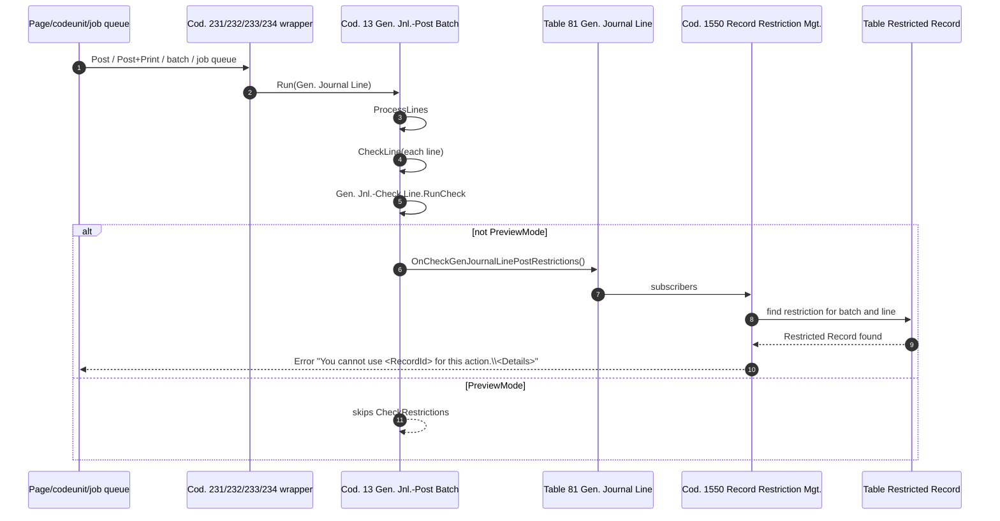
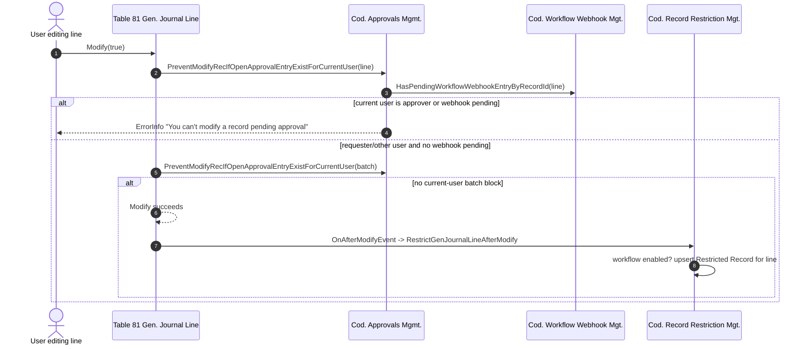
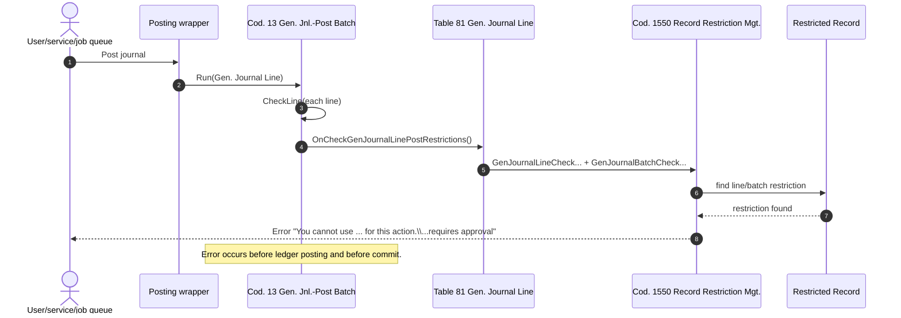
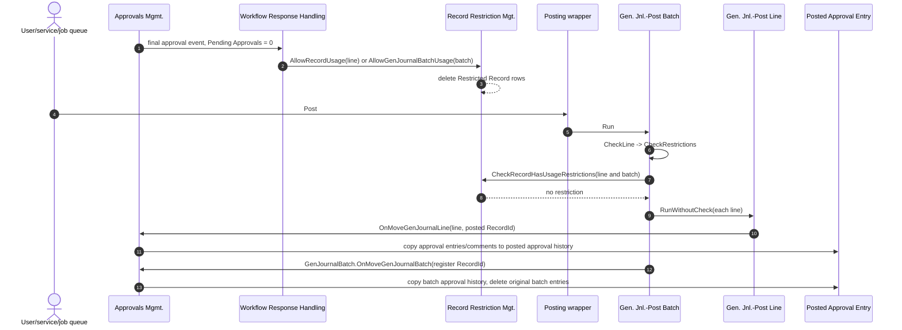
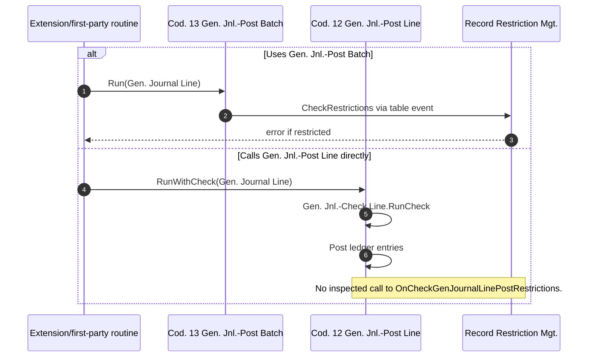

# General Journal Approvals - Session 4: restriction and posting enforcement

Scope: determine how pending approval prevents modification and posting of General Journals. This document does not reanalyse workflow registration and does not propose the target design.

Context:

- Branch: `gb-29-vNext`, commit `a74fec3ec909d`.
- Snapshot: BC `29.0.53247.0` (GB), per Session 1.
- Authoritative prior-session context: `00-environment-and-reconnaissance.md`, `03-runtime-sequence-flows.md`, `04-approval-subject-and-state-model.md`.
- All evidence below is from checked-in first-party source unless stated otherwise.

Legend: **F** = directly readable in source. **I** = interpretation from source. **Risk** = material bypass or uncertainty carried forward.

---

## 1. Executive findings

**Restricted record:** General Journal approvals restrict different records depending on the mechanism:

- The send-approval workflow response restricts the approval subject: `Gen. Journal Batch` for batch approval, or `Gen. Journal Line` for line approval. **F**
- Independently, `Record Restriction Mgt.` restricts each non-temporary, non-system-created `Gen. Journal Line` after insert or material modify when either the line workflow or the batch workflow can execute. For a batch workflow it restricts the line, not only the batch. **F**

**Deepest shared posting enforcement point:** for standard page posting, batch posting, post-and-print, job queue posting, and test-library posting, the deepest shared guard is:

`Codeunit 13 "Gen. Jnl.-Post Batch"` -> `CheckLine` -> `CheckRestrictions` -> `Gen. Journal Line.OnCheckGenJournalLinePostRestrictions()` -> `Record Restriction Mgt.` subscribers for the line and its batch. **F**

**Direct AL posting coverage:** direct AL posting is protected when it uses `Codeunit 13 "Gen. Jnl.-Post Batch"`. It is not proven protected when code bypasses that batch codeunit and calls `Codeunit 12 "Gen. Jnl.-Post Line"` directly. In the inspected source, `Gen. Jnl.-Post Line.RunWithCheck` validates the line but does not raise `OnCheckGenJournalLinePostRestrictions`. **F/Risk**

**Highest bypass risk:** code that posts by calling `Gen. Jnl.-Post Line` directly can bypass the approval restriction event. A secondary bypass exists through integration events that set `IsHandled` before standard batch posting or before restriction subscribers run. **Risk**

---

## 2. Restriction lifecycle

### 2.1 Record restriction infrastructure

Object: `Codeunit 1550 "Record Restriction Mgt."` (`Base Application/System/Workflow/RecordRestrictionMgt.Codeunit.al`).

| Member | Lines | Behaviour | Direct-AL coverage |
| --- | --- | --- | --- |
| `RestrictRecordUsage(RecVar, RestrictionDetails)` | 24-46 | Converts the variant to `RecordRef`, exits for temporary records, upserts one `Restricted Record` row for `RecRef.RecordId`, and overwrites `Details` if a row already exists. | Yes, if called. Public. |
| `AllowRecordUsage(RecVar)` | 103-129 | Deletes all `Restricted Record` rows for the record. Uses `LockTable(true)` before `DeleteAll(true)`. | Yes, if called. Public. |
| `AllowGenJournalBatchUsage(GenJournalBatch)` | 56-68 | Removes restrictions for the batch and every line in that batch. | Yes, if called. Public. |
| `CheckRecordHasUsageRestrictions(RecVar)` | 289-312 | TryFunction. Finds a matching `Restricted Record` and raises `You cannot use %1 for this action.\
`. | Yes, if called. Public. |

`Restricted Record` is therefore the domain-level usage lock. It is not an approval-entry status and is not part of the page editability calculation.

### 2.2 How records become restricted

There are two sources of restrictions.

#### A. Workflow response restriction

The standard workflow response `RestrictRecordUsage` calls `Record Restriction Mgt.RestrictRecordUsage(subject, '<workflow code> <description>')`. Prior Session 3 established the exact response locations in `Workflow Response Handling`:

- Batch approval send restricts the `Gen. Journal Batch` RecordId.
- Line approval send restricts the selected `Gen. Journal Line` RecordId.

This is the approval-subject restriction. It exists because an approval request was sent.

#### B. Automatic line restriction after insert/modify

`Record Restriction Mgt.` subscribes to `Gen. Journal Line.OnAfterInsertEvent` and `OnAfterModifyEvent`:

- `RestrictGenJournalLineAfterInsert` calls `RestrictGenJournalLine` for every inserted line.
- `RestrictGenJournalLineAfterModify` exits if `Format(Rec) = Format(xRec)`, otherwise calls `RestrictGenJournalLine`.
- `RestrictGenJournalLine` exits for `System-Created Entry` and temporary records; otherwise:
  - if line approval workflow can execute, restricts the line with `The restriction was imposed because the line requires approval.`
  - if batch approval workflow can execute for the line's batch, restricts the line with `The restriction was imposed because the journal batch requires approval.`

This is workflow-enabled material-change detection. It does not require an open `Approval Entry`; enabling the workflow is enough for future line insert/modify to create a restriction.

First-party tests confirm the behaviour:

- `RestrictGenJournalLinePostingAfterInsertWithApprovalEnabled` expects a newly inserted line to get a restriction and posting to fail.
- `InsertTempGenJnlLineDoesNotRestrictUsage` confirms temporary lines are excluded.
- Check-print tests confirm `System-Created Entry` lines are not restricted on insert.

### 2.3 Line versus batch scope

| Scenario | Restricted Record row | Posting check sees |
| --- | --- | --- |
| Batch approval request sent | batch RecordId, and often line RecordIds from automatic line restriction if the workflow was enabled before/while lines were inserted/modified | batch subscriber checks the batch RecordId for every posted line; line subscriber checks line RecordId |
| Line approval request sent | selected line RecordId | line subscriber checks that selected line; batch subscriber may also check batch if batch restriction exists |
| Batch workflow enabled, line inserted/modified | line RecordId with batch-requires-approval details | line subscriber blocks posting/print/export on that line |
| Line workflow enabled, line inserted/modified | line RecordId with line-requires-approval details | line subscriber blocks posting/print/export on that line |
| Final batch approval | `AllowGenJournalBatchUsage` clears the batch and every line in the batch | removes both batch- and line-level restrictions for those records |
| Final line approval | `AllowRecordUsageDefault` clears that one line | only that line is released |

**Risk:** prior Session 3 already identified a cross-path interaction: final batch approval clears line restrictions too. This can release line-level restrictions imposed by the line workflow if both workflows are enabled. No contradictory evidence was found in this session.

### 2.4 Removal after approval, rejection, cancellation, posting, and delete

| Event | Approval entries | Restricted Record rows | Source evidence |
| --- | --- | --- | --- |
| Final line approval | Entries become `Approved`; no `Created` or `Open` entries remain for that step instance | line restriction removed by `AllowRecordUsage` | Session 3; `Workflow Response Handling.AllowRecordUsage` |
| Final batch approval | Entries become `Approved` | batch and all batch line restrictions removed by `AllowGenJournalBatchUsage` | Session 3; `RecordRestrictionMgt` lines 56-68 |
| Reject | entries become `Rejected` | restriction unchanged | Session 3 template branch; no allow response |
| Cancel | entries become `Canceled` | restriction unchanged | Session 3 template branch; line test `CancelGenJnlLineForApprovalDoesNotAllowsUsage` |
| Post line | approval entries/comments copied to posted approval entries/comments by `PostApprovalEntriesMoveGenJournalLine`; original line entries are deleted later when the source line is deleted | line restrictions are normally removed by the source line delete subscriber before delete | `Approvals Mgmt.` lines 1771-1782; `RecordRestrictionMgt` lines 646-650 |
| Post batch | approval entries/comments copied when `Gen. Journal Batch.OnMoveGenJournalBatch` is raised; batch restriction removed and approval entries deleted | batch restriction removed by `PostApprovalEntriesMoveGenJournalBatch`; line restrictions normally removed as lines are deleted | `Approvals Mgmt.` lines 1784-1792 |
| Delete line/batch | approval entries/comments deleted after delete | restrictions removed before delete | `RecordRestrictionMgt` lines 646-654; `Approvals Mgmt.DeleteApprovalEntries` lines 2455-2464 |

---

## 3. UI editability versus domain enforcement

### 3.1 Page status and action enablement

`Page 39 "General Journal"` computes approval state on every current-record change:

- `OnAfterGetCurrRecord` calls `SetControlAppearance` and `SetApprovalStateForBatch`.
- `SetApprovalState` sets booleans from `Approvals Mgmt.HasOpenApprovalEntries`, `HasOpenApprovalEntriesForCurrentUser`, `CanCancelApprovalForRecord`, and webhook `GetCanRequestAndCanCancel`.
- `SetApprovalStateForBatch` also checks `HasAnyOpenJournalLineApprovalEntries`, workflow existence for table 81 and 232, and webhook batch state.
- The `Approval Status` fields are page variables, not persisted fields; they are non-editable display fields.

This affects button visibility/enabled state and displayed status only. It does not enforce posting.

### 3.2 Table-trigger modification protection

`Gen. Journal Line` table:

- `OnModify` calls `CheckOpenApprovalEntryExistForCurrentUser`, which calls `PreventModifyRecIfOpenApprovalEntryExistForCurrentUser` for the line and then for the batch.
- `OnInsert` checks the batch through `PreventInsertRecIfOpenApprovalEntryExist`.
- `OnDelete` checks the line and, when deleting the last line, the batch through `PreventDeletingRecordWithOpenApprovalEntry`.
- `OnRename` re-points approval entries and restrictions through `OnRenameRecordInApprovalRequest` and restriction update subscribers.

`Gen. Journal Batch` table:

- `OnModify` calls `PreventModifyRecIfOpenApprovalEntryExistForCurrentUser` for the batch.
- `OnDelete` calls `PreventDeletingRecordWithOpenApprovalEntry`, deletes allocations, and deletes all lines with triggers.
- `OnRename` re-points approval entries and restrictions.

The modify guard is current-user scoped. `PreventModifyRecIfOpenApprovalEntryExistForCurrentUser` blocks if the current user has open/pending approval entries for that record or a pending webhook entry exists. It does not generally block the requester from editing the line. The domain consequence of edit is instead that restrictions are reimposed by `Record Restriction Mgt.` after insert/modify while the workflow remains enabled.

### 3.3 Direct AL data modification

Direct AL modification is partially protected:

- `Insert(true)`, `Modify(true)`, `Delete(true)`, and table-triggered rename execute the table guards and automatic restriction subscribers.
- Direct assignment plus `Modify(true)` by the requester can succeed even while someone else has the approval open, because the modify block is current-approver/current-webhook scoped.
- `Modify(false)`, `Insert(false)`, `Delete(false)`, `ModifyAll`, and direct SQL-like patterns that skip triggers can avoid the table guards and the automatic restriction subscriber. Any existing `Restricted Record` still blocks standard posting if the posting route calls the restriction guard.

---

## 4. Posting entry-point inventory

### 4.1 Page posting and preview actions

`Page 39 "General Journal"`:

| Action | Code path | Restriction behaviour |
| --- | --- | --- |
| `Post` | `Rec.SendToPosting(Codeunit::"Gen. Jnl.-Post")` -> batch processing -> `Codeunit 231 "Gen. Jnl.-Post"` -> `Codeunit 13 "Gen. Jnl.-Post Batch"` unless job queue is enabled | Protected by `Gen. Jnl.-Post Batch.CheckRestrictions` |
| `Preview` | `GenJnlPost.Preview(Rec)` -> preview framework -> `Gen. Jnl.-Post` in `PreviewMode` -> `Gen. Jnl.-Post Batch` | `CheckRestrictions` skips when `PreviewMode = true`; first-party test `CanPreviewPost` confirms preview with pending batch approval creates no G/L entries and is allowed |
| `Post and Print` | `Rec.SendToPosting(Codeunit::"Gen. Jnl.-Post+Print")` -> `Codeunit 232` -> `Codeunit 13`, or job queue | Protected by `Gen. Jnl.-Post Batch.CheckRestrictions` before posting; print occurs only after successful posting |

Equivalent journal pages (`Cash Receipt Journal`, `Payment Journal`, `Purchase Journal`, `Sales Journal`, `Recurring General Journal`) use the same `SendToPosting(Codeunit::"Gen. Jnl.-Post")`, `Preview`, and `Post+Print` patterns. They converge on the same batch engine.

### 4.2 Batch posting from batch list

`Page 251 "General Journal Batches"`:

- `Post` calls `Codeunit 233 "Gen. Jnl.-B.Post"`.
- `Post and Print` calls `Codeunit 234 "Gen. Jnl.-B.Post+Print"`.

Both codeunits iterate selected `Gen. Journal Batch` records, find their lines, and either enqueue document jobs or run `Codeunit 13 "Gen. Jnl.-Post Batch"`. Therefore standard batch posting is protected by the same deepest guard.

### 4.3 Posting reports and print/export adjacent routes

No separate General Journal posting report was found in the inspected `Finance/GeneralLedger` source that posts General Journal lines outside the standard codeunits. The batch-post codeunits behave as the posting-report equivalent.

Adjacent routes use record restrictions for usage enforcement:

- Check printing: `Report Check` calls `RecordRestrictionMgt.CheckRecordHasUsageRestrictions(GenJnlLine2)` while preparing multiple-line check output. `Gen. Journal Line.OnCheckGenJournalLinePrintCheckRestrictions` also has a line restriction subscriber for computer checks.
- Payment export: `PaymentExportGenJnlCheck.CheckGenJournalBatch` calls `GenJournalBatch.OnCheckGenJournalLineExportRestrictions`; `Record Restriction Mgt.` subscribes for batch and line export restriction checks.
- SEPA credit-transfer check line calls `GenJnlLine.OnCheckGenJournalLineExportRestrictions`.

These are not posting routes, but they confirm restriction infrastructure is the shared usage barrier for print/export as well.

### 4.4 Direct posting codeunits

| Codeunit | Role | Restriction enforcement |
| --- | --- | --- |
| `231 "Gen. Jnl.-Post"` | UI-facing wrapper; handles confirmation, job queue, preview binding, and calls `Gen. Jnl.-Post Batch` | Protected unless `OnBeforeGenJnlPostBatchRun` is handled or preview mode is active |
| `232 "Gen. Jnl.-Post+Print"` | UI-facing post-and-print wrapper; calls `Gen. Jnl.-Post Batch` before printing | Protected unless `OnAfterConfirmPostJournalBatch` is handled or job queue/posting route is replaced |
| `233 "Gen. Jnl.-B.Post"` | Multi-batch post | Protected because each batch runs `Gen. Jnl.-Post Batch` |
| `234 "Gen. Jnl.-B.Post+Print"` | Multi-batch post-and-print | Protected because each batch runs `Gen. Jnl.-Post Batch` |
| `13 "Gen. Jnl.-Post Batch"` | Deepest standard batch engine | Protected by `CheckRestrictions`, except `PreviewMode` skips |
| `12 "Gen. Jnl.-Post Line"` | Low-level single-line posting engine | Not shown to call `OnCheckGenJournalLinePostRestrictions`; direct calls can bypass approval restrictions |

Direct first-party uses of `Gen. Jnl.-Post Line` include specialized routines such as direct debit collection posting and late general journal line posting. These appear to create/process their own lines, often temporary or system/service-generated, but as a mechanism they are not protected by the General Journal approval restriction event.

### 4.5 Job queue/background posting

`Codeunit 250 "Gen. Jnl.-Post via Job Queue"`:

- The UI wrapper enqueues one job queue entry per document number when General Ledger Setup enables job queue posting.
- The job queue codeunit loads the `Record ID to Process`, sets filters for template/batch/document number, marks lines as `Posting`, and runs `Codeunit 13 "Gen. Jnl.-Post Batch"`.
- If the batch codeunit errors, job queue status becomes `Error` and the last error is raised.

Therefore background posting is protected at execution time by the same restriction guard. Enqueueing itself does not appear to check restrictions, so a journal can be scheduled and later fail when the job runs.

### 4.6 APIs or service routes

`Page 6406 "Gen. Journal Batch Entity"` and `Page 6407 "Gen. Journal Line Entity"` expose workflow-related batch/line entities with `DelayedInsert = true` and no posting actions. They can create or update journal data, which means table triggers and restriction reimposition matter. They do not provide a standard posting route in the inspected source.

For OData/SOAP/web-service use of page/codeunit posting, the same codeunit route applies when it ultimately calls `Gen. Jnl.-Post Batch`. Page 39 suppresses some UI behaviour for OData/ODataV4, but posting enforcement is not a page-only feature.

---

## 5. Deepest shared guard details

### 5.1 Call stack

Standard posting routes converge as follows:

### 5.2 Guard implementation

`Gen. Jnl.-Post Batch.CheckLine` validates the line, calls `Gen. Jnl.-Check Line.RunCheck`, then calls `CheckRestrictions(GenJnlLine5)`.

`CheckRestrictions` does only this:

- if not `PreviewMode`, call `GenJournalLine.OnCheckGenJournalLinePostRestrictions()`.

`Gen. Journal Line.OnCheckGenJournalLinePostRestrictions` is an integration event. `Record Restriction Mgt.` subscribes four relevant handlers:

| Subscriber | Check performed | Record checked | Error |
| --- | --- | --- | --- |
| `CustomerCheckGenJournalLinePostRestrictions` | Customer account/balancing account is restricted | `Customer` | `You cannot use Customer ... for this action.` |
| `VendorCheckGenJournalLinePostRestrictions` | Vendor account/balancing account is restricted | `Vendor` | `You cannot use Vendor ... for this action.` |
| `GenJournalLineCheckGenJournalLinePostRestrictions` | Journal line is restricted | `Gen. Journal Line` | `You cannot use Gen. Journal Line: ... for this action.\
` |
| `GenJournalBatchCheckGenJournalLinePostRestrictions` | Journal batch is restricted | `Gen. Journal Batch` resolved from line template/batch | `You cannot use Gen. Journal Batch: ... for this action.\
` |

Each subscriber exposes an `OnBefore...PostRestrictions(..., var IsHandled)` event. Setting `IsHandled = true` skips the standard restriction check.

### 5.3 Transaction timing

The restriction check happens in `Gen. Jnl.-Post Batch.CheckLine`, during the initial "Checking lines" loop, before balance processing, before `FindNextGLRegisterNo`, before posting any line through `Gen. Jnl.-Post Line.RunWithoutCheck`, and before the later commit points in `ProcessLines`.

Consequences:

- A restriction error aborts before any ledger entries are posted by the batch engine.
- In batch posting (`Gen. Jnl.-B.Post`), the codeunit catches failed `Gen. Jnl.-Post Batch.Run` per batch and marks that batch as failed.
- In job queue posting, the job status becomes `Error` and no standard posting occurs.

---

## 6. State-specific behaviour

| State | Posting behaviour | Explanation |
| --- | --- | --- |
| No workflow configured | Allowed if normal journal validation passes | No automatic line restrictions are created; no approval-send restriction exists. |
| Workflow configured but no request sent | Existing untouched lines may post if no restriction row exists. New or materially modified lines are restricted automatically and cannot post until released. | Automatic restriction is tied to insert/modify after workflow can execute, not to an open approval entry. |
| Pending or partially approved | Blocked for standard posting. | `Created`/`Open` approval entries keep the workflow incomplete; restrictions remain. Standard posting checks restrictions before posting. |
| Approved | Allowed after final approval if restrictions were removed. | Final approval removes line or batch usage restrictions. Approval entry remains until posting moves/deletes it. |
| Rejected | Blocked if restriction remains. | Reject changes approval entries to `Rejected` but does not remove `Restricted Record`. Resubmission is possible because there are no open entries. |
| Canceled | Blocked if restriction remains. | Cancel changes entries to `Canceled` but does not remove `Restricted Record`. First-party test confirms canceled line approval still cannot post. |
| Stale open `Approval Entry` | Usually blocked if the restriction row also remains; table edits may be blocked for current approver. | Posting does not check `Approval Entry` directly. Its protection is only indirect through `Restricted Record`. |
| Restriction without open approval entry | Blocked. | Posting guard checks `Restricted Record`, not approval status. This covers canceled/rejected/stale material-change states. |
| Approval entry without restriction | Standard posting may be allowed. | Posting guard does not check `Approval Entry` directly. The UI may still show approval status, but domain posting depends on restrictions. |
| Pending workflow webhook entry | Table modify/insert/delete guards can block/cancel. Posting protection depends on whether a `Restricted Record` exists because `CheckRestrictions` checks restrictions, not webhook state directly. | Webhook internals remain unresolved from prior sessions. |
| Preview while pending | Allowed; no ledger entries are inserted. | `CheckRestrictions` skips in preview mode; first-party test `CanPreviewPost` asserts preview works with pending batch approval. |

---

## 7. Bypass analysis

### 7.1 Strongly protected paths

The following paths are protected because they call `Codeunit 13 "Gen. Jnl.-Post Batch"` and do not set preview mode:

- General Journal page `Post`.
- General Journal page `Post and Print` before printing.
- Other standard journal pages using `SendToPosting(Codeunit::"Gen. Jnl.-Post")` or `Codeunit::"Gen. Jnl.-Post+Print"`.
- General Journal Batches page `Post` and `Post and Print`.
- Job queue execution via `Gen. Jnl.-Post via Job Queue`.
- Test library `LibraryERM.PostGeneralJnlLine`, which runs `Gen. Jnl.-Post Batch`.

### 7.2 Known or plausible bypasses

| Bypass | Why it bypasses | Impact |
| --- | --- | --- |
| Direct call to `Codeunit 12 "Gen. Jnl.-Post Line"` | `RunWithCheck`/`RunWithoutCheck` call `Gen. Jnl.-Check Line` and posting routines, but no `OnCheckGenJournalLinePostRestrictions` call was found. | Approval restrictions can be bypassed by AL that deliberately posts at the low-level line engine. |
| `Gen. Jnl.-Post` event `OnBeforeGenJnlPostBatchRun` handled | Wrapper exits before `Gen. Jnl.-Post Batch.Run`. | Extension can replace standard posting and must enforce restrictions itself. |
| `Gen. Jnl.-Post Batch.OnBeforeCheckLine` handled | `CheckLine` exits before `Gen. Jnl.-Check Line` and `CheckRestrictions`. | Extension can skip the shared guard. |
| `Gen. Jnl.-Post Batch.OnBeforePostGenJnlLine` sets `Posted = true` | Can skip the internal call to `Gen. Jnl.-Post Line.RunWithoutCheck`, but this event is after the check loop. | Does not bypass the earlier restriction check unless combined with an earlier skip. |
| `Record Restriction Mgt.OnBefore...PostRestrictions` sets `IsHandled = true` | Skips a specific standard restriction subscriber. | Extension can suppress line or batch approval restriction checks. |
| `Modify(false)` / `Insert(false)` / `ModifyAll` | Skips table triggers and automatic line restriction subscriber. | Can create or change lines without reimposing restrictions; existing restrictions still block standard posting. |
| Preview mode | `CheckRestrictions` explicitly skips. | Preview can show posting results while approval is pending; first-party tests treat this as expected. |

---

## 8. Public APIs and reusable extension surface

### 8.1 Reusable public restriction APIs

From `Record Restriction Mgt.`:

- `RestrictRecordUsage(RecVar: Variant; RestrictionDetails: Text)` - public generic restriction upsert.
- `AllowRecordUsage(RecVar: Variant)` - public generic restriction removal.
- `CheckRecordHasUsageRestrictions(RecVar: Variant)` - public generic check/error.
- `AllowGenJournalBatchUsage(GenJournalBatch)` - public but journal-specific; clears batch and all contained lines.

These are reusable, but `AllowGenJournalBatchUsage` encodes General Journal structure and should not be copied blindly for a different target domain.

### 8.2 Reusable posting-related events

- `Gen. Journal Line.OnCheckGenJournalLinePostRestrictions()` - standard event that posting uses for General Journal restriction checks.
- `Gen. Journal Line.OnCheckGenJournalLinePrintCheckRestrictions()` - standard event for check-print usage checks.
- `Gen. Journal Line.OnCheckGenJournalLineExportRestrictions()` and `Gen. Journal Batch.OnCheckGenJournalLineExportRestrictions()` - standard events for payment export checks.
- `Gen. Journal Batch.OnMoveGenJournalBatch(ToRecordID)` - standard event used to move batch approval history after posting.
- `Gen. Jnl.-Post Line.OnMoveGenJournalLine(var GenJournalLine; ToRecordID)` - standard event used to move line approval history to the posted record.
- `Gen. Jnl.-Post Batch` events around check and posting (`OnBeforeCheckLine`, `OnBeforePostGenJnlLine`, `OnAfterPostGenJournalLine`) are extension points, but they can also bypass the guard if mishandled.

### 8.3 Standard checks another extension may call

- `RecordRestrictionMgt.CheckRecordHasUsageRestrictions(SomeRecord)` is the reusable check.
- For General Journal specifically, calling `GenJournalLine.OnCheckGenJournalLinePostRestrictions()` invokes all subscribers, including line, batch, customer, and vendor checks.
- `Approvals Mgmt.IsGeneralJournalLineApprovalsWorkflowEnabled` and `IsGeneralJournalBatchApprovalsWorkflowEnabled` are public workflow-enabled probes.
- `Approvals Mgmt.HasAnyOpenJournalLineApprovalEntries`, `HasOpenApprovalEntries`, and `CanCancelApprovalForRecord` are public approval-state helpers.

### 8.4 Journal-specific mechanisms requiring a target equivalent

- The line/batch subject split (`Gen. Journal Batch` and `Gen. Journal Line`) is domain-specific.
- Automatic line restriction after insert/modify is journal-specific and uses `System-Created Entry` and `IsTemporary` exclusions.
- Batch release clears every line in the batch.
- Posting enforcement is not in the low-level ledger posting engine; it is in the General Journal batch engine before `Gen. Jnl.-Post Line.RunWithoutCheck`.
- Posted approval history relies on `OnMoveGenJournalLine` and `OnMoveGenJournalBatch`, both tied to the General Journal posting lifecycle.

### 8.5 Inaccessible behaviour that must not be copied directly

- Page variables and internal page procedures such as approval status display logic are UI state, not a domain guard.
- Local procedures in `Workflow Response Handling` and `Record Restriction Mgt.RestrictGenJournalLine` are not reusable as APIs.
- The exact `Details` labels are standard text but not a durable API contract for downstream logic.
- The `IsHandled` events can suppress standard checks; a target implementation should not depend on subscriber order or assume no other extension handles them.

---

## 9. Sequence diagrams

### 9.1 Attempted edit while pending

### 9.2 Attempted posting while pending

### 9.3 Posting after final approval

### 9.4 Direct codeunit posting

---

## 10. Target implications

- A target approval design should treat `Restricted Record` as the enforceable usage lock, not `Approval Entry.Status` or page status text.
- The deepest target posting guard should be placed at the last shared batch/domain posting layer before any ledger writes, and should execute before commit.
- If the target has a lower-level posting engine like `Gen. Jnl.-Post Line`, either protect that layer too or clearly prevent external use for restricted subjects.
- If preview should be blocked, the target must intentionally differ from standard General Journal behaviour; standard BC 29 allows preview with pending approval.
- Editing and posting require separate guards. General Journal intentionally allows some requester edits, then reimposes restrictions so posting/export/print require renewed release.
- A target with both header/batch and line approvals must define whether final header approval clears line restrictions. The standard General Journal implementation does clear all lines for final batch approval.

---

## 11. Unresolved risks and contradictions

No prior conclusion was contradicted by source evidence in this session. The session strengthened prior conclusions around restriction persistence after cancel/reject and the batch/line dual subject.

Unresolved or version-sensitive risks:

1. Webhook internals remain incompletely traced. Table edit guards check pending webhook entries, but posting checks only restrictions.
2. Direct `Gen. Jnl.-Post Line` is a real bypass candidate. This session did not classify each first-party direct call as defective because several direct callers create their own system/service-generated lines outside the interactive General Journal approval scenario.
3. Integration events can suppress standard guards through `IsHandled`; subscriber ordering and installed extensions can change effective behaviour.
4. Existing lines created before workflow enablement may not have restrictions until modified or sent for approval.
5. Approval entry without restriction allows standard posting in principle, because posting checks restrictions rather than approval entries. The standard workflow normally creates both, but data repair, custom code, or trigger-skipping modification can separate them.
6. Final batch approval clearing all line restrictions remains an unresolved cross-path interaction when line and batch workflows are both enabled.

### Next-session handoff

- Facts established:
  - General Journal approval enforcement uses `Restricted Record` rows as the posting/usage lock.
  - Approval can restrict `Gen. Journal Batch` or `Gen. Journal Line`, and workflow-enabled line insert/modify can independently restrict the line.
  - Standard posting routes through `Gen. Jnl.-Post Batch` check restrictions before any ledger posting.
  - Preview posting skips restriction checks and is first-party tested as allowed while approval is pending.
  - Reject and cancel do not remove restrictions; final approval does.
- Standard symbols verified:
  - `Record Restriction Mgt.`
  - `Restricted Record`
  - `Gen. Jnl.-Post Batch`
  - `Gen. Jnl.-Post`
  - `Gen. Jnl.-Post+Print`
  - `Gen. Jnl.-B.Post`
  - `Gen. Jnl.-B.Post+Print`
  - `Gen. Jnl.-Post via Job Queue`
  - `Gen. Jnl.-Post Line`
  - `Gen. Journal Line.OnCheckGenJournalLinePostRestrictions`
  - `Gen. Journal Line.OnCheckGenJournalLinePrintCheckRestrictions`
  - `Gen. Journal Line.OnCheckGenJournalLineExportRestrictions`
  - `Gen. Journal Batch.OnCheckGenJournalLineExportRestrictions`
  - `Gen. Jnl.-Post Line.OnMoveGenJournalLine`
  - `Gen. Journal Batch.OnMoveGenJournalBatch`
- Target-specific symbols verified:
  - None. This session stayed within standard first-party General Journal source.
- Important interpretations:
  - Posting protection is restriction-based, not approval-entry-based.
  - UI status and action enablement are advisory compared with the posting guard.
  - Direct low-level posting through `Gen. Jnl.-Post Line` is outside the deepest shared guard.
  - Automatic line restriction after material change is the standard stale-approval detector.
- Unresolved questions:
  - Exact webhook state-to-restriction behaviour.
  - Whether any installed/custom extension suppresses restriction subscribers through `IsHandled` events.
  - Whether final batch approval clearing line restrictions is intentional for simultaneous batch and line workflows.
  - Whether a target should block preview while pending, unlike standard General Journal.
- Version-sensitive findings:
  - Evidence is from BC 29.0.53247.0 GB snapshot on `gb-29-vNext` at `a74fec3ec909d`.
  - Posting event signatures, preview handling, and workflow restriction details may change in other BC versions/localizations.
- Files that provide the strongest evidence:
  - `Base Application/System/Workflow/RecordRestrictionMgt.Codeunit.al`
  - `Base Application/Finance/GeneralLedger/Posting/GenJnlPostBatch.Codeunit.al`
  - `Base Application/Finance/GeneralLedger/Posting/GenJnlPost.Codeunit.al`
  - `Base Application/Finance/GeneralLedger/Posting/GenJnlPostPrint.Codeunit.al`
  - `Base Application/Finance/GeneralLedger/Posting/GenJnlBPost.Codeunit.al`
  - `Base Application/Finance/GeneralLedger/Posting/GenJnlBPostPrint.Codeunit.al`
  - `Base Application/Finance/GeneralLedger/Posting/GenJnlPostviaJobQueue.Codeunit.al`
  - `Base Application/Finance/GeneralLedger/Posting/GenJnlPostLine.Codeunit.al`
  - `Base Application/Finance/GeneralLedger/Journal/GenJournalLine.Table.al`
  - `Base Application/Finance/GeneralLedger/Journal/GenJournalBatch.Table.al`
  - `Base Application/Finance/GeneralLedger/Journal/GeneralJournal.Page.al`
  - `Base Application/Finance/GeneralLedger/Journal/GeneralJournalBatches.Page.al`
  - `Base Application/OtherCapabilities/Approvals/ApprovalsMgmt.Codeunit.al`
  - `Tests-General Journal/GeneralJournalBatchApproval.Codeunit.al`
  - `Tests-General Journal/GeneralJournalLineApproval.Codeunit.al`
  - `Tests-General Journal/ApprovalHistoryTests.Codeunit.al`
- Documents created:
  - `.design/architecture/general-journal-approvals/05-restriction-and-posting-enforcement.md`
- Recommended scope for the next session:
  - Trace webhook approval entries and workflow webhook state only as far as needed to decide whether pending webhook approval always creates, preserves, or removes `Restricted Record` rows, then map the target-domain equivalent enforcement point.
