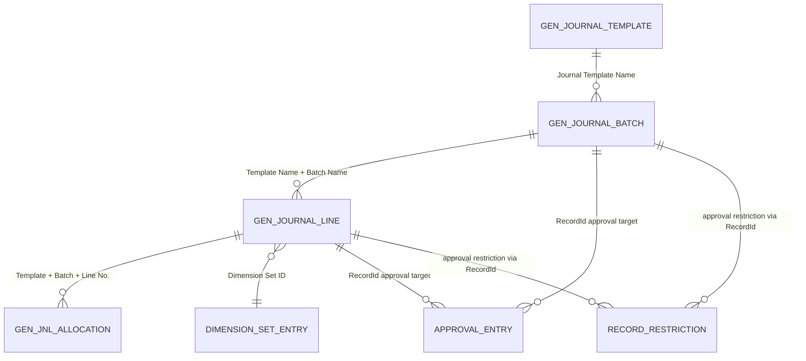
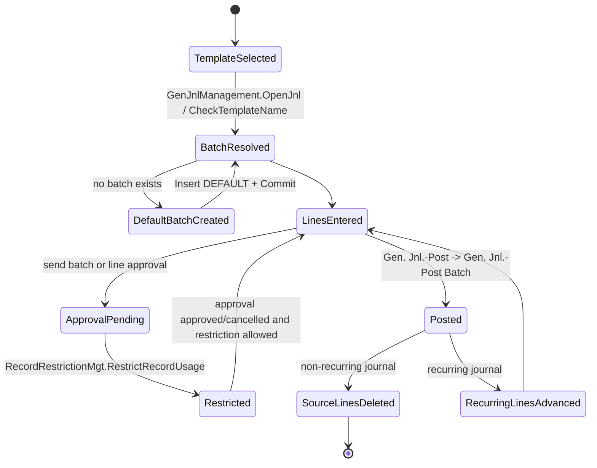
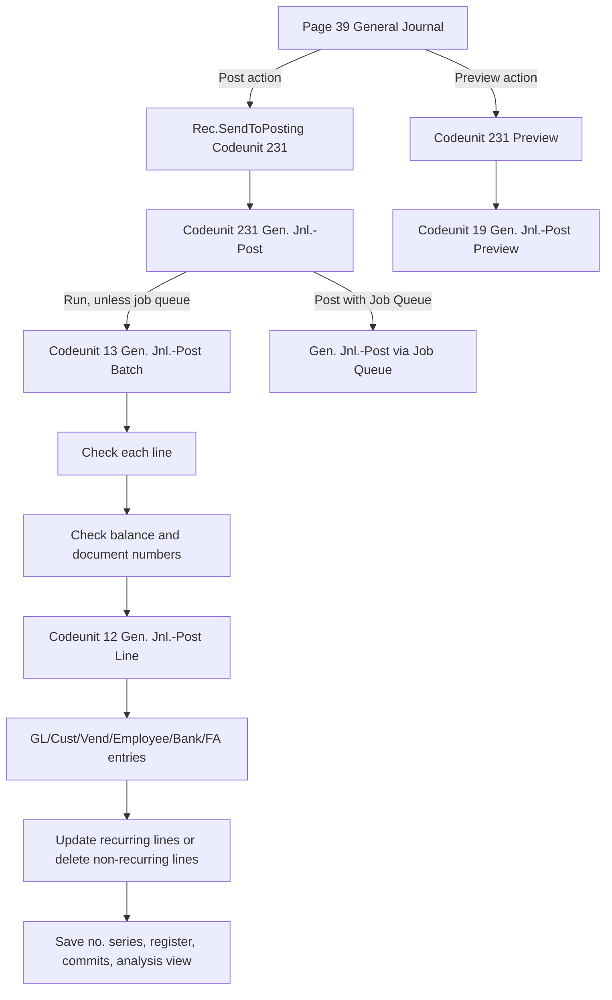
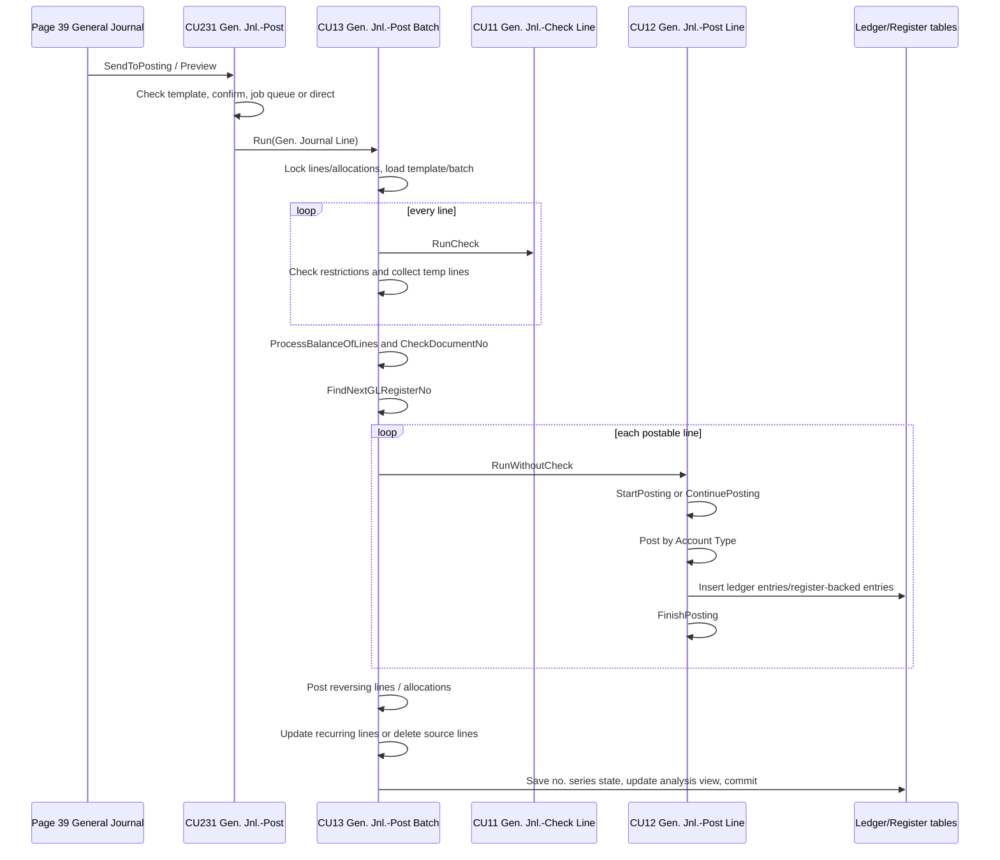
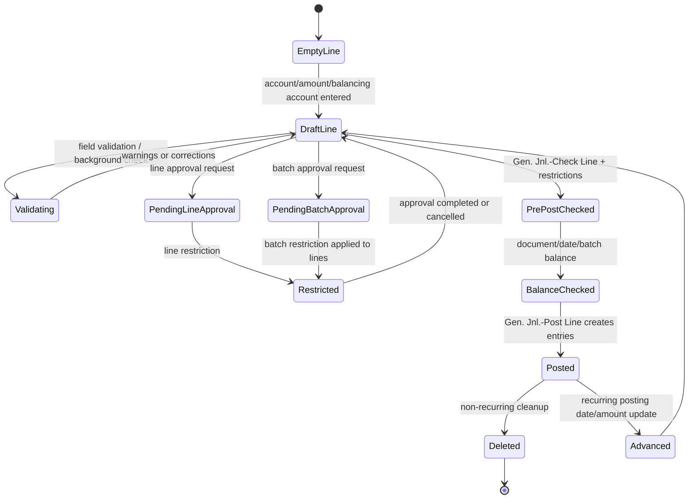

# General Journal runtime architecture (gj-02)

## Labels used in this artifact
- **Verified**: directly supported by repository evidence.
- **Inference**: reasoned conclusion from verified evidence.
- **Recommendation**: suggested design or follow-up research step.
- **Not located**: searched but not found in this branch snapshot.
- **Version-specific**: tied to this branch/commit/app version.

## Executive summary

- **Version-specific** This artifact describes branch `gb-29-vNext` at commit `fc4c58aef0106` / discovery commit `fc4c58aef01063370e19823eb0aec4e891b626ea`. The primary application is Base Application 29.0.53300.0 as recorded in `Base Application/app.json` and summarized in `gj-01-discovery.md`.
- **Verified** General Journal runtime state is centered on table 80 `Gen. Journal Template`, table 232 `Gen. Journal Batch`, and table 81 `Gen. Journal Line`. Templates define type, source code, page/report selection, recurrence, and number series. Batches inherit template defaults and group lines. Lines hold posting-ready transaction facts and run field-level validation/defaulting.
- **Verified** Page 39 `General Journal` is a worksheet over table 81. It owns user interaction, batch switching, simple/classic view state, totals/warnings, approval action state, and action dispatch. It does not own posting semantics; `Post` calls `Rec.SendToPosting(Codeunit::"Gen. Jnl.-Post")`, and preview calls codeunit 231 `Gen. Jnl.-Post`. Evidence: `Base Application/Finance/GeneralLedger/Journal/GeneralJournal.Page.al` page declaration and source table lines 46-65; post/preview actions lines 1033-1089.
- **Verified** Posting is layered: codeunit 231 `Gen. Jnl.-Post` performs template checks, user confirmation, job-queue choice, preview binding, and delegates to codeunit 13 `Gen. Jnl.-Post Batch`. Codeunit 13 performs batch-level checks, balance/document-number handling, register orchestration, recurring-line update or non-recurring cleanup, number-series state persistence, and commits. Codeunit 12 `Gen. Jnl.-Post Line` performs account-type-specific entry creation.
- **Verified** Approval/workflow is a boundary around batches and lines, not a separate General Journal-specific persistence model. Journal batch/line approval uses shared `Approval Entry`, workflow event/response codeunits, and `Record Restriction Mgt.` subscribers. Evidence: `WorkflowEventHandling.Codeunit.al` lines 528-545 and 836-869; `WorkflowResponseHandling.Codeunit.al` lines 765-824; `RecordRestrictionMgt.Codeunit.al` lines 360-386 and 506-515.

## Responsibility catalogue

| Layer | Objects | Responsibilities | Not responsible for | Accessibility / reuse class |
|---|---|---|---|---|
| Template | table 80 `Gen. Journal Template` | Selects journal type, page, source code, test/posting reports, recurrence, no. series, posting no. series, balancing defaults, VAT-copy policy. `Type` validation maps template types to source codes/pages and recurring templates to page 283. | Does not store lines or perform posting. | Public table object; field triggers and helper logic are implementation details. General Journal-specific plus architectural pattern. Evidence: `GenJournalTemplate.Table.al` lines 31-145, 188-314. |
| Batch | table 232 `Gen. Journal Batch` | Composite key under template, default inheritance through `SetupNewBatch`, approval-sensitive lifecycle, batch totals, line propagation for selected defaults, batch deletion of allocations/lines. | Does not post ledger entries. | Public table with published events such as `OnGeneralJournalBatchBalanced` and `OnGeneralJournalBatchNotBalanced`. Evidence: `GenJournalBatch.Table.al` lines 27-248, 325-381, 381-514. |
| Line | table 81 `Gen. Journal Line` | Transaction facts: posting/document dates, document no., account/balancing account, amount/currency, posting groups, dimensions, application fields, source/reason codes, approval flag. Runs field validation/defaulting and exposes post/print/export restriction events. | Does not create final ledger entries directly; posting codeunits do that. | Public table; many field triggers/local procedures are internal implementation. Evidence: `GenJournalLine.Table.al` lines 84-930, 1286-1325, 3902-3988, 4253-4385, 7565-7600. |
| Worksheet | page 39 `General Journal` and variants | Presents lines, selects/switches batch, computes displayed balances, refreshes approval state, exposes imports/generation, dispatches posting/preview. | Does not own business validation or account posting. | Public worksheet page; action/triggers are page implementation. Evidence: `GeneralJournal.Page.al` lines 46-115, 1018-1092, 1908-2025, 2188-2220. |
| Journal management | codeunit 230 `GenJnlManagement` | Template lookup, page opening, batch filtering, default batch creation, user preferences for simple/classic and last batch. | Does not validate posting correctness or create ledger entries. | Public codeunit with OnPrem scoped procedures and events; architectural pattern. Evidence: `GenJnlManagement.Codeunit.al` lines 62-190, 190-255, 253-450. |
| Validation | codeunit 11 `Gen. Jnl.-Check Line`; codeunit 9081 `Check Gen. Jnl. Line. Backgr.` | Pre-post line validation, date/account/amount/document/dimension/setup checks, background error collection and document balance feedback. | Does not post; background check is diagnostic/UX feedback. | Public codeunit objects; internals are implementation details with events. Evidence: `GenJnlCheckLine.Codeunit.al` lines 41-190, 312-353; `CheckGenJnlLineBackgr.Codeunit.al` lines 20-110. |
| Posting orchestrator | codeunit 231 `Gen. Jnl.-Post` | Confirmation, template-level preconditions, preview binding, job-queue routing, call to batch engine, post result message. | Does not perform account-specific entry creation. | Public posting entry point with integration events. Evidence: `GenJnlPost.Codeunit.al` lines 23-183. |
| Batch posting engine | codeunit 13 `Gen. Jnl.-Post Batch` | Locks source lines/allocations, checks all lines, checks balances/document numbers, determines register no., posts each line, handles recurring/reversing/allocation/IC behavior, updates/deletes source lines, saves no. series state, commits. | Does not decide account-specific ledger-entry details. | Public codeunit object; most logic local/internal with many integration events. Evidence: `GenJnlPostBatch.Codeunit.al` lines 37-344, 353-760, 857-882, 1279-1333, 1532-1633. |
| Account-specific posting | codeunit 12 `Gen. Jnl.-Post Line` | Starts/continues/finishes transaction posting, branches by account type, inserts G/L/customer/vendor/employee/bank/fixed asset entries, manages G/L register and temp G/L entry buffers. | Does not own worksheet state or batch cleanup. | Public codeunit object; account routines are local implementation with extensive events. Evidence: `GenJnlPostLine.Codeunit.al` lines 74-250, 250-388, 388-470, 1248-1595, 1897-2055, 2328-2365. |
| Workflow/approval | codeunits 1535, 1520, 1521, 1550; tables 454/467 | Send/cancel approval requests, workflow event routing, response execution, pending status, record restrictions checked before post/print/export. | Does not replace journal validation/posting checks. | Public framework and published event consumption. Evidence: `WorkflowEventHandling.Codeunit.al` lines 528-545 and 836-869; `WorkflowResponseHandling.Codeunit.al` lines 765-824; `RecordRestrictionMgt.Codeunit.al` lines 360-386 and 506-515. |

## Data model

### Core relationships

- **Verified** table 232 key is `Journal Template Name, Name`, so batch identity is template-scoped. Evidence: `GenJournalBatch.Table.al` lines 27-40 and 317-321.
- **Verified** table 81 line identity is template/batch/line-number scoped; the line has `Journal Batch Name` with a table relation to `Gen. Journal Batch`. Evidence: `GenJournalLine.Table.al` lines 84-91 and 1286-1297.
- **Verified** `GetNewLineNo` allocates line numbers by finding the last line in a template/batch and adding 10000, defaulting to 10000. Evidence: `GenJournalLine.Table.al` lines 8216-8231.
- **Verified** dimensions are stored through `Dimension Set ID`, with shortcut dimension validation updating the dimension set and global dimension fields. Evidence: `GenJournalLine.Table.al` lines 778-799 and 2717-2731.

### Template responsibility

- **Verified** `Type` validation sets the test report to `General Journal - Test`, posting report to `G/L Register`, obtains `Source Code Setup`, then maps `General`, `Sales`, `Purchases`, `Cash Receipts`, `Payments`, `Assets`, `Intercompany`, and `Jobs` to source code and worksheet page. If `Recurring` is true, it overrides the page to `Recurring General Journal`. Evidence: `GenJournalTemplate.Table.al` lines 101-145.
- **Verified** `No. Series` and `Posting No. Series` are mutually constrained. A recurring template cannot use `No. Series`, and posting no. series cannot equal no. series. Evidence: `GenJournalTemplate.Table.al` lines 286-326.
- **Verified** template-level changes can cascade to existing lines/batches: `Source Code` validation modifies journal lines, and `Copy VAT Setup to Jnl. Lines` / `Allow VAT Difference` modify batches. Evidence: `GenJournalTemplate.Table.al` lines 151-169 and 332-360.

### Batch responsibility

- **Verified** `SetupNewBatch` copies balancing account, no. series, posting no. series, reason code, VAT-copy policy, VAT-difference allowance, and copy-to-posted-lines from the template. Evidence: `GenJournalBatch.Table.al` lines 381-401.
- **Verified** batch insertion reads the template, initializes copy-VAT and payment-export defaults, and updates last-modified datetime. Evidence: `GenJournalBatch.Table.al` lines 338-346.
- **Verified** batch delete blocks open approval entries, deletes journal allocations for the batch, and deletes all lines with triggers. Evidence: `GenJournalBatch.Table.al` lines 325-335.
- **Verified** batch modify blocks modification when open approval entries exist for the current user. Evidence: `GenJournalBatch.Table.al` lines 348-352.
- **Verified** `CheckBalance` calculates `Balance (LCY)` over all lines and raises either `OnGeneralJournalBatchBalanced` or `OnGeneralJournalBatchNotBalanced`. Evidence: `GenJournalBatch.Table.al` lines 477-514.

### Line responsibility

- **Verified** line fields include posting date, document type/no., account type/no., balancing account, currency code/factor, amount/debit/credit/LCY amount, balance LCY, dimensions, source code, reason code, application fields, and approval flag. Evidence: `GenJournalLine.Table.al` lines 84-930 and 1286-1325.
- **Verified** `OnInsert` blocks insertion into a batch with open approval entries, loads template/batch defaults, sets `Posting No. Series`, `Source Code`, shortcut dimensions, and VAT reporting date. Evidence: `GenJournalLine.Table.al` lines 3951-3978.
- **Verified** `OnModify` checks job queue status, approval state, last-modified timestamp, and check-print status. Evidence: `GenJournalLine.Table.al` lines 3980-3997.
- **Verified** `OnDelete` blocks open approvals, prevents deletion of the last line in an approved batch, blocks deletion after check printing, clears applications/payment/export/data-exchange artifacts, and deletes allocations. Evidence: `GenJournalLine.Table.al` lines 3902-3949.
- **Verified** `SetUpNewLine` copies prior-line posting/document date and document no., peeks or simulates no. series, sets payment-journal defaults, source/reason/posting no. series, batch balancing account, and optional suggested balancing amount. Evidence: `GenJournalLine.Table.al` lines 4253-4348.

## Lifecycle

### Template and batch lifecycle

- **Verified** `GenJnlManagement.CheckTemplateName` creates a `DEFAULT` batch with description `Default Journal` and calls `Commit()` when no batch exists. Evidence: `GenJnlManagement.Codeunit.al` lines 253-275.
- **Verified** opening from batch validates template page ID and batch name, filters the line record to the template, sets batch context, and runs the template page. Evidence: `GenJnlManagement.Codeunit.al` lines 111-148.
- **Verified** page open selects a template, restores the last viewed batch, calls `OpenJnl`, applies batch control appearance, and initializes simple-mode data. Evidence: `GeneralJournal.Page.al` lines 1988-2025.

### Line creation/import/generation

- **Verified** manual worksheet insertion calls `Rec.SetUpNewLine(xRec, Balance, BelowxRec)` in `OnNewRecord`, so page insertion delegates defaulting to table 81. Evidence: `GeneralJournal.Page.al` lines 1969-1982.
- **Verified** standard journals create table 81 lines through table 751 `Standard General Journal` procedures `CreateGenJnlFromStdJnl` and `CreateGenJnlFromStdJnlWithDocNo`, targeting a journal batch and optional document/posting date. Evidence: `StandardGeneralJournal.Table.al` lines 95-123.
- **Verified** page 39 can call `Rec.ImportBankStatement()`, payroll import codeunits, and opening-balance reports for G/L, customer, and vendor lines; create-line actions commit before running reports. Evidence: `GeneralJournal.Page.al` lines 1234-1351 and 1539-1601.
- **Verified** Edit in Excel is exposed through OData utility with page object ID, batch name, and template name. Evidence: `GeneralJournal.Page.al` lines 1615-1626.
- **Inference** Import/generation paths are feeder paths into table 81. They still depend on table validation, background checks, and posting-time checks before any ledger entry is created.

### Worksheet binding and editability

- **Verified** page 39 is a `Worksheet` page with `AutoSplitKey`, `DelayedInsert`, `SaveValues`, and `SourceTable = "Gen. Journal Line"`. Evidence: `GeneralJournal.Page.al` lines 46-65.
- **Verified** batch switching uses `CurrentJnlBatchName` lookup/validation, `GenJnlManagement.LookupName`, `CheckName`, and page refresh/control appearance updates. Evidence: `GeneralJournal.Page.al` lines 75-99.
- **Verified** displayed balances are page-owned UI state calculated by `GenJnlManagement.CalcBalance`, with page variables `Balance`, `TotalBalance`, visibility flags, and record count. Evidence: `GeneralJournal.Page.al` lines 2026-2045.
- **Verified** approval-related edit/action state is page-owned by calling `Approvals Mgmt.`, `Workflow Webhook Management`, and `Workflow Management`, including enabled workflow existence for batch and line approval events. Evidence: `GeneralJournal.Page.al` lines 1908-1931 and 2188-2220.
- **Inference** Page responsibility is orchestration and presentation. Business invariants must remain in table/codeunit layers because table 81 can be populated by pages, reports, imports, Excel/OData, and APIs.

## Validation matrix

| Layer | Examples | Enforcement timing | Evidence |
|---|---|---|---|
| Field validation | Account type disallows conflicting customer/vendor/fixed asset/employee pairs; account no. loads account-specific defaults, currency, posting groups, dimensions; posting date validates VAT/date/currency/apply requirements; amount updates debit/credit/LCY/balance. | During table field validation and page entry/import/report insertion when `Validate` is used. | `GenJournalLine.Table.al` lines 98-260, 270-306, 573-706, 4137-4252. |
| Template/batch validation | Template type maps page/source/report; no. series constraints; batch no. series and posting no. series constraints; recurring batch balancing account restrictions. | Template/batch field validation and setup. | `GenJournalTemplate.Table.al` lines 101-145 and 286-326; `GenJournalBatch.Table.al` lines 102-143 and 381-414. |
| Line lifecycle guards | Delete/modify/rename blocked by job queue, approvals, printed checks, applications/data exchange/allocations cleanup. | Table triggers. | `GenJournalLine.Table.al` lines 3902-3997. |
| Background validation | Runs codeunit 11, recurring checks, document balance checks, and returns collected errors. | Page background task / UX error reporting. | `CheckGenJnlLineBackgr.Codeunit.al` lines 20-110. |
| Pre-post line check | `Gen. Jnl.-Post Batch.CheckLine` checks recurring line, allocations, posting-after-working-date confirmation, `Gen. Jnl.-Check Line.RunCheck`, and usage restrictions. | Before posting each line in codeunit 13. | `GenJnlPostBatch.Codeunit.al` lines 1591-1625. |
| Core check line | `RunCheck` validates dates, document no., account/balancing account requirements, zero amount, amount sign, account-specific checks, IC checks, dimensions/setup. | Standalone check and posting-time check. | `GenJnlCheckLine.Codeunit.al` lines 110-190 and date APIs lines 312-353. |
| Batch/document balance | `ProcessBalanceOfLines` enforces document/date/batch balance, currency balance, correction consistency, and no. series/manual no. handling. | Posting-time after line checks, before entry creation. | `GenJnlPostBatch.Codeunit.al` lines 353-760. |
| Workflow restriction | Table 81 publishes post/print/export restriction events; `Record Restriction Mgt.` subscribers check restricted customers/vendors/batches/lines. | Explicit restriction checks, including pre-post. | `GenJournalLine.Table.al` lines 7585-7596; `RecordRestrictionMgt.Codeunit.al` lines 360-386 and 506-515. |

## Posting sequence

### Entry-to-posting flow

### Posting call sequence

- **Verified** codeunit 231 checks jobs/template constraints, force posting report, recurring posting-date filter, user confirmation, unvoidable check confirmation, job-queue setup, and delegates to codeunit 13. Evidence: `GenJnlPost.Codeunit.al` lines 57-145.
- **Verified** preview binds a manual instance of codeunit 231 to codeunit 19 `Gen. Jnl.-Post Preview`. Evidence: `GenJnlPost.Codeunit.al` lines 177-183.
- **Verified** codeunit 13 `ProcessLines` handles empty/preview behavior, opens progress UI, checks every line, processes balances, locks/finds G/L register no., posts normal and reversing lines, throws preview error in preview mode, updates/deletes lines, saves no. series state, commits, clears posting codeunits, updates analysis views, calls batch move event, and commits again. Evidence: `GenJnlPostBatch.Codeunit.al` lines 194-344.
- **Verified** posting document numbers are assigned from `Posting No. Series` if present; otherwise the batch `No. Series` is used, and repeated source document numbers share the last posted number. Evidence: `GenJnlPostBatch.Codeunit.al` lines 857-882.
- **Verified** non-recurring source lines are deleted after posting; recurring lines are advanced or reset according to recurring method. Evidence: `GenJnlPostBatch.Codeunit.al` lines 1407-1465.
- **Verified** optional posted journal-line archival is controlled by batch `Copy to Posted Jnl. Lines` and skipped for recurring/empty lines. Evidence: `GenJnlPostBatch.Codeunit.al` lines 1665-1683.
- **Verified** codeunit 12 starts or continues posting, posts account and balancing-account sides, posts unrealized VAT/deferrals, finishes posting consistency checks, and branches account-specific posting through `PostGenJnlLine`. Evidence: `GenJnlPostLine.Codeunit.al` lines 250-388 and 388-411.
- **Verified** account-specific routines include customer, vendor, employee, bank account, fixed asset, G/L, and IC partner branches; customer/vendor routines insert subsidiary ledger entries and detailed entries, assign G/L register no., and publish move events. Evidence: `GenJnlPostLine.Codeunit.al` lines 388-411, 1248-1595, 1709 and following in discovery.

## State model

- **Verified** pending approval is stored on both batch and line as non-editable Boolean fields, while open approval entries and record restrictions are checked through shared framework code. Evidence: `GenJournalBatch.Table.al` lines 248-253; `GenJournalLine.Table.al` lines 826-832; `GeneralJournal.Page.al` lines 2188-2220.
- **Verified** table 81 publishes restriction events for post, print check, and export, which lets workflow restrictions block those operations without making page 39 the enforcement point. Evidence: `GenJournalLine.Table.al` lines 7585-7596.

## Extensibility map

| Surface | Classification | What can be extended | Key evidence |
|---|---|---|---|
| table 80 `Gen. Journal Template` events | Published event / internal implementation | Type validation aftermath, no. series validation handling, template-selection behavior through related management codeunit. | `GenJournalTemplate.Table.al` lines 101-145 and 286-314. |
| table 232 `Gen. Journal Batch` events | Published event | Batch setup defaults, line modification override, balance/not-balance workflow events, move batch event. | `GenJournalBatch.Table.al` lines 381-514. |
| table 81 `Gen. Journal Line` events | Published event | Field validation hooks, new-line setup, line balance updates, restriction events, import/export/payment related hooks. | `GenJournalLine.Table.al` lines 4253-4348 and 7585-7596. |
| codeunit 230 `GenJnlManagement` | Architectural pattern / public codeunit | Template selection, page launch, lookup, preference and batch selection hooks. | `GenJnlManagement.Codeunit.al` lines 62-190 and 253-450. |
| codeunit 231 `Gen. Jnl.-Post` | Public posting entrypoint / published events | Dialog suppression, pre/post batch-run hooks, custom posting override by `IsHandled`, result-message suppression. | `GenJnlPost.Codeunit.al` lines 57-183. |
| codeunit 13 `Gen. Jnl.-Post Batch` | Internal implementation with published events | Pre/post processing, balance checks, document number assignment, line posting hooks, cleanup/commit hooks. | `GenJnlPostBatch.Codeunit.al` lines 194-344 and 1532-1633. |
| codeunit 12 `Gen. Jnl.-Post Line` | Internal implementation with published events | Account-specific posting hooks, entry insertion hooks, start/finish posting hooks. | `GenJnlPostLine.Codeunit.al` lines 250-388 and 1248-1595. |
| Workflow/approval events | Public framework / published event consumption | Journal batch/line send/cancel approval event routing, record restriction response handling. | `WorkflowEventHandling.Codeunit.al` lines 528-545 and 836-869; `WorkflowResponseHandling.Codeunit.al` lines 765-824. |

- **Verified** `OnBeforeGenJnlPostBatchRun` in codeunit 231 can set `IsHandled` and skip standard codeunit 13 execution. This is a powerful public extension point and should be treated as a posting replacement boundary, not a small validation hook. Evidence: `GenJnlPost.Codeunit.al` lines 123-134 and 205-214.
- **Verified** codeunit 13 has `SetSuppressCommit`, and posting flow honors `SuppressCommit` around commit points. Evidence: `GenJnlPostBatch.Codeunit.al` lines 323-339 and 1629-1633.
- **Inference** Extension design should prefer narrow events at table validation, setup, check, or account-posting boundaries. Replacing batch posting is possible but high-risk because it must preserve balance checks, number-series state, register semantics, recurring cleanup, preview behavior, restrictions, and commits.

## Transferable principles

- **Recommendation** Use a three-tier mutable source model when a worksheet has reusable defaults: template for type/page/source/report policy, batch for user-selected working context and inherited defaults, line for transaction facts.
- **Recommendation** Keep UI pages as binding/action surfaces. Put defaults and invariants in records/codeunits so imports, reports, Excel/OData, and web-service callers share the same rules.
- **Recommendation** Validate progressively: field triggers for immediate consistency, background checks for UX feedback, check codeunit for business preconditions, batch posting engine for cross-line invariants, account-specific posting for ledger-entry rules.
- **Recommendation** Treat approvals as a framework boundary: status and restrictions should be checked at table/posting boundaries, not only in page action enablement.
- **Recommendation** Treat number series as transaction state. Simulate/peek for draft lines, consume and save state only in posting paths that commit ledger effects.
- **Recommendation** Expose public extension points before and after durable boundaries: setup defaulting, line validation, pre-post checks, account posting, cleanup, and commit boundaries.

## General Journal-specific and non-transferable behavior

- **Verified** Template types and page mappings are specific to General Journal variants: General, Sales, Purchases, Cash Receipts, Payments, Assets, Intercompany, Jobs, plus recurring page override. Evidence: `GenJournalTemplate.Table.al` lines 101-145.
- **Verified** The line table supports a wide account-type matrix: G/L Account, Customer, Vendor, Employee, Bank Account, Fixed Asset, IC Partner, and Allocation Account in field relations/defaulting. Evidence: `GenJournalLine.Table.al` lines 98-260 and 365-573.
- **Verified** Posting uses General Ledger registers and account-specific ledger tables; that entry model is not portable to unrelated worksheets without equivalent ledger/register semantics. Evidence: `GenJnlPostLine.Codeunit.al` lines 74-103, 1897-2055, and 2328-2365.
- **Verified** Recurring journals have special constraints and cleanup behavior: recurring templates cannot use normal no. series, recurring line checks require method/frequency, recurring posting updates lines rather than deleting them. Evidence: `GenJournalTemplate.Table.al` lines 188-204 and 286-308; `GenJnlPostBatch.Codeunit.al` lines 610-666 and 1407-1435.
- **Verified** Payment/bank/payroll/import actions are page-specific entry points and may be hidden/conditional. Evidence: `GeneralJournal.Page.al` lines 1234-1351.

## Risks

- **Verified** Posting replacement through `OnBeforeGenJnlPostBatchRun` is possible. **Risk**: a subscriber that skips standard posting must recreate restrictions, line checks, balance checks, number-series state, preview semantics, posted-line archiving, cleanup, register behavior, analysis-view updates, and transaction/commit behavior. Evidence: `GenJnlPost.Codeunit.al` lines 123-134; `GenJnlPostBatch.Codeunit.al` lines 194-344.
- **Verified** Batch creation in `GenJnlManagement.CheckTemplateName` commits immediately after inserting the default batch. **Risk**: opening a journal can have durable side effects before a user posts anything. Evidence: `GenJnlManagement.Codeunit.al` lines 253-275.
- **Verified** Table triggers and posting code both enforce approvals/restrictions. **Risk**: custom import or posting paths that bypass `Validate`, table triggers, or posting check codeunits can create inconsistent or unpostable lines. Evidence: `GenJournalLine.Table.al` lines 3951-3997; `GenJnlPostBatch.Codeunit.al` lines 1591-1625.
- **Verified** Posting has explicit commit boundaries after no. series state/line cleanup and after analysis-view/update/move events. **Risk**: extension code at pre/post commit events can introduce partial-update surprises if it assumes a single atomic boundary. Evidence: `GenJnlPostBatch.Codeunit.al` lines 323-339.
- **Verified** Page action enablement reflects approval/workflow state, but enforcement is also in tables and restrictions. **Risk**: relying only on page UI state is insufficient for API/report/import scenarios. Evidence: `GeneralJournal.Page.al` lines 2188-2220; `RecordRestrictionMgt.Codeunit.al` lines 360-386 and 506-515.

## Open questions

- **Not located** This pass did not enumerate every first-party subscriber to every General Journal Line integration event. `gj-01-discovery.md` recommends a follow-up focused on restriction-event subscribers.
- **Not located** This pass did not map every workflow template step sequence side-by-side for standard approval versus webhook approval. Discovery identified the workflow setup objects and recommends a dedicated follow-up.
- **Recommendation** Verify country/localization-specific variants before applying this model to another branch, because branch/app inventory is version-specific and Business Central localization apps can alter journal behavior.
- **Recommendation** For extension design, classify the intended hook as one of: defaulting, UX, validation, posting replacement, entry insertion, cleanup, workflow/restriction. The risk profile changes sharply across those boundaries.