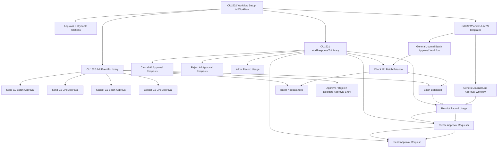
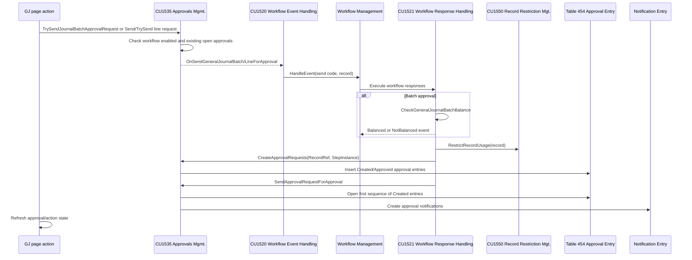
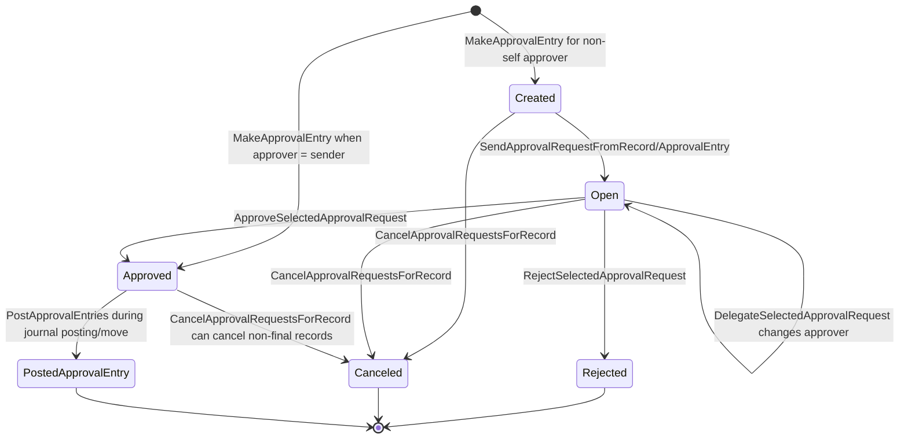
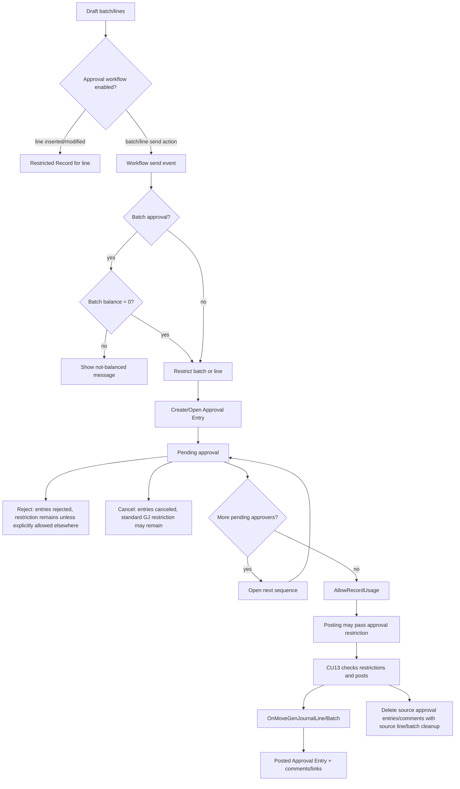

# General Journal approvals (gj-03)

## Labels used in this artifact

- **Verified**: directly supported by repository evidence.
- **Inference**: reasoned conclusion from verified evidence.
- **Recommendation**: design or follow-up guidance.
- **Not located**: searched but not found in this branch snapshot.
- **Version-specific**: tied to this branch/commit/app version.

## Context

- **Version-specific** Branch `gb-29-vNext`, commit `fc4c58aef01063370e19823eb0aec4e891b626ea`.
- **Version-specific** Primary app is Base Application 29.0.53300.0, as established in `gj-01-discovery.md`.
- **Verified** This artifact extends `gj-01-discovery.md` and `gj-02-architecture.md`. It focuses on source-level approval behavior for table 232 `Gen. Journal Batch` and table 81 `Gen. Journal Line`, including workflow setup, approval entries, restrictions, posting, check printing, export, webhook approvals, and tests.
- **Verified** Approval behavior is implemented through shared framework objects: codeunit 1535 `Approvals Mgmt.`, codeunit 1520 `Workflow Event Handling`, codeunit 1521 `Workflow Response Handling`, codeunit 1502 `Workflow Setup`, codeunit 1550 `Record Restriction Mgt.`, table 454 `Approval Entry`, table 1550 `Restricted Record`, and webhook objects 1540-1545/467-469.

## Object catalogue

| Object | Role in General Journal approvals | Accessibility / reuse class | Evidence |
|---|---|---|---|
| page 39 `General Journal` | Exposes send/cancel approval actions for batch and selected lines; refreshes action/status state. | Public worksheet page; UI orchestration, not enforcement. | `Base Application/Finance/GeneralLedger/Journal/GeneralJournal.Page.al` lines 1352-1438, 1908-1931, 2194-2211. |
| pages 253/254/255/256 `Sales/Purchase/Cash Receipt/Payment Journal` | Same approval action family over table 81 with page-specific helper copies. | Public worksheet pages; General Journal-specific variants. | Search confirmed calls in page actions at `SalesJournal.Page.al` lines 1122/1142, `PurchaseJournal.Page.al` lines 1189/1209, `CashReceiptJournal.Page.al` lines 914/933, `PaymentJournal.Page.al` lines 1340/1359. |
| page `IC General Journal` | Intercompany worksheet variant using the same batch/line approval APIs and shared page 39 state helper. | Public worksheet page; cross-area General Journal variant. | `Base Application/Finance/Intercompany/Journal/ICGeneralJournal.Page.al` lines 848/868 and 1178/1362. |
| page 283 `Recurring General Journal` | Uses table 81 but no explicit approval send/cancel actions were located in this page. | Public worksheet page; table-level restrictions can still affect lines. | `RecurringGeneralJournal.Page.al` lines 31-36; search for `Request Approval`, `TrySendJournal`, `SetApprovalState` returned no matches in the page. |
| table 232 `Gen. Journal Batch` | Batch approval target, pending flag, delete/modify/rename hooks, balance event publisher, export-restriction event publisher. | Public table; published events are extension surface. | `GenJournalBatch.Table.al` lines 248-253, 325-352, 477-524. |
| table 81 `Gen. Journal Line` | Line approval target, pending flag, insert/modify/delete/rename guards, post/print/export restriction event publishers. | Public table; events are extension surface; triggers are implementation. | `GenJournalLine.Table.al` lines 3902-3997, 7585-7596, 8412-8424, 8475-8488. |
| codeunit 1535 `Approvals Mgmt.` | Public approval API used by pages and table guards; creates and updates approval entries; publishes GJ send/cancel events. | Public framework and published events. | `ApprovalsMgmt.Codeunit.al` lines 157-172, 383-525, 640-820, 794-820, 2267-2325. |
| table 454 `Approval Entry` | Standard approval persistence for GJ batch/line approvals. | Public framework table. | `ApprovalEntry.Table.al` lines 19-180. |
| codeunit 1520 `Workflow Event Handling` | Registers GJ workflow events, event predecessors, and subscribers from `Approvals Mgmt.`/batch balance events into workflow engine. | Public framework. | `WorkflowEventHandling.Codeunit.al` lines 155-169, 229-252, 528-545, 836-869. |
| codeunit 1521 `Workflow Response Handling` | Registers responses and event/response combinations; executes create/send/cancel/approve/reject/restrict/allow/check-balance responses. | Public framework; response execution internals. | `WorkflowResponseHandling.Codeunit.al` lines 100-245, 765-824, 1013-1086. |
| codeunit 1502 `Workflow Setup` | Creates standard GJ batch and line workflow templates, approval table relations, request-page fields, and step graphs. | Public setup framework; template internals. | `WorkflowSetup.Codeunit.al` lines 283-305, 1252-1306, 1610-1684, 1754-1833. |
| codeunit 1550 `Record Restriction Mgt.` | Creates/removes/checks `Restricted Record`; subscribes to line insert/modify and post/print/export restriction events. | Public framework plus event subscribers. | `RecordRestrictionMgt.Codeunit.al` lines 16-72, 153-204, 289-320, 360-448, 506-555. |
| codeunit 13 `Gen. Jnl.-Post Batch` | Actual posting checks; skips restrictions in preview, checks them in non-preview posting. | Public posting engine; internal implementation. | `GenJnlPostBatch.Codeunit.al` lines 194-345 and 1495-1625. |
| check/export paths | Print check and payment export invoke restriction checks before mutating/exporting lines. | First-party consumers of restriction events. | `Check.Report.al` lines 625-703 and 1498-1520; `DocumentPrint.Codeunit.al` lines 312-322; `SEPACTCheckLine.Codeunit.al` lines 45-58; `PaymentExportGenJnlCheck.Codeunit.al` lines 126-140. |
| webhook stack | Alternative Power Automate approval path using `Workflow Webhook Entry`, not `Approval Entry`. | Public webhook framework. | `WorkflowWebhookSetup.Codeunit.al` lines 31-96; `WorkflowWebhookManagement.Codeunit.al` lines 56-236; `WorkflowWebhookResponses.Codeunit.al` lines 18-84. |
| tests 134321/134322/134219/134220/approval history | Behavioral evidence for preview, posting block, delete/rename, chain approvers, restrictions, webhook, and posted audit copy. | Test-only evidence. | `Tests-General Journal/*.Codeunit.al` ranges cited below. |

## Workflow registration

### Registration graph

- **Verified** `Workflow Event Handling` registers GJ batch send/cancel, GJ line send/cancel, and batch balanced/not-balanced event codes against table 232/81. Evidence: `WorkflowEventHandling.Codeunit.al` lines 155-169.
- **Verified** It registers approval approve/reject/delegate events against table 454 `Approval Entry`, and predecessor links from these approval events back to GJ batch, GJ line, and batch-balanced events. Evidence: `WorkflowEventHandling.Codeunit.al` lines 126-132 and 229-252.
- **Verified** `Approvals Mgmt.` publishes integration events `OnSendGeneralJournalBatchForApproval`, `OnCancelGeneralJournalBatchApprovalRequest`, `OnSendGeneralJournalLineForApproval`, and `OnCancelGeneralJournalLineApprovalRequest`. Evidence: `ApprovalsMgmt.Codeunit.al` lines 157-172.
- **Verified** `Workflow Event Handling` subscribes to those `Approvals Mgmt.` events and calls `WorkflowManagement.HandleEvent(...)`; it also subscribes to `Gen. Journal Batch` balanced/not-balanced events. Evidence: `WorkflowEventHandling.Codeunit.al` lines 836-869.
- **Verified** `Workflow Response Handling` registers responses including create approval requests, send approval request, approve/reject/cancel all requests, check GJ batch balance, restrict record usage, and allow record usage. Evidence: `WorkflowResponseHandling.Codeunit.al` lines 100-123.
- **Verified** GJ line, GJ batch, and batch-balanced event codes are valid predecessors for create approval requests and send approval request responses. Evidence: `WorkflowResponseHandling.Codeunit.al` lines 165-192 and 227-245.
- **Verified** Approval table relations are registered from `Gen. Journal Line` and `Gen. Journal Batch` to `Approval Entry`.`Record ID to Approve`. Evidence: `WorkflowSetup.Codeunit.al` lines 283-305.
- **Verified** Workflow request-page conditions expose batch fields `Name`, `Template Type`, `Recurring`, and line fields `Document Type`, `Account Type`, `Account No.`, `Amount`. Evidence: `WorkflowRequestPageHandling.Codeunit.al` lines 174-194.

## Standard workflow templates and conditions

- **Verified** `InsertGeneralJournalBatchApprovalWorkflowTemplate` creates template code `GJBAPW` / description `General Journal Batch Approval Workflow`; its default approver setup is `Approver` + `Direct Approver`, with confirmation message enabled. Evidence: `WorkflowSetup.Codeunit.al` lines 102-105 and 1252-1271.
- **Verified** Batch workflow uses `InsertGenJnlBatchApprovalWorkflowSteps`. The first response after the send event is `CheckGeneralJournalBatchBalance`; only the balanced branch restricts record usage, creates approval requests, and sends requests. The not-balanced branch shows `The selected general journal batch is not balanced and cannot be sent for approval.` Evidence: `WorkflowSetup.Codeunit.al` lines 1754-1833.
- **Verified** `InsertGeneralJournalLineApprovalWorkflowTemplate` creates template code `GJLAPW` / description `General Journal Line Approval Workflow`; its default approver setup is `Approver` + `Direct Approver`, with confirmation message disabled. Evidence: `WorkflowSetup.Codeunit.al` lines 1273-1306.
- **Verified** Line workflow uses the generic `InsertRecApprovalWorkflowSteps`: send event -> restrict usage -> create approval requests -> send approval request -> approve/reject/cancel/delegate branches. Evidence: `WorkflowSetup.Codeunit.al` lines 1610-1684.
- **Verified** The standard line workflow passes `RemoveRestrictionOnCancel = false`, so cancellation does not automatically allow record usage. Evidence: `WorkflowSetup.Codeunit.al` lines 1295-1306 and 1610-1684.
- **Verified** The standard batch workflow cancellation branch cancels requests and shows a message, but does not include an `AllowRecordUsage` response in the batch-specific step builder. Evidence: `WorkflowSetup.Codeunit.al` lines 1804-1824.
- **Inference** For both standard batch and standard line approval, approval completion is what removes restrictions through the `Approve` + no-pending-approvals branch. Cancellation changes approval entry status but should not be assumed to prove the record is usable again.

## Send for approval sequence

- **Verified** Page 39 batch send action calls `ApprovalsMgmt.TrySendJournalBatchApprovalRequest(Rec)` and refreshes control appearance. Evidence: `GeneralJournal.Page.al` lines 1363-1375.
- **Verified** Page 39 selected-line send action collects selected lines, calls `ApprovalsMgmt.SendJournalLinesApprovalRequests(GenJournalLine)`, and refreshes batch state. Evidence: `GeneralJournal.Page.al` lines 1382-1394.
- **Verified** Payment Journal and IC General Journal use the same API family (`TrySendJournalBatchApprovalRequest`, `TrySendJournalLineApprovalRequests`) from their actions. Evidence: `PaymentJournal.Page.al` lines 1321-1398 and `ICGeneralJournal.Page.al` lines 840-888.
- **Verified** `TrySendJournalBatchApprovalRequest` resolves the batch from a line, checks that the batch approval workflow is enabled, errors if the batch or any line already has open approval entries, prompts if previously approved entries exist, then publishes the send event. Evidence: `ApprovalsMgmt.Codeunit.al` lines 2267-2280.
- **Verified** `TrySendJournalLineApprovalRequests` checks workflow existence for a single line and then loops selected lines; each line is sent only if its workflow can execute and it has no open approval entries. Evidence: `ApprovalsMgmt.Codeunit.al` lines 2283-2296.
- **Verified** `SendJournalLinesApprovalRequests` marks selected lines without open approval entries; for multiple lines it uses batch processing with codeunit `Approvals Journal Line Request`. Evidence: `ApprovalsMgmt.Codeunit.al` lines 2875-2898 and `ApprovalsJournalLineRequest.Codeunit.al` lines 16-20.
- **Verified** Approval requests are built through `PopulateApprovalEntryArgument`. For a GJ batch, only the record id/table id are populated. For a GJ line, document type/no., salesperson/purchaser code, amount, amount LCY, and currency are copied from the line. Evidence: `ApprovalsMgmt.Codeunit.al` lines 1188-1287.
- **Verified** `MakeApprovalEntry` stores table id, sequence no., sender, approver, workflow step instance id, record id to approve, due/delegation formulas, amount/limit metadata, and starts entries as `Created` unless the approver is the sender, in which case the entry starts as `Approved`. Evidence: `ApprovalsMgmt.Codeunit.al` lines 1092-1142.
- **Verified** `SendApprovalRequestFromRecord` opens the first created sequence and creates approval notifications; if no created entries remain but an approved entry exists, it raises the approve event. Evidence: `ApprovalsMgmt.Codeunit.al` lines 716-795.
- **Verified** Notifications are created for approvers and optionally senders based on current user/background context and workflow argument settings. Evidence: `ApprovalsMgmt.Codeunit.al` lines 1290-1318.

## Approval Entry lifecycle

### State transitions

- **Verified** `ApproveApprovalRequests`, `RejectApprovalRequests`, and `DelegateApprovalRequests` iterate selected approval entries and delegate to single-entry routines. Evidence: `ApprovalsMgmt.Codeunit.al` lines 383-424.
- **Verified** Approve validates the entry is open, checks approver/admin rights, sets status to `Approved`, modifies the row, and publishes `OnApproveApprovalRequest`. Evidence: `ApprovalsMgmt.Codeunit.al` lines 438-453.
- **Verified** Reject validates open status, checks approver/admin rights, publishes `OnRejectApprovalRequest`, reloads, sets status `Rejected`, and modifies. Evidence: `ApprovalsMgmt.Codeunit.al` lines 456-475.
- **Verified** Delegate validates open status and edit permission, then substitutes the approver user id. The workflow responds to delegate by sending the next approval request. Evidence: `ApprovalsMgmt.Codeunit.al` lines 477-525; `WorkflowSetup.Codeunit.al` lines 1674-1684 and 1818-1824.
- **Verified** Cancel for a record filters approval entries by table id, record id, non-rejected/non-canceled status, and workflow step instance, then sets them to `Canceled`; notifications are created when old status was open or approved. Evidence: `ApprovalsMgmt.Codeunit.al` lines 661-681.
- **Verified** Reject for a record filters similarly and sets non-rejected/non-canceled entries to `Rejected`; notifications are created for previously open rows. Evidence: `ApprovalsMgmt.Codeunit.al` lines 685-710.
- **Verified** Approve-all for a record approves entries whose status is `Created` or `Open` for the workflow step instance. Evidence: `ApprovalsMgmt.Codeunit.al` lines 640-657.
- **Verified** `Approval Entry`.`Status` validation updates sent date when `Created -> Open`, and deletes workflow event queue when status is no longer `Created`/`Open`. Evidence: `ApprovalEntry.Table.al` lines 53-65.
- **Verified** `Pending Approvals`, `Number of Approved Requests`, and `Number of Rejected Requests` are FlowFields over entries for the same record id and workflow step instance. Evidence: `ApprovalEntry.Table.al` lines 135-162.

## Approver selection, limits, and groups

- **Verified** `CreateApprovalRequests` chooses request creation by workflow step approver type: salesperson/purchaser, approver, workflow user group, or extension event. Evidence: `ApprovalsMgmt.Codeunit.al` lines 794-820.
- **Verified** Direct approver uses the current user's `User Setup`.`Approver ID`, with approval administrator fallback to self if no approval user exists. Evidence: `ApprovalsMgmt.Codeunit.al` lines 1007-1032.
- **Verified** Approver chain and first-qualified approver traverse `User Setup`.`Approver ID` until `IsSufficientApprover` succeeds; first-qualified creates only sufficient approver entries. Evidence: `ApprovalsMgmt.Codeunit.al` lines 922-1004.
- **Verified** Workflow user group creates entries for every group member using member sequence number. Evidence: `ApprovalsMgmt.Codeunit.al` lines 888-920.
- **Verified** GJ line sufficiency uses the line account matrix: purchase lines use purchase approver limits, sales lines use sales approver limits, G/L-account lines use request amount approval limit/unlimited request approval, and other lines are treated as sufficient. Evidence: `ApprovalsMgmt.Codeunit.al` lines 1411-1448.
- **Verified** `IsSufficientApprover` has no amount-specific batch logic; for `Gen. Journal Batch`, `Item Journal Batch`, and `Requisition Wksh. Name` it leaves the default sufficiency and displays an unsupported approval-chain message unless handled by event. Evidence: `ApprovalsMgmt.Codeunit.al` lines 1450-1473.
- **Verified** Tests confirm GJ batch chain/first-qualified approval sends self-approved entries rather than a real chain, while GJ line chain approval creates and progresses chained approval entries. Evidence: `GeneralJournalBatchApproval.Codeunit.al` lines 155-204; `GeneralJournalLineApproval.Codeunit.al` lines 213-365.

## Restriction strategy

- **Verified** `Record Restriction Mgt.` persists restrictions in table 1550 `Restricted Record` by `Record ID`, updates details when a restriction already exists, ignores temporary records, and reads with `ReadCommitted`. Evidence: `RecordRestrictionMgt.Codeunit.al` lines 16-45.
- **Verified** `RestrictRecordUsage` is a workflow response; it stores details based on workflow code/description. Evidence: `WorkflowResponseHandling.Codeunit.al` lines 1013-1020.
- **Verified** `AllowRecordUsage` is a workflow response. For an `Approval Entry`, it allows the approval entry itself, follows `Record ID to Approve`, and allows the approved record. For `Gen. Journal Batch`, it calls `AllowGenJournalBatchUsage`, which allows the batch and every current line in that batch. Evidence: `WorkflowResponseHandling.Codeunit.al` lines 1022-1086; `RecordRestrictionMgt.Codeunit.al` lines 47-56.
- **Verified** `Record Restriction Mgt.` subscribes to `Gen. Journal Line` `OnAfterInsertEvent` and `OnAfterModifyEvent`. If a non-temporary, non-system-created line matches enabled GJ line approval workflow, it restricts the line; if its batch matches enabled GJ batch approval workflow, it restricts the line with batch-approval details. Evidence: `RecordRestrictionMgt.Codeunit.al` lines 153-182.
- **Verified** Table 81 has a separate local `RestrictGenJournalLine` with the same non-temporary/non-system-created and workflow-enabled checks. Evidence: `GenJournalLine.Table.al` lines 8475-8488.
- **Verified** `CheckRecordHasUsageRestrictions` errors with `You cannot use %1 for this action.` plus restriction details when a matching restricted record exists. Evidence: `RecordRestrictionMgt.Codeunit.al` lines 289-316.
- **Verified** Posting checks line restrictions, customer/vendor restrictions, and batch restrictions by subscribers to `OnCheckGenJournalLinePostRestrictions`. Evidence: `RecordRestrictionMgt.Codeunit.al` lines 360-433 and 506-520.
- **Verified** Check printing checks line restrictions only for computer-check lines through `OnCheckGenJournalLinePrintCheckRestrictions`. Evidence: `RecordRestrictionMgt.Codeunit.al` lines 436-447.
- **Verified** Payment export checks batch and line restrictions only when payment export is allowed on the batch. Evidence: `RecordRestrictionMgt.Codeunit.al` lines 523-555.
- **Inference** There are two restriction sources: workflow send responses and automatic line insert/modify subscribers. Therefore a line can be restricted because approval is required even before a specific approval request has an open entry.

## Enforcement matrix

| Action/path | Enforced? | Mechanism | Evidence | Notes/gaps |
|---|---|---|---|---|
| UI send batch approval | Yes, for workflow existence, open approvals, batch balance. | `TrySendJournalBatchApprovalRequest`; workflow batch balance response. | `ApprovalsMgmt.Codeunit.al` lines 2267-2280; `WorkflowSetup.Codeunit.al` lines 1754-1833. | Existing approved entries only prompt; they do not prove current data is still unchanged. |
| UI send selected line approvals | Partial by line. | `TrySendJournalLineApprovalRequests`; skips lines that cannot execute workflow or already have open entries. | `ApprovalsMgmt.Codeunit.al` lines 2283-2296. | Selected subset can be approved while other batch lines remain restricted/unapproved. |
| UI action enablement/refresh | Reflective only. | Page variables from approval entries, webhook entries, and enabled workflow checks. | `GeneralJournal.Page.al` lines 1908-1931 and 2194-2211. | Not an enforcement boundary. |
| Batch insert | No direct approval guard. | `OnInsert` initializes defaults only. | `GenJournalBatch.Table.al` lines 338-346. | Lines inserted into a restricted/approval-enabled batch are guarded/restricted separately. |
| Batch modify | Yes for current user's open/pending approvals and pending webhooks. | `ApprovalsMgmt.PreventModifyRecIfOpenApprovalEntryExistForCurrentUser`. | `GenJournalBatch.Table.al` lines 348-352; `ApprovalsMgmt.Codeunit.al` lines 2833-2860. | This current-user guard is narrower than universal “any approver pending” blocking. |
| Batch delete | Yes; can cancel then delete. | `PreventDeletingRecordWithOpenApprovalEntry`; table delete then deletes lines. | `GenJournalBatch.Table.al` lines 325-335; `ApprovalsMgmt.Codeunit.al` lines 2706-2746. | Batch delete may ask confirmation and publish cancel event for sender-cancelable approvals. |
| Batch rename | Approval record id updated. | `OnRenameRecordInApprovalRequest(xRec.RecordId, RecordId)`. | `GenJournalBatch.Table.al` lines 354-358. | Rename is not itself blocked by approval in this trigger. |
| Line insert | Yes for batch approvals; automatic restriction for enabled workflows. | `PreventInsertRecIfOpenApprovalEntryExist(GenJournalBatch)`; restriction subscriber after insert. | `GenJournalLine.Table.al` lines 3951-3964; `ApprovalsMgmt.Codeunit.al` lines 2748-2808; `RecordRestrictionMgt.Codeunit.al` lines 153-182. | If batch has open approval, insert may cancel batch approval after confirmation rather than simply fail. |
| Line modify | Yes for current user open/pending approval on line or batch; automatic restriction after modify. | `CheckOpenApprovalEntryExistForCurrentUser`; restriction subscriber. | `GenJournalLine.Table.al` lines 3980-3997 and 8412-8424; `RecordRestrictionMgt.Codeunit.al` lines 153-182. | Approved-line changes can reimpose restrictions; see tests below. |
| Line delete | Yes; line deletion with open approval is blocked for sender; last-line delete checks batch approval. | `PreventDeletingRecordWithOpenApprovalEntry`; last-line batch check. | `GenJournalLine.Table.al` lines 3902-3924; `ApprovalsMgmt.Codeunit.al` lines 2706-2746. | Tests show line delete after sending request errors, while deleting all lines can cancel batch approval entries. |
| Line rename | Approval record id updated. | `OnRenameRecordInApprovalRequest(xRec.RecordId, RecordId)`. | `GenJournalLine.Table.al` lines 3998-4004; tests `GeneralJournalLineApproval.Codeunit.al` lines 90-140. | Rename preserves approval linkage rather than invalidating approval. |
| Import/programmatic line creation | Yes if table triggers run; no if callers bypass triggers. | Table 81 triggers and restriction subscribers. | `GenJournalLine.Table.al` lines 3951-3997; `RecordRestrictionMgt.Codeunit.al` lines 153-182. | **Risk** Direct SQL or triggerless writes are outside AL enforcement. |
| Edit in Excel/OData | Inference: table-level triggers/restrictions apply for AL writes. | Page 39 OData action feeds table 81; table triggers own enforcement. | `gj-02-architecture.md` cites `GeneralJournal.Page.al` lines 1615-1626; table trigger evidence above. | OData UI state is skipped in page `OnAfterGetCurrRecord`; enforcement must be table/codeunit. |
| Preview posting | No restriction enforcement. | `CheckRestrictions` calls restriction event only when `not PreviewMode`. | `GenJnlPostBatch.Codeunit.al` lines 1495-1509. | Tests verify preview can run with pending batch approval and creates no G/L entries. |
| Actual posting | Yes. | Codeunit 13 runs `CheckLine`, which calls `CheckRestrictions`, before posting. | `GenJnlPostBatch.Codeunit.al` lines 194-262 and 1591-1625. | Restrictions are checked before ledger entries and source cleanup. |
| Post and print | Yes for posting restrictions; print path also checks check-print restrictions. | Posting path plus `Document-Print`/`Check` report checks. | `GeneralJournalBatchApproval.Codeunit.al` lines 115-150; `DocumentPrint.Codeunit.al` lines 312-322; `Check.Report.al` lines 625-703. | Generated check lines can be allowed only if source batch or line is approved. |
| Payment export | Yes for payment-export batches. | `OnCheckGenJournalLineExportRestrictions` on line/batch. | `SEPACTCheckLine.Codeunit.al` lines 45-58; `PaymentExportGenJnlCheck.Codeunit.al` lines 126-140. | Test error may surface through payment export error collection, not direct restriction text. |
| Background posting/job queue | Inference: posting engine checks restrictions in non-preview mode regardless of UI. | Codeunit 13 non-preview restriction check. | `GenJnlPostBatch.Codeunit.al` lines 1495-1509 and 1591-1625. | Direct replacement via posting events could bypass if extension suppresses standard path. |
| Customer/vendor restricted master records | Yes during GJ line posting. | Post restriction subscribers check customer/vendor account and balancing account restrictions. | `RecordRestrictionMgt.Codeunit.al` lines 360-400. | Approval of a line does not override separate customer/vendor restrictions. |

## Approval-to-posting lifecycle

- **Verified** Preview mode runs `Code(...)` but `CheckRestrictions` is skipped when `PreviewMode = true`. Evidence: `GenJnlPostBatch.Codeunit.al` lines 1495-1509.
- **Verified** Actual posting checks every line with codeunit 11 and then calls `CheckRestrictions`; only after checks does it process balances, lock/find G/L register, and post lines. Evidence: `GenJnlPostBatch.Codeunit.al` lines 194-262 and 1591-1625.
- **Verified** Tests confirm preview-post with pending batch approval creates no G/L entries and is allowed, while post/post+print with pending batch approval errors on the restricted batch record and creates no G/L entries. Evidence: `GeneralJournalBatchApproval.Codeunit.al` lines 37-150.
- **Verified** Posting audit entries are created by `Approvals Mgmt.` subscribers: line move from `Gen. Jnl.-Post Line`.`OnMoveGenJournalLine` posts approval entries to the posted record id; batch move from table 232 `OnMoveGenJournalBatch` posts batch approvals to the target record id, allows batch usage, and deletes source approval entries. Evidence: `ApprovalsMgmt.Codeunit.al` lines 1768-1805.
- **Verified** `PostApprovalEntries` transfers fields from `Approval Entry` to `Posted Approval Entry`, stores counts, posted document no., posted record id, and copies record links; it also posts approval comments. Evidence: `ApprovalsMgmt.Codeunit.al` lines 1884-1936.
- **Verified** Codeunit 13 calls `TempGenJnlBatch.OnMoveGenJournalBatch(GLReg.RecordId)` near the end of posting after analysis update and before the final commit. Evidence: `GenJnlPostBatch.Codeunit.al` lines 323-339.
- **Verified** Tests validate posted approval history for customer, vendor, bank, fixed asset, G/L account, and batch approvals; they also validate links copied from approval entry to posted approval entry. Evidence: `ApprovalHistoryTests.Codeunit.al` lines 52-245 and 351-432.
- **Verified** Posted journal-line archival is separate from posted approval entries and is controlled by batch field `Copy to Posted Jnl. Lines`; it is skipped for recurring journals, disabled batches, and empty lines. Evidence: `GenJnlPostBatch.Codeunit.al` lines 1665-1683.

## Webhook approval lifecycle

- **Verified** Webhook workflow definitions are created for GJ batch and GJ line send events. `CreateWorkflowDefinition` maps the event code to GJ batch/line workflow creation. Evidence: `WorkflowWebhookSetup.Codeunit.al` lines 31-44.
- **Verified** Generic webhook approval workflow starts with send event -> restrict record usage -> set status to pending approval -> send notification to webhook. Continue response allows usage and releases the document; reject opens the document; cancel allows usage and opens the document. Evidence: `WorkflowWebhookSetup.Codeunit.al` lines 59-96.
- **Verified** `Workflow Webhook Responses` registers `SendNotificationToWebhook` as a response predecessor for GJ batch/line send events and executes it by calling `WorkflowWebhookManagement.GenerateRequest`. Evidence: `WorkflowWebhookResponses.Codeunit.al` lines 18-84.
- **Verified** `WorkflowWebhookManagement.CanRequestApproval` returns false when a pending webhook entry exists for the record; `GetCanRequestAndCanCancelJournalBatch` prevents simultaneous batch and line approval request choices when pending line webhook entries exist for lines in the batch. Evidence: `WorkflowWebhookManagement.Codeunit.al` lines 70-117.
- **Verified** Continue/reject/cancel validate expected response, update `Workflow Webhook Entry`.`Response`, and publish corresponding workflow callbacks. Evidence: `WorkflowWebhookManagement.Codeunit.al` lines 119-212.
- **Verified** Tests validate webhook GJ batch table relation setup, continue/reject/cancel behavior, pending-entry detection for lines, and user permissions for acting/canceling. Evidence: `WFWHGeneralJournalBatch.Codeunit.al` lines 35-110 and `WFWHGeneralJournalLine.Codeunit.al` lines 35-63.
- **Inference** Standard approval entries and webhook approvals are parallel approval implementations. Page state combines both, but `Approval Entry` lifecycle statements should not be applied to webhook approvals unless the source explicitly crosses into table 454.

## Data changes after approval

- **Verified** Line modify checks for current-user open/pending approvals on both the line and batch, then updates last-modified timestamp. Evidence: `GenJournalLine.Table.al` lines 3980-3997 and 8412-8424.
- **Verified** `Record Restriction Mgt.` re-restricts a line after modify when the line changed and a GJ line or batch approval workflow is enabled. Evidence: `RecordRestrictionMgt.Codeunit.al` lines 159-182.
- **Verified** A test creates an approved approval entry, modifies the line amount, and expects the page line approval status to show `Imposed restriction`. Evidence: `GeneralJournalLineApproval.Codeunit.al` lines 1601-1635.
- **Verified** A renumber-document-numbers test over multiple approved lines expects restricted records to exist for all lines after renumbering. Evidence: `GeneralJournalLineApproval.Codeunit.al` lines 1642-1668.
- **Inference** A prior approved approval entry is not a durable proof that the current line values are still approved. The protection strategy is to impose/reimpose restrictions on changed lines, not to cryptographically bind approval entries to a snapshot of approved field values.
- **Verified** `TrySendJournalBatchApprovalRequest` detects existing approved batch approval entries and prompts the user before resending. Evidence: `ApprovalsMgmt.Codeunit.al` lines 2273-2278.
- **Risk** Batch-level approved data changes are less explicit than line-level restrictions because batch approval entry arguments do not carry amount fields, and batch modify guards are current-user/pending-approval oriented. Posting still depends on `Restricted Record` checks and line-level re-restriction.

## Edge cases

- **Empty batches**: **Verified** Codeunit 13 exits early when no lines are found. In preview it throws the preview error; outside preview it commits (unless suppressed), deletes dimension balance batch, and exits. Evidence: `GenJnlPostBatch.Codeunit.al` lines 217-231. **Inference** Empty-batch approval proof is not relevant to ledger posting because no ledger entries are created.
- **Unbalanced batch approval**: **Verified** Standard batch approval checks balance first; unbalanced branch shows a message instead of creating approval requests. Test `CannotSendApprovalRequestBatchWithUnbalancedLines` covers this. Evidence: `WorkflowSetup.Codeunit.al` lines 1769-1833; `GeneralJournalBatchApproval.Codeunit.al` lines 370-390.
- **Multiple approvers**: **Verified** GJ line workflows support approver chains, first qualified approvers, specific users, and workflow groups through shared approval framework. GJ batch chain/first-qualified behavior is effectively unsupported/self-approved unless customized. Evidence: `ApprovalsMgmt.Codeunit.al` lines 820-1004 and 1450-1473; tests cited above.
- **Cancel line approval**: **Verified** Canceling a standard GJ line approval does not allow usage; a test sends, cancels, then expects posting to fail due to restricted line. Evidence: `GeneralJournalLineApproval.Codeunit.al` lines 626-656.
- **Delete line after send**: **Verified** Deleting a line after sending line approval errors for the sender with a cancel-first message. Evidence: `GeneralJournalLineApproval.Codeunit.al` lines 42-89.
- **Delete batch/all lines after send**: **Verified** Batch-level tests show deleting all lines or deleting the batch can cancel approval requests and delete approval entries/comments/workflow step instances. Evidence: `GeneralJournalBatchApproval.Codeunit.al` lines 219-325.
- **Rename after send**: **Verified** Line and batch rename call `OnRenameRecordInApprovalRequest`, and tests verify line approval entries move to the new record id. Evidence: `GenJournalLine.Table.al` lines 3998-4004; `GenJournalBatch.Table.al` lines 354-358; `GeneralJournalLineApproval.Codeunit.al` lines 90-140.
- **System-created entries**: **Verified** Restriction logic skips `System-Created Entry` at insert/modify restriction time. Tests verify no print restriction for a system-created line inserted under approval workflow; later modification scenarios can still create restrictions. Evidence: `RecordRestrictionMgt.Codeunit.al` lines 166-172; `GeneralJournalLineApproval.Codeunit.al` lines 786-824 and 871-912.
- **Check printing**: **Verified** Computer-check printing is blocked by line or batch restrictions, including cases where not all related payment lines are approved. Evidence: `GeneralJournalLineApproval.Codeunit.al` lines 912-950 and 1389-1492.
- **Generated check lines**: **Verified** Check report creates additional lines in one-check-per-vendor style and explicitly allows the generated line only if either the source batch or source line has approved approval entries and no open/pending entries. Evidence: `Check.Report.al` lines 625-703 and 1498-1520.
- **Payment export**: **Verified** Export path invokes line/batch export restriction events. Tests demonstrate export error when line approval workflow creates restrictions. Evidence: `SEPACTCheckLine.Codeunit.al` lines 45-58; `PaymentExportGenJnlCheck.Codeunit.al` lines 126-140; `GeneralJournalLineApproval.Codeunit.al` lines 824-870.
- **Concurrency/stale entries**: **Verified** Restriction checks use `ReadCommitted` and table filters by current `RecordId`. `HasOpenApprovalEntries` and `HasOpenOrPendingApprovalEntries` filter out approval entries related to record changes. Evidence: `RecordRestrictionMgt.Codeunit.al` lines 25-45 and 289-316; `ApprovalsMgmt.Codeunit.al` lines 2117-2169. **Inference** Rename propagation reduces stale-record-id risk, but stale `Approval Entry` rows can still exist until delete/move subscribers clean them.
- **Background posting**: **Inference** Because codeunit 13 checks restrictions in non-preview mode, background/job-queue posting that uses standard posting engine should hit the same approval restrictions as UI posting.
- **Non-UI writes**: **Inference** AL inserts/modifies with triggers should create or check restrictions. Triggerless writes or replacement posting paths can bypass this protection.

## First-party analogues and journal-page differences

- **Verified** Standard GJ page variants with approval actions located: General Journal, Sales Journal, Purchase Journal, Cash Receipt Journal, Payment Journal, and IC General Journal. Evidence: page search results for `TrySendJournalBatchApprovalRequest`, `TrySendJournalLineApprovalRequests`, and shared `SetApprovalStateForBatch`.
- **Not located** Request approval actions on page 283 `Recurring General Journal` in this branch. Search terms `Request Approval`, `SendApprovalRequest`, `TrySendJournal`, `SetApprovalState`, and workflow-management identifiers returned no matches in `RecurringGeneralJournal.Page.al`.
- **Verified** First-party batch approval analogues include Item Journal Batch and Requisition Worksheet Batch. Workflow event setup registers item journal batch and requisition worksheet send/cancel events next to GJ events. Evidence: `WorkflowEventHandling.Codeunit.al` lines 170-175 and 546-558.
- **Verified** `WorkflowResponseHandling.AllowRecordUsage` has special batch allow logic for GJ batch, item journal batch, FA journal batch, and requisition worksheet batch. Evidence: `WorkflowResponseHandling.Codeunit.al` lines 1038-1067.
- **Verified** Item/physical inventory/consumption/output journal pages use `TrySendJournalBatchApprovalRequest` and item-journal batch state helpers, showing the reusable batch approval pattern across worksheet families. Evidence: search results in `ItemJournal.Page.al`, `PhysInventoryJournal.Page.al`, `ConsumptionJournal.Page.al`, and `OutputJournal.Page.al`.
- **Inference** The reusable pattern is worksheet batch/line state plus shared approval/restriction framework; General Journal adds batch balance gating and line amount/account-type approver-limit logic.

## Extension requirements

- **Recommendation** Treat `Approval Entry`.`Status`, `Gen. Journal Batch`.`Pending Approval`, and `Gen. Journal Line`.`Pending Approval` as status signals, not as enforcement proof. Enforcement must use `Restricted Record` checks and standard posting/export/print paths.
- **Recommendation** Extensions that create or mutate GJ lines should use normal AL insert/modify with triggers so approval guards and restriction subscribers run.
- **Recommendation** Extensions that send approval should call `Approvals Mgmt.` APIs or publish equivalent workflow events only after verifying the standard workflow conditions apply.
- **Recommendation** Extensions that override posting through `OnBeforeGenJnlPostBatchRun` must explicitly preserve `OnCheckGenJournalLinePostRestrictions`, batch/line approval restrictions, balance checks, posted approval history movement, and delete/cleanup behavior.
- **Recommendation** For custom batch-amount approval limits, prefer adding explicit batch amount calculation and `OnAfterIsSufficientApprover`/related extension handling rather than relying on default GJ batch approval chain semantics.
- **Recommendation** To prove completed approval before posting, check both absence of open/pending approval entries/webhook entries and absence of restricted records for the batch and all lines; do not rely only on an approved approval entry existing.

## Risks and gaps

- **Risk** Preview posting intentionally skips approval restriction checks. This is verified behavior, but consumers may misinterpret preview success as proof that posting will pass. Evidence: `GenJnlPostBatch.Codeunit.al` lines 1495-1509 and `GeneralJournalBatchApproval.Codeunit.al` lines 37-75.
- **Risk** Standard GJ line cancellation leaves restrictions in place. Users may expect cancel to restore usability, but tests confirm posting remains blocked. Evidence: `GeneralJournalLineApproval.Codeunit.al` lines 626-656.
- **Risk** GJ batch approval has no amount/limit payload like GJ line approval. Chain/first-qualified approval for batches is not materially supported without extension logic. Evidence: `ApprovalsMgmt.Codeunit.al` lines 1188-1287 and 1450-1473; `GeneralJournalBatchApproval.Codeunit.al` lines 155-204.
- **Risk** Approved data changes are not snapshot-bound. Modifying/renumbering approved lines reimposes restrictions, but an existing approved approval entry alone is not sufficient proof of current data approval. Evidence: `GeneralJournalLineApproval.Codeunit.al` lines 1601-1668.
- **Risk** Any custom import/posting path that bypasses table triggers or standard codeunit 13 checks can bypass approval restrictions. Evidence: table and posting enforcement locations above.
- **Risk** Page action state is not complete enforcement. Page 39 disables/enables actions based on approval/workflow state, but APIs, imports, reports, OData, and background paths must depend on table/codeunit checks. Evidence: `GeneralJournal.Page.al` lines 1352-1438 and 2194-2211 versus table/posting evidence above.
- **Not located** A dedicated General Journal approval snapshot table or hash of approved line values. Approval uses shared `Approval Entry` and `Restricted Record` records.
- **Not located** A recurring-journal page action for sending/canceling GJ approvals in page 283.

## Open questions

- **Not located** A complete proof that all non-page import/report generation paths always run table triggers; this artifact verifies table/posting enforcement but not every feeder's trigger behavior.
- **Not located** A standard batch-level amount/limit implementation for GJ batch approvals. Existing source suggests it is unsupported by default.
- **Not located** A source-level guarantee that canceling standard GJ batch approval always leaves or removes every line restriction in all combinations. The workflow step builder does not add `AllowRecordUsage`; tests emphasize delete cleanup and line-cancel restriction, not every batch-cancel combination.
- **Recommendation** A follow-up artifact should enumerate every table 81 feeder path from `gj-02-architecture.md` and classify whether it uses `Insert/Modify(true)`, `Validate`, or a lower-level mutation path.
- **Recommendation** Add a focused side-by-side workflow-step table for standard approval versus webhook approval, because their status storage and cancel/reject behavior differ.
